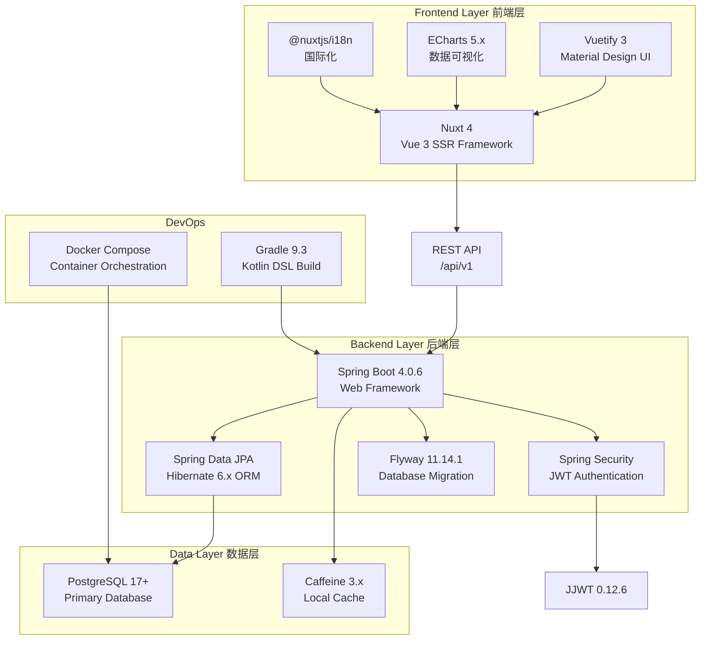

本文档为 Bookkeeping 个人记账系统提供整体定位说明，帮助开发者快速理解项目的核心价值主张、技术选型依据以及系统架构概览。作为入门指南的第一篇文章，本文将为后续深入学习各个模块奠定基础认知框架。

## 1. 项目定位与愿景

Bookkeeping 是一款面向个人及家庭的轻量级自托管记账应用，致力于为用户提供完全自主可控的财务管理工具。与商业记账软件不同，本项目强调**隐私优先**和**轻量部署**两大核心价值，用户无需将财务数据交给第三方服务商，可运行在树莓派、NAS 等低功耗设备上，真正实现数据完全自主掌控。

项目起源于对现有开源记账解决方案的功能不满，目标是构建一个功能全面但架构简洁的系统。从技术角度看，本项目采用 **Spring Boot 4 + Nuxt 4** 全栈架构，后端使用 Java 25 + PostgreSQL 17，前端使用 Vue 3 + Vuetify 3，这种组合兼顾了企业级稳定性与现代化的开发体验。

Sources: [PRD.md](PRD.md#L1-L30), [README.md](README.md#L1-L30)

## 2. 目标用户画像

根据 PRD 文档定义，本系统面向三类核心用户群体，每类用户对系统功能的需求侧重点有所不同。

| 用户类型 | 典型场景 | 核心需求 |
|---------|---------|---------|
| 个人用户 | 日常收支记录、月底对账、预算追踪 | 快速记账、清晰统计、多账户支持 |
| 自由职业者 | 业务收入追踪、发票关联、税务准备 | 项目分类、详细备注、多币种 |
| 小企业主 | 流水记录、简单报表、收支分类 | 多用户协作、权限管理、导出功能 |

理解目标用户有助于开发者在实现功能时做出合理取舍：保持核心功能的高质量实现，而非追求功能数量但质量平庸。系统的每一个功能设计都应服务于上述三类用户的实际使用场景。

Sources: [PRD.md](PRD.md#L31-L45)

## 3. 技术架构全景

### 3.1 全栈技术选型

本项目采用成熟稳定的技术栈组合，每个选择都经过权衡考虑。以下是详细的技术对照表：



### 3.2 后端包结构设计

后端代码遵循清晰的分层架构，所有模块按职责分为三个层级：

```
backend/src/main/java/com/bookkeeping/
├── common/                    # 共享基础设施
│   ├── BaseEntity.java       # 所有实体的基类（id, createdAt, updatedAt）
│   ├── ApiResponse.java      # 统一响应封装（success, result, errorCode）
│   ├── ResultCode.java       # 错误码定义
│   └── enums/                # 枚举类型
│
├── config/                    # 基础设施配置
│   ├── SecurityConfig.java   # Spring Security 配置
│   ├── OpenApiConfig.java    # Swagger API 文档
│   ├── CacheConfig.java      # Caffeine 缓存配置
│   └── FlywayConfig.java     # 数据库迁移配置
│
├── core/                      # 核心业务模块（账户、交易、分类等）
│   ├── account/              # 账户管理
│   ├── transaction/          # 交易管理
│   ├── category/            # 分类管理
│   ├── tag/                 # 标签管理
│   └── budget/              # 预算管理
│
├── supporting/                # 支撑模块（认证、用户）
│   ├── auth/                 # 登录注册
│   ├── security/            # JWT 令牌处理
│   └── user/                # 用户信息管理
│
└── infrastructure/            # 基础设施端点
    └── controller/
        └── HealthController.java
```

这种包结构的设计原则是：**core** 目录包含与记账直接相关的业务实体（账户、交易、分类、标签、预算），**supporting** 目录包含支撑业务运行的辅助模块（认证、用户）。这种划分使得后续功能扩展时能快速定位代码位置。

Sources: [AGENTS.md](AGENTS.md#L1-L100), [backend/build.gradle.kts](backend/build.gradle.kts#L1-L60)

### 3.3 前端页面路由

前端采用 Nuxt 4 的文件路由系统，每个页面文件直接对应一个路由：

| 页面路径 | 功能描述 | 路由 |
|---------|---------|-----|
| `pages/index.vue` | 仪表盘首页，展示资产/负债/收支统计 | `/` |
| `pages/transactions.vue` | 交易列表与搜索 | `/transactions` |
| `pages/accounts.vue` | 账户管理 | `/accounts` |
| `pages/categories.vue` | 收入/支出分类管理 | `/categories` |
| `pages/tags.vue` | 交易标签管理 | `/tags` |
| `pages/budgets.vue` | 月度预算设置 | `/budgets` |
| `pages/reports.vue` | 报表生成与导出 | `/reports` |
| `pages/statistics.vue` | 详细统计分析 | `/statistics` |
| `pages/profile.vue` | 用户偏好设置 | `/profile` |
| `pages/login.vue` | 用户登录 | `/login` |
| `pages/register.vue` | 用户注册 | `/register` |

前端页面通过 `middleware/auth.ts` 中间件进行访问控制，未登录用户会被重定向到登录页面。

Sources: [frontend/nuxt.config.ts](frontend/nuxt.config.ts#L1-L48), [frontend/middleware/auth.ts](frontend/middleware/auth.ts)

## 4. 核心功能模块

系统功能围绕个人记账的核心场景展开，划分为以下主要模块：

| 模块 | 核心功能 | 数据实体 |
|------|---------|---------|
| 用户认证 | 注册/登录/JWT 令牌/刷新令牌 | User, TokenRecord |
| 账户管理 | 多类型账户（现金/支票/储蓄/信用卡/投资）余额追踪 | Account |
| 交易管理 | 收入/支出/转账四种交易类型，自动余额更新 | Transaction |
| 分类管理 | 收入/支出分类树形结构，支持二级分类 | Category |
| 标签系统 | 交易标签自由标记，多标签筛选 | Tag, TransactionTagIndex |
| 预算管理 | 月度预算设置与实际支出对比预警 | Budget |
| 仪表盘 | 资产/负债/净值的实时统计与趋势图表 | - |
| 统计报表 | 月度收支趋势、分类占比、年度汇总 | - |

每种交易类型的数据库存储值如下：MODIFY_BALANCE=1（余额调整）、INCOME=2（收入）、EXPENSE=3（支出）、TRANSFER_OUT=4（转出）、TRANSFER_IN=5（转入）。转账操作在数据库中存储为两条关联记录，通过 `related_id` 字段链接。

Sources: [PRD.md](PRD.md#L46-L120), [AGENTS.md](AGENTS.md#L101-L150)

## 5. 关键设计决策

系统设计过程中做出了若干重要的技术决策，这些决策直接影响代码实现方式和开发规范。

### 5.1 金额存储策略

金额统一使用 **BIGINT** 类型存储，以最小货币单位（分/ cents）为基准。这种设计完全避免了浮点数精度丢失问题，代价是前端展示时需要除以 100 进行格式化。后端存储 `12345` 代表 `123.45` 元，任何货币计算都应使用整数运算。

```java
// ❌ 错误：浮点数精度问题
private Double balance;

// ✅ 正确：整数存储分/厘
private Long balance;  // 1234500 = 12345.00 元
```

### 5.2 时间戳统一格式

所有时间字段使用 **Unix 时间戳（BIGINT）** 存储秒级精度，而非 Java Date 或 LocalDateTime。这种设计确保前后端时间表示一致，简化跨时区处理逻辑。

```java
// BaseEntity 中的时间字段
@Column(name = "created_at", nullable = false, updatable = false)
protected Long createdAt;

@PrePersist
protected void onCreate() {
    this.createdAt = System.currentTimeMillis() / 1000;  // Unix 秒
}
```

### 5.3 软删除机制

所有业务实体使用软删除策略，通过 `deleted` 布尔标志位和 `deleted_unix_time` 字段实现。这种设计允许数据恢复，同时满足合规要求。查询时应始终添加 `WHERE deleted = false` 条件。

### 5.4 统一 API 响应格式

所有 REST API 响应遵循标准信封格式，无论成功或失败：

```json
// 成功响应
{
  "success": true,
  "result": { ... },
  "errorCode": null,
  "errorMessage": null
}

// 错误响应
{
  "success": false,
  "result": null,
  "errorCode": 200101,
  "errorMessage": "用户名或密码错误"
}
```

错误码采用 `category * 100000 + subCategory * 1000 + index` 的编码规则，便于按类别统计和定位问题。

Sources: [AGENTS.md](AGENTS.md#L151-L200), [backend/src/main/java/com/bookkeeping/common/ApiResponse.java](backend/src/main/java/com/bookkeeping/common/ApiResponse.java#L1-L41)

## 6. 项目快速概览

通过以下关键数据点，快速建立对项目规模的认知：

| 维度 | 指标 |
|------|------|
| 后端代码行数（核心模块） | ~5000 行 Java |
| 前端页面数量 | 11 个路由页面 |
| 数据库表数量 | 15+ 张（通过 Flyway 管理迁移） |
| REST API 端点 | 40+ 个 |
| 测试覆盖要求 | 每个模块单元测试 + 集成测试 |
| 默认测试账号 | demo / demo123 |

项目采用渐进式开发策略，分为 7 个阶段（Phase 0-7），每个阶段通过门控（Gate）验证后方可进入下一阶段。目前系统已完成 Phase 0-7 的基础功能实现，包括用户认证、账户管理、交易管理等核心模块。

Sources: [AGENTS.md](AGENTS.md#L201-L297)

## 7. 下一步学习路径

完成本文档阅读后，建议按以下顺序深入学习各模块：

### 入门指南
- **[快速开始 - 环境搭建与运行指南](2-kuai-su-kai-shi-huan-jing-da-jian-yu-yun-xing-zhi-nan)**：动手搭建开发环境，运行第一个"Hello World"

### 技术架构
- **[系统架构 - Spring Boot + Nuxt 4 全栈设计](3-xi-tong-jia-gou-spring-boot-nuxt-4-quan-zhan-she-ji)**：深入理解前后端通信、数据流转、部署架构

### 深度解析
- **[认证机制 - JWT 令牌与安全配置](6-ren-zheng-ji-zhi-jwt-ling-pai-yu-an-quan-pei-zhi)**：理解令牌生成、刷新、黑名单机制
- **[数据库设计 - Flyway 迁移与实体关系](7-shu-ju-ku-she-ji-flyway-qian-yi-yu-shi-ti-guan-xi)**：学习数据库迁移规范、实体设计原则
- **[账户管理 - 账户实体与 CRUD 操作](9-zhang-hu-guan-li-zhang-hu-shi-ti-yu-crud-cao-zuo)**：从具体模块学习代码组织与业务逻辑分离

建议先完成环境搭建，亲手运行项目后再进入深度学习阶段。纸上得来终觉浅，亲身体验才能真正理解系统的工作方式。

---

*本文档为 Bookkeeping 项目入门指南系列的第一篇，后续将持续更新更多模块的技术细节与最佳实践。*