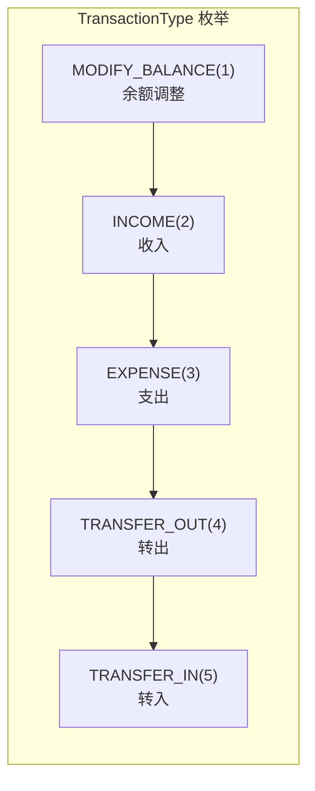
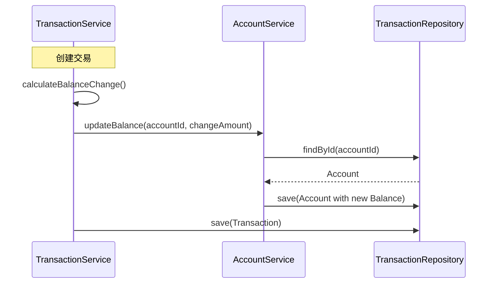
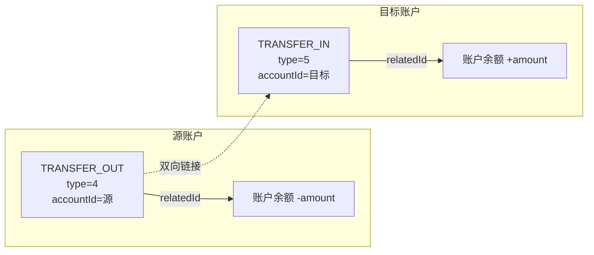
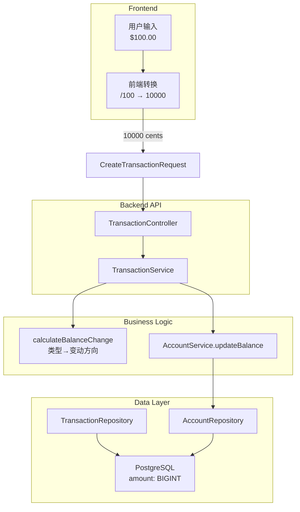

本页面深入解析复式记账系统中**交易管理模块**的核心设计，涵盖交易类型枚举定义、金额存储机制、账户余额更新逻辑以及转账交易的配对处理。这些设计共同确保了财务数据的完整性和一致性。

## 交易类型体系

### 类型枚举定义

系统定义了五种交易类型，通过 `TransactionType` 枚举进行统一管理。该枚举位于 `backend/src/main/java/com/bookkeeping/common/enums/TransactionType.java`，采用 **code → name** 的双字段设计模式：



枚举提供了 `fromCode(int code)` 静态方法，用于将数据库存储的整数值反序列化为枚举实例。`getCode()` 和 `getDisplayName()` 方法则支持双向转换，满足 API 响应和数据持久化的不同场景需求。

Sources: [TransactionType.java](backend/src/main/java/com/bookkeeping/common/enums/TransactionType.java#L1-L37)

### 类型语义解析

每种交易类型具有明确的财务语义：

| 类型代码 | 枚举值 | 财务语义 | 余额变动 | 适用场景 |
|:---:|:---|:---|:---:|:---|
| 1 | `MODIFY_BALANCE` | 余额调整 | **增加** | 账户初始化、手动校准 |
| 2 | `INCOME` | 收入 | **增加** | 工资、奖金、理财收益 |
| 3 | `EXPENSE` | 支出 | **减少** | 消费、缴费、退款 |
| 4 | `TRANSFER_OUT` | 转出 | **减少** | 资金转出源账户 |
| 5 | `TRANSFER_IN` | 转入 | **增加** | 资金转入目标账户 |

前端页面通过类型映射提供差异化视觉呈现：收入类交易显示绿色并使用向下箭头图标，支出类交易显示红色并使用向上箭头图标，转账交易则使用蓝色并采用双向交换图标。

Sources: [transactions.vue](frontend/pages/transactions.vue#L335-L358)

## 金额存储机制

### 分整数存储策略

系统采用**分（cents）作为最小计量单位**存储金额，将用户输入的美元金额乘以 100 后以 `Long` 类型持久化。这一设计从根本上避免了浮点数运算的精度丢失问题。

数据库 schema 在 `V3__categories_transactions.sql` 中明确定义：

```sql
CREATE TABLE transactions (
    amount BIGINT NOT NULL,  -- 以分为单位存储
    ...
);
```

Sources: [V3__categories_transactions.sql](backend/src/main/resources/db/migration/V3__categories_transactions.sql#L27-L40)

### 前后端金额转换

Transaction 实体中的 `amount` 字段采用分单位存储，而用户在界面看到的金额需要以美元显示。转换逻辑在 `transactions.vue` 中实现：

```typescript
// 前端显示转换：分 → 美元
function fmt(c: number) { 
    return (c / 100).toLocaleString('en-US', { 
        minimumFractionDigits: 2 
    }) 
}
```

`CreateTransactionRequest` 接收的金额同样以分为单位，前端通过金额输入框的 `prefix="$"` 前缀提示用户输入的是美元，但实际传输时需确保已转换为分值：

```java
public record CreateTransactionRequest(
    @NotNull Long amount,  // 接收以分为单位的金额
    ...
)
```

Sources: [CreateTransactionRequest.java](backend/src/main/java/com/bookkeeping/core/transaction/CreateTransactionRequest.java#L1-L15)

## 账户余额更新逻辑

### 核心计算方法

`TransactionService` 提供了 `calculateBalanceChange()` 私有方法，根据交易类型计算账户余额的变动值：

```java
private Long calculateBalanceChange(Integer transactionType, Long amount) {
    return switch (transactionType) {
        case 1, 2, 5 -> amount;           // 增加
        case 3, 4 -> -Math.abs(amount);  // 减少
        default -> 0L;
    };
}
```

这一设计的精妙之处在于：收入（2）和转入（5）类型**增加**余额，支出（3）和转出（4）类型**减少**余额，而余额调整（1）仅用于特殊场景。

Sources: [TransactionService.java](backend/src/main/java/com/bookkeeping/core/transaction/TransactionService.java#L315-L322)

### 更新流程时序

当交易创建、更新或删除时，`AccountService.updateBalance()` 负责原子性地更新账户余额：



`updateBalance` 方法的实现非常简洁，直接将变动值累加到当前余额：

```java
@Transactional
public void updateBalance(Long accountId, Long amountChange) {
    Account account = accountRepository.findById(accountId)
            .orElseThrow(() -> new BusinessException(ResultCode.ACCOUNT_NOT_FOUND));
    accountRepository.save(account.toBuilder()
            .balance(account.getBalance() + amountChange)
            .build());
}
```

Sources: [AccountService.java](backend/src/main/java/com/bookkeeping/core/account/AccountService.java#L107-L115)

## 转账交易的配对处理

### 双记录关联机制

转账交易在系统中创建**一对关联记录**：转出记录（type=4）和转入记录（type=5），通过 `relatedId` 字段建立双向引用：



创建转账时，`TransactionService.createTransaction()` 的处理流程如下：

1. **验证账户差异**：确保源账户与目标账户不同
2. **创建转出记录**：保存 `TRANSFER_OUT` 交易
3. **同步更新余额**：源账户减少，目标账户增加
4. **创建转入记录**：保存 `TRANSFER_IN` 交易并设置 `relatedId`
5. **回填关联 ID**：将转入记录的 ID 写入转出记录的 `relatedId` 字段

```java
// 创建 TRANSFER_OUT 记录
Transaction saved = transactionRepository.save(tx);
accountService.updateBalance(request.accountId(), -Math.abs(request.amount()));
accountService.updateBalance(request.destinationAccountId(), request.amount());

// 创建关联的 TRANSFER_IN 记录
Transaction transferIn = Transaction.builder()
        .transactionType(5)  // TRANSFER_IN
        .accountId(request.destinationAccountId())
        .relatedId(saved.getId())  // 关联转出记录
        .build();
transferIn = transactionRepository.save(transferIn);

// 回填转出记录的 relatedId
saved = transactionRepository.save(saved.toBuilder()
        .relatedId(transferIn.getId())
        .build());
```

Sources: [TransactionService.java](backend/src/main/java/com/bookkeeping/core/transaction/TransactionService.java#L84-L109)

### 删除时的级联处理

删除关联转账记录时，需要同时回滚两笔交易的余额变动：

```java
public void deleteTransaction(Long id) {
    Transaction existing = transactionRepository.findByIdAndUserId(id, userId)
            .orElseThrow(() -> new BusinessException(...));

    // 处理关联的转账记录
    if (existing.getRelatedId() != null) {
        transactionRepository.findById(existing.getRelatedId())
                .ifPresent(related -> {
                    // 回滚关联记录的余额变动
                    Long relatedChange = calculateBalanceChange(
                            related.getTransactionType(), related.getAmount());
                    accountService.updateBalance(related.getAccountId(), -relatedChange);
                    transactionRepository.delete(related);
                });
    }

    // 回滚当前记录的余额变动
    Long change = calculateBalanceChange(existing.getTransactionType(), existing.getAmount());
    accountService.updateBalance(existing.getAccountId(), -change);
    transactionRepository.delete(existing);
}
```

这种设计确保了无论从哪一端删除转账，都能正确恢复两个账户的余额。

## 数据流架构总览



## 交易筛选与统计

### 筛选参数支持

`TransactionSearchParams` 记录类封装了所有筛选条件，支持多维度组合查询：

```java
public record TransactionSearchParams(
    Integer year,           // 年份筛选
    Integer month,          // 月份筛选
    Integer accountId,      // 账户筛选
    Integer categoryId,     // 分类筛选
    Integer transactionType, // 类型筛选
    String search           // 关键词搜索
) {
    public boolean hasFilters() {
        return year != null || month != null || accountId != null 
            || categoryId != null || transactionType != null 
            || (search != null && !search.isBlank());
    }
}
```

前端筛选栏通过 `v-btn-toggle` 组件提供类型快速切换：`all`（全部）、`2`（收入）、`3`（支出）、`4`（转账）。

Sources: [TransactionSearchParams.java](backend/src/main/java/com/bookkeeping/core/transaction/TransactionSearchParams.java)

### 月度统计聚合

`getStatistics()` 方法按月聚合交易数据，计算收入支出汇总及分类占比：

```java
public StatisticsDto getStatistics(int year, int month) {
    // 按月份范围查询交易
    List<Transaction> transactions = transactionRepository
            .findByUserIdAndMonth(userId, startTime, endTime);
    
    // 分别聚合收入和支出
    for (Transaction tx : transactions) {
        switch (tx.getTransactionType()) {
            case 2 -> totalIncome += tx.getAmount();
            case 3 -> totalExpense += tx.getAmount();
        }
    }
    
    // 按分类分组计算占比
    StatisticsDto.CategoryBreakdown[] breakdown = ...
}
```

返回的 `StatisticsDto` 包含：
- `totalIncome`：月度总收入（分）
- `totalExpense`：月度总支出（分）
- `netBalance`：净收支差额
- `transactionCount`：交易笔数
- `incomeBreakdown` / `expenseBreakdown`：分类明细及占比

Sources: [TransactionService.java](backend/src/main/java/com/bookkeeping/core/transaction/TransactionService.java#L269-L300)

---

本模块的核心设计理念在于**类型驱动的余额计算**和**转账的原子性处理**。通过将业务规则封装在 `calculateBalanceChange` 方法中，确保了任何交易操作都能正确维护账户余额的一致性。如需了解更多分类体系设计，请参阅 [分类管理 - 收入支出分类体系](11-fen-lei-guan-li-shou-ru-zhi-chu-fen-lei-ti-xi)。