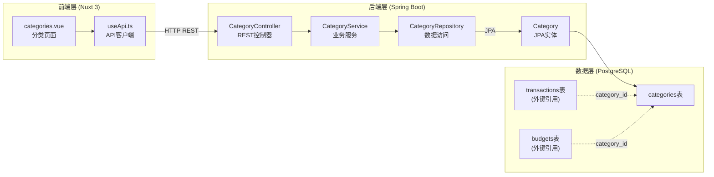
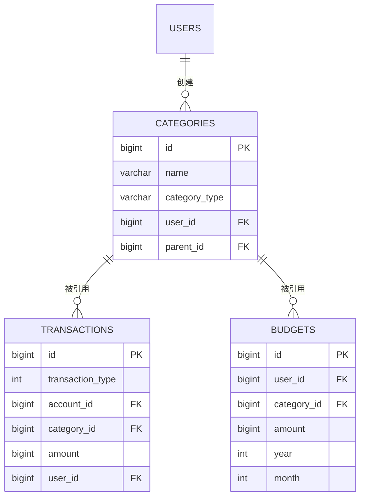

分类管理模块是家庭记账系统的核心组成部分之一，负责管理用户的收入与支出分类体系。该模块采用标准的 Spring Boot + Nuxt 4 全栈架构，后端基于 Spring Data JPA 实现持久化，前端使用 Vuetify 3 构建响应式界面。通过用户隔离机制确保每个用户的分类数据互不干扰，同时支持分类的层级结构设计，为后续功能扩展奠定基础。

## 架构概览

分类管理模块遵循清晰的分层架构设计，从前端到后端各层职责明确。下图展示了分类管理在系统中的位置及其与周边模块的交互关系：



前端页面通过 `useApi` 组合函数发起 RESTful 请求，后端控制器接收请求后交由服务层处理业务逻辑，最终通过 Repository 层与数据库交互。分类实体作为核心数据模型，同时被交易记录和预算模块引用，形成系统内的关键数据依赖关系。

Sources: [categories.vue](frontend/pages/categories.vue#L1-L50), [CategoryController.java](backend/src/main/java/com/bookkeeping/core/category/CategoryController.java#L1-L37), [CategoryService.java](backend/src/main/java/com/bookkeeping/core/category/CategoryService.java#L1-L61)

## 数据模型设计

### Category 实体类

后端实体类是整个分类模块的核心数据载体，采用 JPA 注解进行数据库表映射。实体类继承自 `BaseEntity` 以获得审计字段支持：

```java
@Entity
@Table(name = "categories")
@Getter
@Builder(toBuilder = true)
@NoArgsConstructor(access = AccessLevel.PROTECTED)
@AllArgsConstructor
public class Category extends BaseEntity {

    @Column(nullable = false, length = 64)
    private String name;

    @Column(name = "category_type", nullable = false, length = 10)
    @Enumerated(EnumType.STRING)
    private CategoryType categoryType;

    @Column(name = "user_id", nullable = false)
    private Long userId;

    @Column(name = "parent_id")
    private Long parentId;

    @Column
    private Integer sortOrder = 0;
}
```

实体设计遵循以下原则：使用 Lombok 消除样板代码，通过 `@Builder` 支持流式构造，采用 `@NoArgsConstructor(access = AccessLevel.PROTECTED)` 防止直接实例化。字段设计简洁明了，name 限制最大 64 字符，categoryType 以字符串形式存储枚举值，parentId 支持分类的树形层级结构，sortOrder 用于控制同类分类的显示顺序。

Sources: [Category.java](backend/src/main/java/com/bookkeeping/core/category/Category.java#L1-L36), [BaseEntity.java](backend/src/main/java/com/bookkeeping/common/BaseEntity.java#L1-L53)

### CategoryType 枚举

分类类型通过枚举严格定义，仅支持收入和支出两种基本类型：

```java
public enum CategoryType {
    INCOME("Income"),
    EXPENSE("Expense");

    private final String displayName;
    
    CategoryType(String displayName) {
        this.displayName = displayName;
    }
}
```

这种设计确保了类型安全性，在数据库层面以字符串存储（VARCHAR(10)），便于调试和直接查询。每个枚举值附带 displayName 用于前端显示，但当前实现中尚未被充分利用。

Sources: [CategoryType.java](backend/src/main/java/com/bookkeeping/common/enums/CategoryType.java#L1-L20)

### DTO 传输对象

前端与后端之间通过 DTO 进行数据交换，使用 MapStructPlus 注解自动生成映射逻辑：

```java
@MapperAuto(sourceEntity = Category.class, direction = Direction.From)
public record CategoryDto(
    Long id,
    String name,
    CategoryType categoryType,
    Long userId,
    Long parentId,
    Integer sortOrder
) {}
```

DTO 采用 Java Record 类型，简洁且不可变。映射方向固定为 From（即从实体到 DTO），因为当前接口仅涉及查询和创建操作，不存在反向更新场景。

Sources: [CategoryDto.java](backend/src/main/java/com/bookkeeping/core/category/CategoryDto.java#L1-L16)

## 数据库Schema

分类表通过 Flyway 迁移脚本创建，与交易表在同一个迁移文件中定义，反映了二者紧密的关联关系：

```sql
CREATE TABLE categories (
    id BIGSERIAL PRIMARY KEY,
    name VARCHAR(64) NOT NULL,
    category_type VARCHAR(10) NOT NULL,
    user_id BIGINT NOT NULL REFERENCES users(id),
    parent_id BIGINT,
    sort_order INTEGER DEFAULT 0,
    created_at BIGINT NOT NULL,
    updated_at BIGINT NOT NULL,
    created_by BIGINT,
    modified_by BIGINT
);

CREATE INDEX idx_categories_user_id ON categories(user_id);
CREATE INDEX idx_categories_type ON categories(category_type);
```

表结构设计包含以下要点：主键使用 BIGSERIAL 自增序列，user_id 强制非空且引用用户表确保数据隔离，parent_id 可为空以支持顶级分类，审计字段采用 Unix 时间戳格式。两个复合索引分别优化按用户查询和按类型筛选的场景，这是高频查询路径的关键优化。

Sources: [V3__categories_transactions.sql](backend/src/main/resources/db/migration/V3__categories_transactions.sql#L1-L18)

## RESTful API 设计

### 端点定义

分类控制器暴露了两个 REST 端点，遵循标准的资源导向设计：

| 方法 | 路径 | 功能 | 参数 |
|------|------|------|------|
| GET | /api/v1/categories | 查询分类列表 | type (可选, INCOME/EXPENSE) |
| POST | /api/v1/categories | 创建新分类 | name, type, parentId (可选) |

```java
@GetMapping
@Operation(summary = "List all categories")
public ApiResponse<List<CategoryDto>> list(@RequestParam(required = false) CategoryType type) {
    if (type != null) return ApiResponse.success(categoryService.getCategoriesByType(type));
    return ApiResponse.success(categoryService.getCurrentUserCategories());
}

@PostMapping
@Operation(summary = "Create category")
public ApiResponse<CategoryDto> create(@RequestParam String name,
                                        @RequestParam CategoryType type,
                                        @RequestParam(required = false) Long parentId) {
    return ApiResponse.success(categoryService.createCategory(name, type, parentId));
}
```

控制器采用简单的条件判断分发逻辑，当请求包含 type 参数时按类型筛选，否则返回当前用户的全部分类。创建接口接受 name 和 type 必填参数，parentId 可选用于指定父分类。API 文档通过 OpenAPI 注解自动生成 Swagger 界面。

Sources: [CategoryController.java](backend/src/main/java/com/bookkeeping/core/category/CategoryController.java#L1-L37)

### 统一响应格式

所有接口返回统一封装的 `ApiResponse<T>` 结构，包含 success 状态、result 结果数据和错误信息字段。这种设计为前端提供了稳定的响应契约，便于统一处理成功和异常情况。

Sources: [ApiResponse.java](backend/src/main/java/com/bookkeeping/common/ApiResponse.java)

## 业务逻辑层

服务层承载核心业务规则，实现用户隔离和数据验证：

```java
@Transactional(readOnly = true)
public List<CategoryDto> getCurrentUserCategories() {
    Long userId = securityUtils.requireCurrentUser().getId();
    return categoryRepository.findByUserId(userId).stream()
            .map(categoryMapper::toDto).toList();
}

@Transactional(readOnly = true)
public List<CategoryDto> getCategoriesByType(CategoryType type) {
    Long userId = securityUtils.requireCurrentUser().getId();
    return categoryRepository.findByUserIdAndCategoryType(userId, type).stream()
            .map(categoryMapper::toDto).toList();
}

@Transactional
public CategoryDto createCategory(String name, CategoryType type, Long parentId) {
    Long userId = securityUtils.requireCurrentUser().getId();
    if (categoryRepository.existsByNameAndUserId(name, userId)) {
        throw new BusinessException(ResultCode.CATEGORY_ALREADY_EXISTS, 
            "Category '" + name + "' already exists");
    }
    Category category = Category.builder()
            .name(name)
            .categoryType(type)
            .userId(userId)
            .parentId(parentId)
            .build();
    return categoryMapper.toDto(categoryRepository.save(category));
}
```

关键设计特点：所有查询方法使用 `@Transactional(readOnly = true)` 优化只读事务性能，通过 `SecurityUtils.requireCurrentUser()` 获取当前登录用户 ID 确保数据隔离，创建时检查同名分类防止重复添加。事务由方法级别的注解管理，创建操作自动提交，查询操作在连接池层面可能使用只读视图优化。

Sources: [CategoryService.java](backend/src/main/java/com/bookkeeping/core/category/CategoryService.java#L1-L61)

## 数据访问层

Repository 接口继承 Spring Data JPA 的 `JpaRepository`，提供基础的 CRUD 能力和自定义查询方法：

```java
@Repository
public interface CategoryRepository extends JpaRepository<Category, Long> {
    List<Category> findByUserId(Long userId);
    List<Category> findByUserIdAndCategoryType(Long userId, CategoryType categoryType);
    boolean existsByNameAndUserId(String name, Long userId);
}
```

三个自定义方法覆盖了核心业务场景：按用户查询所有分类、按用户和类型组合查询、查询同名分类是否存在。方法命名遵循 Spring Data JPA 的派生查询规则，无需手动编写 JPQL 或 SQL。

Sources: [CategoryRepository.java](backend/src/main/java/com/bookkeeping/core/category/CategoryRepository.java#L1-L15)

## 前端实现

### 页面结构

分类管理页面采用 Vuetify 3 组件构建，包含标签页切换、分类列表和新建对话框三个核心区域：

```vue
<v-tabs v-model="activeTab" color="primary" class="mb-4" density="compact">
  <v-tab value="EXPENSE">Expense</v-tab>
  <v-tab value="INCOME">Income</v-tab>
</v-tabs>
```

页面使用 `shallowRef` 存储分类列表以优化大数据量场景的渲染性能，通过 `computed` 属性 `filteredCategories` 实现实时的类型筛选，无需额外请求后端。前端维护 loading 和 saving 状态控制异步操作的 UI 反馈。

Sources: [categories.vue](frontend/pages/categories.vue#L1-L113)

### API 交互

前端通过 `useApi` 组合函数与后端通信，采用 Promise 风格的异步调用模式：

```typescript
async function fetchData() {
  loading.value = true
  try { categories.value = await api.get<Category[]>('/categories') }
  finally { loading.value = false }
}

async function save() {
  saving.value = true
  try {
    await api.post(`/categories?name=${encodeURIComponent(form.name)}&type=${form.type}`)
    dialog.value = false
    await fetchData()
  } finally { saving.value = false }
}
```

当前实现使用查询参数传递表单数据，与后端的 `@RequestParam` 注解对应。创建成功后自动关闭对话框并刷新列表，错误处理通过 `useApi` 内部的统一异常拦截机制完成。

Sources: [categories.vue](frontend/pages/categories.vue#L60-L80), [useApi.ts](frontend/composables/useApi.ts#L1-L47)

## 初始化数据

系统通过 `DataInitializer` 在首次启动时自动创建演示数据，包含 12 个预置分类：

**收入分类（4个）**：

| 分类名称 | 类型 | 用途 |
|---------|------|------|
| Salary | INCOME | 工资收入 |
| Freelance | INCOME | 自由职业收入 |
| Investment | INCOME | 投资收益 |
| Other Income | INCOME | 其他收入 |

**支出分类（8个）**：

| 分类名称 | 类型 | 用途 |
|---------|------|------|
| Food & Dining | EXPENSE | 餐饮消费 |
| Transportation | EXPENSE | 交通出行 |
| Shopping | EXPENSE | 购物消费 |
| Housing | EXPENSE | 住房相关 |
| Entertainment | EXPENSE | 娱乐休闲 |
| Healthcare | EXPENSE | 医疗健康 |
| Utilities | EXPENSE | 水电气费 |
| Other Expense | EXPENSE | 其他支出 |

这些分类覆盖了家庭记账的主要场景，为新用户提供了开箱即用的体验。数据初始化逻辑会检查是否已存在分类数据，避免重复创建。

Sources: [DataInitializer.java](backend/src/main/java/com/bookkeeping/config/DataInitializer.java#L75-L95)

## 模块依赖关系

分类模块与其他核心模块存在紧密的数据关联：



交易记录通过 `category_id` 外键引用分类表，用于统计各分类的收支汇总。预算模块同样引用分类，支持按分类设置月度限额。这种设计使分类成为系统的关键维度，任何分类的变更都可能影响关联数据的完整性。

Sources: [Transaction.java](backend/src/main/java/com/bookkeeping/core/transaction/Transaction.java#L1-L48), [Budget.java](backend/src/main/java/com/bookkeeping/core/budget/Budget.java#L1-L39)

## 后续阅读

本篇文档介绍了分类管理模块的整体架构和实现细节。如需继续深入，可阅读以下相关章节：

- [交易管理 - 交易类型与金额处理](10-jiao-yi-guan-li-jiao-yi-lei-xing-yu-jin-e-chu-li) — 了解分类如何被交易记录引用
- [预算管理 - 月度预算设置与追踪](13-yu-suan-guan-li-yue-du-yu-suan-she-zhi-yu-zhui-zong) — 了解按分类设置预算的功能
- [数据库设计 - Flyway 迁移与实体关系](7-shu-ju-ku-she-ji-flyway-qian-yi-yu-shi-ti-guan-xi) — 深入理解数据库迁移机制