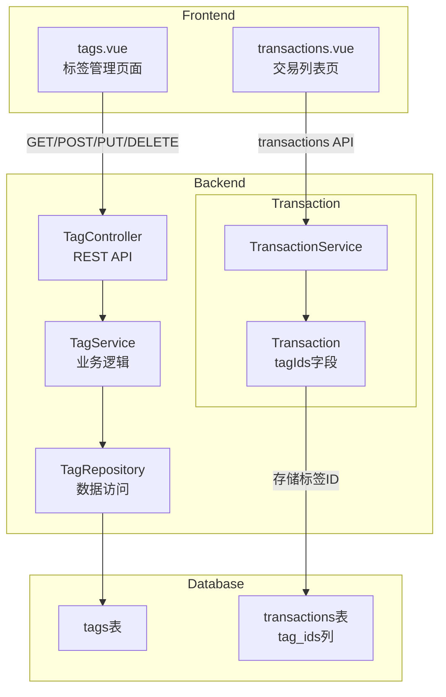
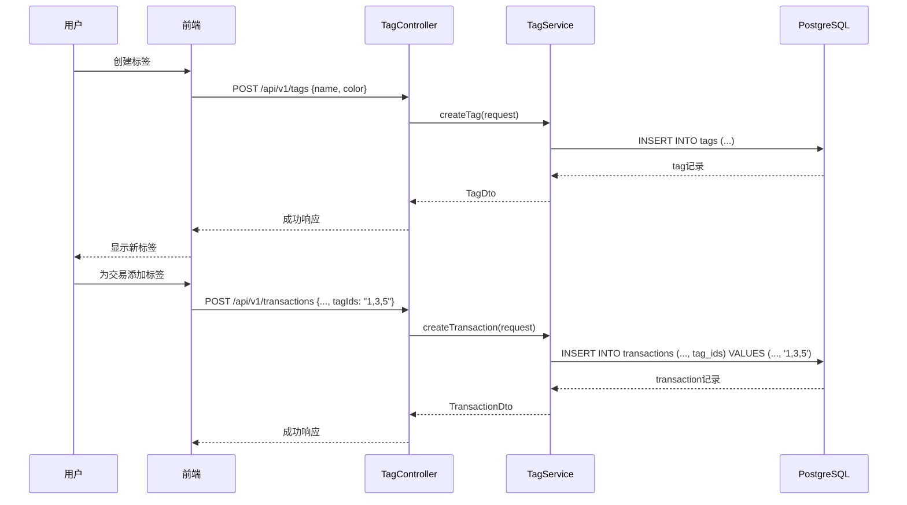

标签系统为家庭记账应用提供了灵活的交易分类能力，支持用户为每笔交易添加多个自定义标签，并通过颜色进行视觉区分。系统设计遵循用户隔离原则，每个用户的标签相互独立，确保数据隐私。

## 系统架构概览

标签系统采用经典的三层架构设计：表现层（前端标签管理页面）、业务逻辑层（TagService）、数据访问层（TagRepository）。交易与标签之间通过 `tag_ids` TEXT 字段建立多对多关联。



## 数据库设计

### 标签表结构

根据迁移脚本 `V4__tags.sql`，标签表包含以下核心字段：

| 字段名 | 类型 | 约束 | 说明 |
|--------|------|------|------|
| id | BIGSERIAL | PRIMARY KEY | 标签唯一标识 |
| user_id | BIGINT | NOT NULL | 所属用户ID |
| name | VARCHAR(100) | NOT NULL | 标签名称 |
| color | VARCHAR(7) | DEFAULT '#1976D2' | 十六进制颜色值 |
| created_unix_time | BIGINT | NOT NULL | 创建时间戳 |
| updated_unix_time | BIGINT | - | 更新时间戳 |
| deleted | BOOLEAN | DEFAULT FALSE | 软删除标记 |

_sources: [V4__tags.sql](backend/src/main/resources/db/migration/V4__tags.sql#L4-L21)_

### 交易表标签字段

交易记录通过 TEXT 类型的 `tag_ids` 字段存储关联的标签ID列表，多个标签以逗号分隔。

```sql
ALTER TABLE transactions ADD COLUMN IF NOT EXISTS tag_ids TEXT;
```

_sources: [V4__tags.sql](backend/src/main/resources/db/migration/V4__tags.sql#L18)_

### 索引设计

为优化查询性能，系统在 `tags` 表上创建了两个索引：

```sql
CREATE INDEX idx_tags_user_id ON tags(user_id);
CREATE INDEX idx_tags_name ON tags(name);
```

_sources: [V4__tags.sql](backend/src/main/resources/db/migration/V4__tags.sql#L14-L15)_

## 后端实现

### 实体类设计

`Tag` 实体采用 JPA 注解映射数据库表，使用 Lombok 生成 Getter 和 Builder 方法：

```java
@Entity
@Table(name = "tags")
@Getter
@Builder(toBuilder = true)
@NoArgsConstructor(access = AccessLevel.PROTECTED)
@AllArgsConstructor
public class Tag {
    @Id
    @GeneratedValue(strategy = GenerationType.IDENTITY)
    private Long id;
    
    @Column(nullable = false)
    private Long userId;
    
    @Column(nullable = false)
    private String name;
    
    @Column(length = 7)
    private String color;
    
    @Column(name = "created_unix_time", nullable = false)
    private Long createdTime;
    
    @Column(name = "updated_unix_time")
    private Long updatedTime;
    
    @Column(name = "deleted")
    private Boolean deleted = false;
}
```

_sources: [Tag.java](backend/src/main/java/com/bookkeeping/core/tag/Tag.java#L1-L35)_

### Repository 层

`TagRepository` 提供基于用户ID的查询方法，支持按名称排序和软删除过滤：

```java
@Repository
public interface TagRepository extends JpaRepository<Tag, Long> {
    List<Tag> findByUserIdAndDeletedFalseOrderByNameAsc(Long userId);
    Optional<Tag> findByIdAndUserIdAndDeletedFalse(Long id, Long userId);
    boolean existsByUserIdAndNameAndDeletedFalse(Long userId, String name);
}
```

_sources: [TagRepository.java](backend/src/main/java/com/bookkeeping/core/tag/TagRepository.java#L1-L14)_

### Service 层业务逻辑

`TagService` 实现标签的完整生命周期管理，包括创建、更新、删除时的名称重复校验：

```java
@Transactional(readOnly = true)
public List<TagDto> getAllTags() {
    Long userId = securityUtils.requireCurrentUser().getId();
    return tagRepository.findByUserIdAndDeletedFalseOrderByNameAsc(userId)
            .stream().map(tagMapper::toDto).toList();
}

@Transactional
public TagDto createTag(CreateTagRequest request) {
    Long userId = securityUtils.requireCurrentUser().getId();
    Long now = System.currentTimeMillis() / 1000;

    // Check for duplicate name
    if (tagRepository.existsByUserIdAndNameAndDeletedFalse(userId, request.name())) {
        throw new BusinessException(ResultCode.VALIDATION_ERROR, "Tag with this name already exists");
    }

    Tag tag = Tag.builder()
            .userId(userId)
            .name(request.name())
            .color(request.color() != null ? request.color() : "#1976D2")
            .createdTime(now)
            .build();

    return tagMapper.toDto(tagRepository.save(tag));
}
```

_sources: [TagService.java](backend/src/main/java/com/bookkeeping/core/tag/TagService.java#L24-L49)_

删除操作采用软删除策略，仅更新 `deleted` 标志位，不物理删除数据，保护关联交易的完整性：

```java
@Transactional
public void deleteTag(Long id) {
    Long userId = securityUtils.requireCurrentUser().getId();
    Tag tag = tagRepository.findByIdAndUserIdAndDeletedFalse(id, userId)
            .orElseThrow(() -> new BusinessException(ResultCode.NOT_FOUND, "Tag not found"));

    tagRepository.save(tag.toBuilder()
            .deleted(true)
            .updatedTime(System.currentTimeMillis() / 1000)
            .build());
}
```

_sources: [TagService.java](backend/src/main/java/com/bookkeeping/core/tag/TagService.java#L75-L85)_

### REST API 接口

`TagController` 暴露四个标准 CRUD 端点：

| 方法 | 路径 | 功能 |
|------|------|------|
| GET | /api/v1/tags | 获取当前用户所有标签 |
| POST | /api/v1/tags | 创建新标签 |
| PUT | /api/v1/tags/{id} | 更新标签名称或颜色 |
| DELETE | /api/v1/tags/{id} | 软删除标签 |

```java
@RestController
@RequestMapping("/api/v1/tags")
@Tag(name = "Tags", description = "Tag management APIs")
public class TagController {

    private final TagService tagService;

    public TagController(TagService tagService) {
        this.tagService = tagService;
    }

    @GetMapping
    @Operation(summary = "Get all tags")
    public ApiResponse<List<TagDto>> getAll() {
        return ApiResponse.success(tagService.getAllTags());
    }
    
    // ... POST, PUT, DELETE endpoints
}
```

_sources: [TagController.java](backend/src/main/java/com/bookkeeping/core/tag/TagController.java#L1-L47)_

### 标签与交易的关联

交易记录在创建和更新时接受 `tagIds` 参数，存储格式为逗号分隔的ID字符串：

```java
public record CreateTransactionRequest(
    @NotNull Integer transactionType,
    @NotNull Long accountId,
    Long categoryId,
    Long destinationAccountId,
    @NotNull Long amount,
    @NotBlank String description,
    Long transactionTime,
    String tagIds  // 逗号分隔的标签ID
) {}
```

_sources: [CreateTransactionRequest.java](backend/src/main/java/com/bookkeeping/core/transaction/CreateTransactionRequest.java#L1-L15)_

`TransactionService` 在创建交易时保存标签关联：

```java
Transaction tx = Transaction.builder()
        .transactionType(request.transactionType())
        .accountId(request.accountId())
        .categoryId(request.categoryId())
        .amount(request.amount())
        .description(request.description())
        .transactionTime(transactionTime)
        .userId(userId)
        .tagIds(request.tagIds())  // 保存标签
        .build();
```

_sources: [TransactionService.java](backend/src/main/java/com/bookkeeping/core/transaction/TransactionService.java#L112-L128)_

## 前端实现

### 标签管理页面

`tags.vue` 提供完整的标签 CRUD 界面，包含颜色选择、创建、编辑和删除确认功能：

```vue
interface Tag { id: number; name: string; color: string; createdTime: number }

const presetColors = [
  '#F44336', '#E91E63', '#9C27B0', '#673AB7',
  '#3F51B5', '#2196F3', '#03A9F4', '#00BCD4',
  '#009688', '#4CAF50', '#8BC34A', '#CDDC39',
  '#FFEB3B', '#FFC107', '#FF9800', '#FF5722',
]

async function fetchTags() {
  loading.value = true
  try {
    tags.value = await api.get<Tag[]>('/tags')
  } finally { loading.value = false }
}
```

_sources: [tags.vue](frontend/pages/tags.vue#L1-L174)_

### 标签显示组件

标签以彩色圆点配合名称的方式呈现，每个标签都有唯一颜色标识：

```vue
<v-list-item v-for="tag in tags" :key="tag.id">
  <template v-slot:prepend>
    <v-avatar size="40" :style="{ backgroundColor: tag.color + '20' }">
      <v-icon :color="tag.color">mdi-tag</v-icon>
    </v-avatar>
  </template>
  <v-list-item-title class="font-weight-medium">
    <span :style="{ color: tag.color }">●</span> {{ tag.name }}
  </v-list-item-title>
</v-list-item>
```

_sources: [tags.vue](frontend/pages/tags.vue#L16-L31)_

### API 客户端

前端通过统一的 `useApi` Composable 与后端通信：

```typescript
export const useApi = () => ({
  get: <T>(path: string) => request<T>('GET', path),
  post: <T>(path: string, body?: unknown) => request<T>('POST', path, body),
  put: <T>(path: string, body?: unknown) => request<T>('PUT', path, body),
  delete: <T>(path: string) => request<T>('DELETE', path),
})
```

_sources: [useApi.ts](frontend/composables/useApi.ts#L41-L46)_

## 标签存储机制

系统采用逗号分隔字符串存储多标签关联，这种设计简化了数据库结构但需要注意解析逻辑：



## 技术特点与限制

### 已实现特性

| 特性 | 状态 | 说明 |
|------|------|------|
| 标签 CRUD | ✅ 已实现 | 完整的创建、读取、更新、删除 |
| 颜色自定义 | ✅ 已实现 | 支持 16 种预设颜色 |
| 用户隔离 | ✅ 已实现 | 每个用户只能访问自己的标签 |
| 软删除 | ✅ 已实现 | 删除标签不损坏关联交易 |
| 名称重复校验 | ✅ 已实现 | 同一用户下标签名称唯一 |

### 当前限制

| 限制 | 说明 | 影响 |
|------|------|------|
| 无标签筛选 | `TransactionSearchParams` 暂不支持 `tagIds` 筛选 | 用户无法按标签过滤交易列表 |
| 交易编辑无标签UI | `transactions.vue` 表单未集成标签选择 | 无法在创建/编辑交易时分配标签 |
| TEXT 存储格式 | 逗号分隔ID字符串，非规范化 | 查询和过滤效率较低 |

OpenAPI 规范中已定义 `TagFilter` 参数引用，表明系统规划支持标签筛选功能：

```yaml
# openapi.yaml 中已有定义但未在代码中实现
- $ref: "#/components/parameters/TagFilter"
```

_sources: [openapi.yaml](openapi.yaml#L1053)_

## 后续阅读

标签系统与[分类管理](11-fen-lei-guan-li-shou-ru-zhi-chu-fen-lei-ti-xi)共同构成交易的多元化分类体系。如需了解交易金额处理细节，可参考[交易管理 - 交易类型与金额处理](10-jiao-yi-guan-li-jiao-yi-lei-xing-yu-jin-e-chu-li)。预算功能基于分类实现，可查看[预算管理 - 月度预算设置与追踪](13-yu-suan-guan-li-yue-du-yu-suan-she-zhi-yu-zhui-zong)了解分类与预算的关联。