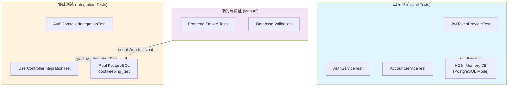

本文档阐述家庭记账系统的后端测试策略，涵盖测试分层架构、配置管理、测试执行流程及覆盖率目标。测试体系采用 Gradle 多源集配置，支持单元测试与集成测试的独立执行，两类测试分别使用内存数据库与真实 PostgreSQL 环境实现隔离验证。

## 测试分层架构

系统测试采用三层分离架构，不同层级在执行环境、依赖范围和执行速度上存在显著差异。



### 各层测试特征对比

| 维度 | 单元测试 | 集成测试 | 手动验证 |
|------|----------|----------|----------|
| **执行位置** | `src/test/java` | `src/integrationTest/java` | Frontend + DB |
| **数据库** | H2 内存数据库 | PostgreSQL 真实实例 | PostgreSQL |
| **执行速度** | < 10s | < 60s | Manual |
| **依赖 mocks** | 100% mocks | 无 mocks | Full stack |
| **配置文件** | `application-test.yml` | `application-integrationtest.yml` | `application-dev.yml` |

Sources: [build.gradle.kts](backend/build.gradle.kts#L90-L108)
Sources: [application-test.yml](backend/src/test/resources/application-test.yml#L1-L19)
Sources: [application-integrationtest.yml](backend/src/integrationTest/resources/application-integrationtest.yml#L1-L28)

## 单元测试实现

单元测试层位于 `src/test/java/com/bookkeeping`，使用 JUnit 5 + Mockito 框架，通过 H2 内存数据库模拟持久层行为，实现对业务逻辑的快速验证。

### 目录结构与组织方式

```
backend/src/test/java/com/bookkeeping/
├── config/security/
│   ├── JwtTokenProviderTest.java          # JWT 令牌生成与校验
│   └── JwtAuthenticationFilterTest.java   # 认证过滤器
├── core/
│   ├── account/
│   │   ├── AccountServiceTest.java        # 账户服务层逻辑
│   │   └── AccountMapperTest.java         # 实体映射验证
│   ├── category/
│   └── transaction/
├── supporting/
│   ├── auth/
│   │   └── AuthServiceTest.java           # 认证服务
│   └── user/
│       ├── UserServiceTest.java           # 用户服务
│       └── UserMapperTest.java            # 用户映射
├── exception/
│   └── GlobalExceptionHandlerTest.java     # 全局异常处理
└── infrastructure/controller/
    └── HealthControllerIntegrationTest.java
```

### JWT 令牌测试示例

JwtTokenProviderTest 验证令牌生成、校验、过期处理等核心安全功能，使用固定密钥确保测试可重复性：

```java
// JwtTokenProviderTest.java (简化示例)
class JwtTokenProviderTest {
    
    @BeforeEach
    void setUp() {
        // 使用测试专用密钥 (至少 32 字节)
        String testSecret = "testSecretKeyForUnitTestingOnly123456789012345678901234567890";
        long testExpiration = 86400000L; // 24 小时
        jwtTokenProvider = new JwtTokenProvider(testSecret, testExpiration);
    }
    
    @Test
    void validateToken_withValidToken_returnsTrue() {
        String token = jwtTokenProvider.generateToken("testuser");
        assertTrue(jwtTokenProvider.validateToken(token));
    }
    
    @Test
    void validateToken_withTamperedToken_returnsFalse() {
        String token = jwtTokenProvider.generateToken("testuser");
        String tamperedToken = token.substring(0, token.length() - 5) + "XXXXX";
        assertFalse(jwtTokenProvider.validateToken(tamperedToken));
    }
}
```

测试配置中 JWT secret 与生产环境完全隔离，避免测试污染真实令牌：

Sources: [JwtTokenProviderTest.java](backend/src/test/java/com/bookkeeping/config/security/JwtTokenProviderTest.java#L1-L50)
Sources: [application-test.yml](backend/src/test/resources/application-test.yml#L14-L19)

### 业务服务层测试模式

业务服务层测试采用 Mockito Extension，通过 `@Mock` 注解注入 Repository 和 Mapper 依赖，隔离数据库操作：

```java
// AccountServiceTest.java (简化示例)
@ExtendWith(MockitoExtension.class)
class AccountServiceTest {
    
    @Mock
    private AccountRepository accountRepository;
    
    @Mock
    private AccountMapper accountMapper;
    
    @Mock
    private SecurityUtils securityUtils;
    
    private AccountService accountService;
    
    @Test
    void createAccount_withDuplicateName_throwsException() {
        when(securityUtils.requireCurrentUser()).thenReturn(testUser);
        when(accountRepository.existsByNameAndUserIdAndDeletedFalse("Cash Wallet", 1L))
            .thenReturn(true);
        
        BusinessException ex = assertThrows(BusinessException.class, 
            () -> accountService.createAccount(request));
        assertEquals(ResultCode.ACCOUNT_ALREADY_EXISTS.getCode(), ex.getErrorCode());
    }
}
```

Sources: [AccountServiceTest.java](backend/src/test/java/com/bookkeeping/core/account/AccountServiceTest.java#L1-L80)

## 集成测试实现

集成测试层位于 `src/integrationTest/java/com/bookkeeping`，通过 `BaseIntegrationTest` 基类连接真实 PostgreSQL 数据库，验证端到端数据流与 API 交互。

### 基类配置

BaseIntegrationTest 使用 `@SpringBootTest` 加载完整应用上下文，并激活 `integrationtest` Profile 连接真实数据库：

```java
@SpringBootTest
@ActiveProfiles("integrationtest")
public abstract class BaseIntegrationTest {
    // Shared configuration for all integration tests
}
```

集成测试数据库配置如下：

| 配置项 | 值 |
|--------|-----|
| **数据库 URL** | `jdbc:postgresql://localhost:5432/bookkeeping_test` |
| **用户名** | `bookkeeping` |
| **密码** | `test123` |
| **Hibernate DDL** | `create-drop` |
| **Flyway** | 禁用 (使用 schema init) |

Sources: [BaseIntegrationTest.java](backend/src/integrationTest/java/com/bookkeeping/BaseIntegrationTest.java#L1-L14)
Sources: [application-integrationtest.yml](backend/src/integrationTest/resources/application-integrationtest.yml#L1-L28)

### Controller 集成测试模式

集成测试通过 RestTemplate 直接调用运行中的服务，验证完整的 HTTP 请求/响应链路：

```java
class AuthControllerIntegrationTest extends BaseIntegrationTest {
    
    private String baseUrl() {
        return "http://localhost:8080";
    }
    
    @Test
    void login_withValidCredentials_returnsToken() {
        createTestUser("testuser", "password123");
        LoginRequest request = new LoginRequest("testuser", "password123");
        RestTemplate restTemplate = new RestTemplate();
        
        ResponseEntity<String> response = restTemplate.postForEntity(
            baseUrl() + "/api/v1/auth/login", request, String.class);
        
        assertEquals(HttpStatus.OK, response.getStatusCode());
        assertTrue(response.getBody().contains("\"token\":"));
    }
}
```

Sources: [AuthControllerIntegrationTest.java](backend/src/integrationTest/java/com/bookkeeping/supporting/auth/AuthControllerIntegrationTest.java#L30-L60)

## Gradle 测试任务配置

构建系统通过自定义 Source Set 实现单元测试与集成测试的分离执行，两者共享主代码库但拥有独立的测试源和资源。

```kotlin
// build.gradle.kts (关键配置)
tasks.named<Test>("test") {
    useJUnitPlatform()
    testLogging {
        events("passed", "skipped", "failed")
    }
}

// 自定义集成测试源集
sourceSets {
    create("integrationTest") {
        java.srcDir("src/integrationTest/java")
        resources.srcDir("src/integrationTest/resources")
        compileClasspath += main.get().runtimeClasspath
    }
}

// 集成测试任务
val integrationTest by tasks.registering(Test::class) {
    group = "verification"
    description = "Runs integration tests against real database"
    testClassesDirs = sourceSets["integrationTest"].output.classesDirs
    shouldRunAfter("test")  // 先跑单元测试
    maxParallelForks = 1   // 串行执行避免数据库冲突
}
```

Sources: [build.gradle.kts](backend/build.gradle.kts#L90-L126)

### 测试执行命令

| 命令 | 用途 | 数据库 |
|------|------|--------|
| `./gradlew test` | 仅运行单元测试 | H2 内存数据库 |
| `./gradlew integrationTest` | 仅运行集成测试 | PostgreSQL |
| `./gradlew test integrationTest` | 运行全部测试 | 两者 |
| `scripts/run-tests.bat` | Windows 一键测试 | 两者 |

Sources: [run-tests.bat](scripts/run-tests.bat#L1-L7)

## 覆盖率目标

根据 TESTING_PLAN.md 中的定义，各层测试需达到以下覆盖率标准：

| 测试层 | 覆盖率目标 | 测量工具 |
|--------|------------|----------|
| **Service 层** | ≥ 80% 行覆盖率 | JaCoCo |
| **Controller 层** | ≥ 70% 行覆盖率 | MockMvc + JaCoCo |
| **Repository 层** | ≥ 90% 方法覆盖率 | DataJpaTest |
| **DTO 校验** | 100% @Valid 注解覆盖 | Controller tests |
| **异常处理** | 100% 错误码映射覆盖 | Controller tests |

## 测试用例映射

### 核心功能测试矩阵

| 功能模块 | 单元测试用例 | 集成测试用例 |
|----------|--------------|--------------|
| **认证安全** | U1-U5: JWT 生成/校验/过期 | I1-I7: 注册/登录/登出/Token 刷新 |
| **账户管理** | U9-U12: 账户 CRUD 逻辑 | I8-I14: 账户 API 端点 |
| **分类管理** | U13-U15: 分类树操作 | I15-I19: 分类 API 端点 |
| **交易管理** | U16-U23: 交易类型处理 | I20-I33: 交易 API 端点 |
| **标签系统** | U25-U26: 标签 CRUD/限制 | I34-I40: 标签 API 端点 |
| **边界校验** | U27-U33: 输入验证/软删除 | I41-I42: 健康检查/版本 |

Sources: [TESTING_PLAN.md](TESTING_PLAN.md#L1-L80)

## 数据库验证清单

集成测试执行后需验证以下数据库状态：

| # | 验证项 | 预期结果 |
|---|--------|----------|
| D1 | 所有 7 张表存在 | `pg_tables` 包含 users/accounts/categories/transactions/tags/transaction_tag_index/budgets |
| D2 | Flyway 迁移记录 | `flyway_schema_history` 包含 V1-V5 |
| D4 | 预设分类数量 | 用户 1 拥有 ≥ 31 个预设分类 |
| D6 | 转账关联正确 | `transactions.related_id` 正确关联两条记录 |
| D7 | 软删除生效 | 删除后 `deleted=true` 但行仍存在 |
| D9 | 余额一致性 | 账户余额等于交易金额之和 |

Sources: [TESTING_PLAN.md](TESTING_PLAN.md#L63-L85)

## 下一步阅读

建议按照以下顺序继续深入了解：

- [编码规范 - Lombok 使用与 DTO 映射](16-bian-ma-gui-fan-lombok-shi-yong-yu-dto-ying-she) — 了解测试中涉及的 Lombok 与 MapStruct 映射模式
- [应用配置 - application.yml 与多环境支持](17-ying-yong-pei-zhi-application-yml-yu-duo-huan-jing-zhi-chi) — 深入理解 application-test.yml 与 application-integrationtest.yml 的配置差异