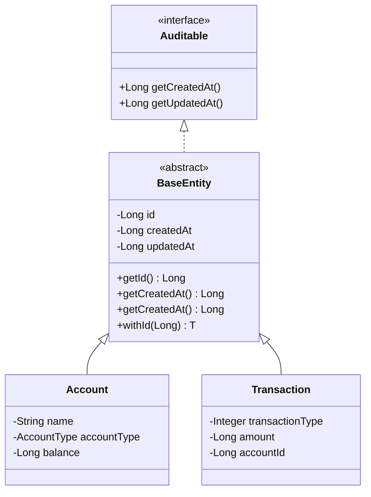

本页面详细说明项目中 Lombok 注解的使用规范以及 Entity 到 DTO 映射的实现模式。这些规范确保了代码的简洁性、一致性以及类型安全。

## Lombok 注解规范

### 基础实体类注解模式

项目采用统一的 Lombok 注解配置策略，核心模式定义在 `BaseEntity` 基类中：



关键注解组合如下：

| 注解 | 作用域 | 作用 |
|------|--------|------|
| `@Getter` | 类级别 | 自动生成所有字段的 getter 方法 |
| `@NoArgsConstructor(access = AccessLevel.PROTECTED)` | 类级别 | 生成受保护的无参构造函数，供 JPA 实体 hydration 使用 |
| `@AllArgsConstructor` | 类级别 | 生成全参构造函数，配合 Builder 使用 |
| `@Builder(toBuilder = true)` | 类级别 | 启用建造者模式，同时支持 toBuilder 复制 |

`BaseEntity` 中的 `withId()` 方法是唯一允许直接设置 ID 的入口，仅用于测试夹具场景：

```java
// BaseEntity.java (lines 36-40)
@SuppressWarnings("unchecked")
public <T extends BaseEntity> T withId(Long id) {
    this.id = id;
    return (T) this;
}
```

所有业务代码中禁止使用 setter，通过 Builder 模式构建实体确保不可变性。

### 实体类完整示例

以 `Account` 实体为例展示完整注解配置：

```java
// Account.java
@Entity
@Table(name = "accounts")
@Getter
@Builder(toBuilder = true)
@NoArgsConstructor(access = AccessLevel.PROTECTED)
@AllArgsConstructor
public class Account extends BaseEntity {

    @Column(nullable = false, length = 64)
    private String name;

    @Column(name = "account_type", nullable = false, length = 20)
    @Enumerated(EnumType.STRING)
    private AccountType accountType;

    @Column(nullable = false, length = 3)
    private String currency = "USD";

    /** Balance in cents (fen) */
    @Column(nullable = false)
    private Long balance = 0L;

    @Column(name = "user_id", nullable = false)
    private Long userId;

    @Column(length = 255)
    private String description;

    @Column
    private Boolean deleted = false;
}
```

`Transaction`、`Category`、`User` 等实体均采用此模式，确保代码风格一致。

Sources: [Account.java](backend/src/main/java/com/bookkeeping/core/account/Account.java#L1-L50)
Sources: [BaseEntity.java](backend/src/main/java/com/bookkeeping/common/BaseEntity.java#L1-L53)

### 独立实体（非继承 BaseEntity）

某些实体不继承 `BaseEntity`，如 `Tag` 和 `Budget`，采用简化的注解配置：

```java
// Tag.java
@Entity
@Table(name = "tags")
@Getter
@Builder(toBuilder = true)
@NoArgsConstructor(access = AccessLevel.PROTECTED)
@AllArgsConstructor
public class Tag {
    @Id
    @GeneratedValue(strategy = GenerationType.IDENTITY)
    private Long id;
    
    @Column(nullable = false)
    private Long userId;
    
    @Column(nullable = false)
    private String name;
    
    @Column(length = 7)
    private String color;
    
    // ... other fields
}
```

Sources: [Tag.java](backend/src/main/java/com/bookkeeping/core/tag/Tag.java#L1-L35)

## DTO 映射规范

### MapStructPlus 自动映射

项目使用 MapStructPlus 实现 Entity 到 DTO 的自动映射。DTO 定义为 Java record，通过 `@MapperAuto` 注解声明映射关系：

```java
// AccountDto.java
@MapperAuto(sourceEntity = Account.class, direction = Direction.From)
public record AccountDto(
    Long id,
    String name,
    AccountType accountType,
    String currency,
    Long balance,
    Long userId,
    String description
) {}
```

映射方向 `Direction.From` 表示从 Entity 到 DTO 的单向映射。

Sources: [AccountDto.java](backend/src/main/java/com/bookkeeping/core/account/AccountDto.java#L1-L21)

### Service 层中的映射使用

在 Service 中注入对应的 Mapper 组件，使用流式 API 完成批量转换：

```java
// AccountService.java
@Service
public class AccountService {

    private final AccountMapper accountMapper;
    private final AccountRepository accountRepository;

    // 获取用户账户列表
    @Transactional(readOnly = true)
    public List<AccountDto> getCurrentUserAccounts() {
        Long userId = securityUtils.requireCurrentUser().getId();
        return accountRepository.findByUserIdAndDeletedFalse(userId).stream()
                .map(accountMapper::toDto)
                .toList();
    }

    // 获取单个账户
    @Transactional(readOnly = true)
    public AccountDto getAccount(Long id) {
        Long userId = securityUtils.requireCurrentUser().getId();
        Account account = accountRepository.findByIdAndUserIdAndDeletedFalse(id, userId)
                .orElseThrow(() -> new BusinessException(ResultCode.ACCOUNT_NOT_FOUND, "Account not found"));
        return accountMapper.toDto(account);
    }
}
```

Sources: [AccountService.java](backend/src/main/java/com/bookkeeping/core/account/AccountService.java#L14-L49)

### Request DTO 与验证

Create/Update 请求使用 record 定义，配合 Jakarta Validation 注解实现参数校验：

```java
// CreateAccountRequest.java
public record CreateAccountRequest(
    @NotBlank(message = "Account name is required")
    @Size(min = 1, max = 64, message = "Account name must be 1-64 characters")
    String name,

    @NotNull(message = "Account type is required")
    AccountType accountType,

    @NotBlank(message = "Currency is required")
    @Size(min = 3, max = 3, message = "Currency must be 3 characters")
    String currency,

    Long initialBalance,

    @Size(max = 255, message = "Description must be at most 255 characters")
    String description
) {
    // Compact constructor for default values
    public CreateAccountRequest {
        if (initialBalance == null) initialBalance = 0L;
    }
}
```

Sources: [CreateAccountRequest.java](backend/src/main/java/com/bookkeeping/core/account/CreateAccountRequest.java#L1-L32)

### 手动构造的复杂 DTO

对于需要聚合多个数据源或包含计算字段的 DTO，采用手动构造方式。`BudgetDto` 是典型示例：

```java
// BudgetDto.java - 纯数据 DTO
public record BudgetDto(
    Long id,
    Long categoryId,
    String categoryName,
    Long amount,
    Integer year,
    Integer month,
    Long spent,
    Double percentUsed
) {}
```

在 `BudgetService` 中通过 `toDtoWithSpent()` 方法构造：

```java
// BudgetService.java (lines 87-114)
private BudgetDto toDtoWithSpent(Budget budget, Long userId) {
    // Get category name
    String categoryName = categoryService.getCategoryById(budget.getCategoryId())
            .map(c -> c.name())
            .orElse("Unknown");

    // Calculate spent amount for this category in this month
    LocalDate startDate = LocalDate.of(budget.getYear(), budget.getMonth(), 1);
    LocalDate endDate = startDate.plusMonths(1);
    long startTime = startDate.atStartOfDay(ZoneId.systemDefault()).toEpochSecond();
    long endTime = endDate.atStartOfDay(ZoneId.systemDefault()).toEpochSecond();

    // Sum all expenses for this category in this month
    List<?> transactions = transactionRepository.findByUserIdAndMonth(userId, startTime, endTime);
    long spent = transactions.stream()
            .filter(tx -> tx instanceof Transaction)
            .map(tx -> (Transaction) tx)
            .filter(tx -> tx.getCategoryId() != null && 
                        tx.getCategoryId().equals(budget.getCategoryId()) && 
                        tx.getTransactionType() == 3)
            .mapToLong(Transaction::getAmount)
            .sum();

    double percentUsed = budget.getAmount() > 0 ? (spent * 100.0 / budget.getAmount()) : 0;

    return new BudgetDto(budget.getId(), budget.getCategoryId(), categoryName, 
            budget.getAmount(), budget.getYear(), budget.getMonth(), spent, percentUsed);
}
```

Sources: [BudgetService.java](backend/src/main/java/com/bookkeeping/core/budget/BudgetService.java#L87-L114)

## Builder 模式使用规范

### 创建实体

使用 `Entity.builder().field(value)...build()` 模式：

```java
// AccountService.createAccount() - lines 64-75
Account account = Account.builder()
        .name(request.name())
        .accountType(request.accountType())
        .currency(request.currency())
        .balance(request.initialBalance())
        .userId(userId)
        .description(request.description())
        .deleted(false)
        .build();

Account saved = accountRepository.save(account);
return accountMapper.toDto(saved);
```

### 更新实体（保留不变字段）

使用 `toBuilder()` 模式仅修改需要变更的字段：

```java
// AccountService.updateAccount() - lines 87-101
Account.AccountBuilder builder = account.toBuilder();
if (request.name() != null) {
    if (!request.name().equals(account.getName()) 
            && accountRepository.existsByNameAndUserIdAndDeletedFalse(request.name(), userId)) {
        throw new BusinessException(ResultCode.ACCOUNT_ALREADY_EXISTS,
                "Account with name '" + request.name() + "' already exists");
    }
    builder.name(request.name());
}
if (request.description() != null) {
    builder.description(request.description());
}

return accountMapper.toDto(accountRepository.save(builder.build()));
```

### 软删除模式

软删除使用 `toBuilder().deleted(true).build()` 设置删除标记：

```java
// AccountService.deleteAccount() - lines 113
accountRepository.save(account.toBuilder().deleted(true).build());
```

Sources: [AccountService.java](backend/src/main/java/com/bookkeeping/core/account/AccountService.java#L1-L134)

## 构建依赖配置

Lombok 与 MapStruct/MapStructPlus 的注解处理顺序非常重要，`build.gradle.kts` 中配置如下：

```kotlin
// build.gradle.kts (lines 60-69)
// Lombok + MapStruct (order matters: Lombok first for lombok-mapstruct-binding)
compileOnly("org.projectlombok:lombok:1.18.38")
annotationProcessor("org.projectlombok:lombok:1.18.38")
implementation("org.mapstruct:mapstruct:1.6.3")
annotationProcessor("org.mapstruct:mapstruct-processor:1.6.3")
annotationProcessor("org.projectlombok:lombok-mapstruct-binding:0.2.0")

// MapStructPlus (custom annotation processor - for entity to DTO mapping)
implementation("com.jcwhmn:mapstruct-plus:1.0.0-SNAPSHOT")
annotationProcessor("com.jcwhmn:mapstruct-plus:1.0.0-SNAPSHOT")
```

关键点：
1. Lombok 注解处理器必须首先配置
2. `lombok-mapstruct-binding` 连接 Lombok 和 MapStruct
3. MapStructPlus 作为自定义注解处理器在最后配置

Sources: [build.gradle.kts](backend/build.gradle.kts#L60-L69)

## 模式总结

| 场景 | 模式 | 示例 |
|------|------|------|
| 响应 DTO | `@MapperAuto` + record | `AccountDto`、`TransactionDto` |
| 请求 DTO | record + Jakarta Validation | `CreateAccountRequest` |
| 复杂 DTO | record + 手动构造 | `BudgetDto`、`StatisticsDto` |
| 创建实体 | `Entity.builder()...build()` | `Account.builder().name("现金").build()` |
| 更新实体 | `entity.toBuilder()...build()` | `account.toBuilder().name("新名称").build()` |
| 软删除 | `toBuilder().deleted(true).build()` | `account.toBuilder().deleted(true).build()` |
| 批量转换 | Stream + Mapper | `.map(accountMapper::toDto).toList()` |

## 延伸阅读

- [应用配置 - application.yml 与多环境支持](17-ying-yong-pei-zhi-application-yml-yu-duo-huan-jing-zhi-chi) - 了解 Lombok 插件在 IDE 中的配置要求
- [测试策略 - 单元测试与集成测试](15-ce-shi-ce-lue-dan-yuan-ce-shi-yu-ji-cheng-ce-shi) - 查看如何在测试中使用 Builder 模式创建测试数据
- [API 设计规范 - 统一响应格式与错误码](8-api-she-ji-gui-fan-tong-xiang-ying-ge-shi-yu-cuo-wu-ma) - 了解 `ApiResponse` 包装类的使用