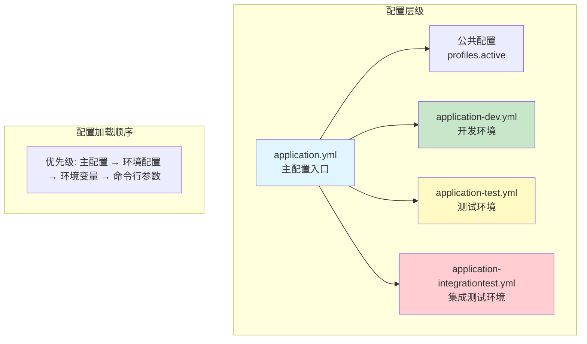
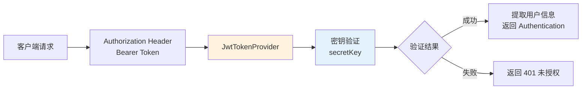
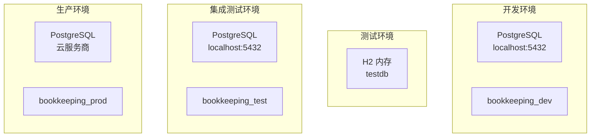

在复式记账系统中，配置管理是连接开发环境与生产环境的关键桥梁。本页文档详细解析 Spring Boot 的配置文件体系、环境切换机制，以及各环境下的核心配置参数。通过理解这套配置架构，开发者可以灵活地在不同环境间切换，同时确保敏感信息的安全管理。

## 配置体系架构

项目采用 Spring Boot 的标准多文档配置模式，通过 `application.yml` 作为主配置入口，结合 `application-{profile}.yml` 实现环境特定配置的分层管理。这种设计遵循了"约定优于配置"的原则，让不同环境的差异化配置能够清晰分离。



配置文件的加载遵循特定顺序：首先是 `application.yml` 加载公共基础配置，随后根据 `spring.profiles.active` 激活的环境配置进行覆盖。环境变量和命令行参数拥有最高优先级，可以在不修改文件的情况下动态调整配置。

Sources: [application.yml](backend/src/main/resources/application.yml#L1-L28)
Sources: [application-dev.yml](backend/src/main/resources/application-dev.yml#L1-L24)

## 主配置文件详解

主配置文件 `application.yml` 位于 `backend/src/main/resources/` 目录，定义了所有环境共用的核心配置。这些配置是应用程序的基础运行参数，不因环境差异而改变。

```yaml
spring:
  application:
    name: bookkeeping
  profiles:
    active: dev  # 默认激活开发环境

server:
  port: 8080     # 服务端口

management:
  endpoints:
    web:
      exposure:
        include: health,info
  endpoint:
    health:
      show-details: always

jwt:
  secret: ${JWT_SECRET:your-256-bit-secret-key-here-change-in-production-minimum-32-chars}
  access-token-expiry: 1800
  refresh-token-expiry: 2592000

springdoc:
  api-docs:
    path: /api-docs
  swagger-ui:
    path: /swagger-ui.html
```

关键配置项说明：

| 配置项 | 说明 | 默认值 | 建议值 |
|--------|------|--------|--------|
| `spring.application.name` | 应用程序名称，用于服务注册 | bookkeeping | 根据实际项目命名 |
| `spring.profiles.active` | 默认激活的环境 | dev | 生产环境应为 prod |
| `server.port` | HTTP 服务端口 | 8080 | 保持默认或根据需求调整 |
| `management.endpoints` | 监控端点暴露配置 | health, info | 生产环境应限制暴露 |
| `jwt.secret` | JWT 签名密钥 | 内置默认 | 必须通过环境变量覆盖 |
| `jwt.access-token-expiry` | Access Token 有效期（秒） | 1800 (30分钟) | 15-30分钟 |
| `jwt.refresh-token-expiry` | Refresh Token 有效期（秒） | 2592000 (30天) | 7-30天 |

主配置文件中的 JWT 密钥使用了环境变量占位符语法 `${JWT_SECRET:default}`，这种写法允许在没有设置 `JWT_SECRET` 环境变量时使用默认值。在生产环境中，**必须通过环境变量或配置中心覆盖此默认值**。

Sources: [application.yml](backend/src/main/resources/application.yml#L1-L28)

## 环境配置文件对比

项目在三个不同的源代码目录下维护了三个环境的配置文件，分别用于单元测试、集成测试和开发环境。这种分离确保了不同测试场景的隔离性，避免测试数据污染实际开发数据。

| 环境 | 配置文件路径 | 数据库 | Flyway | 主要用途 |
|------|--------------|--------|--------|----------|
| 开发环境 | `src/main/resources/application-dev.yml` | PostgreSQL (localhost:5432) | 启用 | 本地开发调试 |
| 测试环境 | `src/test/resources/application-test.yml` | H2 内存数据库 | 禁用 | 单元测试 |
| 集成测试环境 | `src/integrationTest/resources/application-integrationtest.yml` | PostgreSQL (localhost:5432) | 禁用 | 端到端测试 |

### 开发环境配置

```yaml
spring:
  datasource:
    url: jdbc:postgresql://localhost:5432/bookkeeping_dev
    username: bookkeeping
    password: ${DB_PASSWORD:test123}
  jpa:
    hibernate:
      ddl-auto: none
    show-sql: false
  flyway:
    enabled: true
    locations: classpath:db/migration
    baseline-on-migrate: true
    table: flyway_schema_history

jwt:
  secret: ${JWT_SECRET:bookkeepingSecretKeyForDevelopmentOnly12345678901234567890}

logging:
  level:
    root: INFO
    org.flywaydb: DEBUG
```

开发环境配置特点：

- **数据库连接**：指向本地 PostgreSQL 的 `bookkeeping_dev` 数据库，通过 `${DB_PASSWORD:test123}` 语法支持从环境变量读取密码
- **Flyway 迁移**：启用数据库版本管理，迁移脚本位于 `classpath:db/migration`
- **日志级别**：Flyway 相关日志设为 DEBUG，便于追踪数据库迁移过程

Sources: [application-dev.yml](backend/src/main/resources/application-dev.yml#L1-L24)

### 测试环境配置

```yaml
spring:
  datasource:
    url: jdbc:h2:mem:testdb;DB_CLOSE_DELAY=-1;MODE=PostgreSQL
    username: sa
    password: 
    driver-class-name: org.h2.Driver
  jpa:
    hibernate:
      ddl-auto: create-drop
    show-sql: false
  flyway:
    enabled: false  # 单元测试禁用 Flyway

jwt:
  secret: testSecretKeyForUnitTestingOnly123456789012345678901234567890
  expiration: 86400000
```

测试环境配置特点：

- **H2 内存数据库**：使用 `jdbc:h2:mem:testdb` 创建内存数据库，`DB_CLOSE_DELAY=-1` 确保数据库连接在最后一个连接关闭后仍保持可用
- **Hibernate DDL-auto**：设为 `create-drop`，测试结束时自动清理数据库
- **Flyway 禁用**：单元测试不依赖数据库迁移，使用 JPA 的 schema 自动生成

Sources: [application-test.yml](backend/src/test/resources/application-test.yml#L1-L19)

### 集成测试环境配置

```yaml
spring:
  application:
    name: bookkeeping-test
  datasource:
    url: jdbc:postgresql://localhost:5432/bookkeeping_test
    username: bookkeeping
    password: test123
  jpa:
    hibernate:
      ddl-auto: create-drop
    show-sql: false
  flyway:
    enabled: false  # 集成测试禁用 Flyway

jwt:
  secret: test-secret-key-for-integration-testing-minimum-32-chars
  access-token-expiry: 1800
  refresh-token-expiry: 2592000
```

集成测试环境配置特点：

- **独立测试数据库**：使用 `bookkeeping_test` 数据库，与开发环境的 `bookkeeping_dev` 完全隔离
- **Hibernate create-drop**：每次测试运行时重新创建数据库结构
- **Flyway 禁用**：集成测试使用测试数据初始化器而非 Flyway 迁移

Sources: [application-integrationtest.yml](backend/src/integrationTest/resources/application-integrationtest.yml#L1-L28)

## JWT 配置深度解析

JWT (JSON Web Token) 是本系统身份认证的核心机制。在配置文件中，JWT 相关参数分散在主配置和环境配置中，需要统一理解其配置结构。



JwtTokenProvider 类通过 `@Value` 注解注入配置参数：

```java
public JwtTokenProvider(
        @Value("${jwt.secret:defaultSecretKeyForDevelopmentOnly12345678901234567890}") String secret,
        @Value("${jwt.expiration:86400000}") long expirationMs) {
    this.secretKey = Keys.hmacShaKeyFor(secret.getBytes(StandardCharsets.UTF_8));
    this.expirationMs = expirationMs;
}
```

注意一个重要的配置一致性注意：主配置文件使用 `jwt.access-token-expiry` 和 `jwt.refresh-token-expiry`，但 `JwtTokenProvider` 期望的却是 `jwt.expiration` 参数。这是目前配置体系中存在的不一致点，在后续重构中应当统一参数命名。

Sources: [JwtTokenProvider.java](backend/src/main/java/com/bookkeeping/config/security/JwtTokenProvider.java#L31-L36)

## 配置环境切换机制

Spring Boot 提供了多种方式切换运行环境，开发者应根据场景选择最适合的方法。

### 方式一：配置文件指定

在 `application.yml` 中设置 `spring.profiles.active`：

```yaml
spring:
  profiles:
    active: dev  # 切换为开发环境
```

### 方式二：环境变量

```bash
# Linux/macOS
export SPRING_PROFILES_ACTIVE=prod

# Windows
set SPRING_PROFILES_ACTIVE=prod
```

### 方式三：命令行参数

```bash
java -jar bookkeeping.jar --spring.profiles.active=prod
```

### 方式四：application-{profile}.yml 文件命名

Spring Boot 会自动检测与激活 profile 同名的配置文件，无需显式引用。例如激活 `dev` profile 时，系统会自动加载 `application-dev.yml`。

| 切换方式 | 优先级 | 适用场景 |
|----------|--------|----------|
| 命令行参数 | 最高 | 运维人员快速切换环境 |
| 环境变量 | 中 | Docker / CI/CD 环境 |
| application.yml | 最低 | 默认环境配置 |
| VM 参数 | 最高 | 特殊部署场景 |

## 数据库连接配置

数据库配置是应用运行的核心依赖，不同环境使用不同的数据库实例以确保隔离性。



Docker Compose 提供了本地 PostgreSQL 环境的快速启动：

```yaml
services:
  bookkeeping-db:
    image: postgres:18.3
    container_name: bookkeeping-db
    environment:
      POSTGRES_USER: bookkeeping
      POSTGRES_PASSWORD: test123
    ports:
      - "5432:5432"
    healthcheck:
      test: ["CMD-SHELL", "pg_isready -U bookkeeping"]
      interval: 10s
      timeout: 5s
      retries: 5
```

Sources: [docker-compose.yml](docker-compose.yml#L1-L21)

## 安全配置与环境隔离

安全配置通过 Spring Security 的 Java 配置类实现，与环境无关的配置集中在 `SecurityConfig` 中。

```java
@Bean
public CorsConfigurationSource corsConfigurationSource() {
    CorsConfiguration config = new CorsConfiguration();
    config.addAllowedOriginPattern("http://localhost:*");
    config.setAllowedMethods(List.of("GET", "POST", "PUT", "DELETE", "OPTIONS"));
    config.setAllowedHeaders(List.of("Authorization", "Content-Type", "Accept"));
    config.setAllowCredentials(true);
    config.setMaxAge(3600L);

    UrlBasedCorsConfigurationSource source = new UrlBasedCorsConfigurationSource();
    source.registerCorsConfiguration("/api/**", config);
    return source;
}
```

CORS 配置允许来自 `http://localhost:*` 的所有端口请求，这对于前端开发非常友好。生产环境中应将此配置替换为具体的域名白名单。

公开端点的安全配置在授权规则中明确定义：

```java
.requestMatchers(
    "/actuator/**",
    "/api/v1/health",
    "/api/v1/auth/login",
    "/api/v1/auth/register",
    "/api-docs/**",
    "/swagger-ui/**"
).permitAll()
```

Sources: [SecurityConfig.java](backend/src/main/java/com/bookkeeping/config/SecurityConfig.java#L36-L47)
Sources: [SecurityConfig.java](backend/src/main/java/com/bookkeeping/config/SecurityConfig.java#L67-L79)

## Flyway 数据库迁移配置

Flyway 配置通过 Java 配置类和 YAML 配置双重管理，确保数据库版本的一致性。

```java
@Configuration
@ConditionalOnProperty(name = "spring.flyway.enabled", havingValue = "true", matchIfMissing = true)
public class FlywayConfig {

    @Value("${spring.flyway.locations:classpath:db/migration}")
    private String locations;

    @Value("${spring.flyway.baseline-on-migrate:true}")
    private boolean baselineOnMigrate;

    @Value("${spring.flyway.table:flyway_schema_history}")
    private String table;

    @Bean(initMethod = "migrate")
    public Flyway flyway(DataSource dataSource) {
        return Flyway.configure()
                .dataSource(dataSource)
                .locations(locations.split(","))
                .baselineOnMigrate(baselineOnMigrate)
                .table(table)
                .load();
    }
}
```

`@ConditionalOnProperty` 注解确保只有在 `spring.flyway.enabled=true` 时才创建 Flyway Bean，默认值为 `matchIfMissing = true`，即如果未配置该属性则默认启用。

迁移脚本位于 `db/migration` 目录，命名遵循 `V{version}__{description}.sql` 格式：

| 脚本文件名 | 版本 | 说明 |
|------------|------|------|
| `V1__init.sql` | 1 | 初始化数据库结构 |
| `V2__accounts.sql` | 2 | 创建账户表 |
| `V3__categories_transactions.sql` | 3 | 创建分类和交易表 |
| `V4__tags.sql` | 4 | 创建标签系统 |
| `V5__budgets.sql` | 5 | 创建预算表 |

Sources: [FlywayConfig.java](backend/src/main/java/com/bookkeeping/config/FlywayConfig.java#L1-L34)

## 生产环境配置要点

将应用部署到生产环境时，需要特别注意以下配置项：

### 必需的环境变量

| 环境变量 | 说明 | 示例值 |
|----------|------|--------|
| `JWT_SECRET` | JWT 签名密钥（至少 32 字符） | `your-production-secret-key-minimum-32-chars-here` |
| `DB_PASSWORD` | PostgreSQL 数据库密码 | 从密钥管理服务获取 |
| `SPRING_PROFILES_ACTIVE` | 激活的生产环境 profile | `prod` |

### 生产配置建议

```yaml
# application-prod.yml (生产环境配置文件)
spring:
  datasource:
    url: jdbc:postgresql://${DB_HOST}:5432/bookkeeping_prod
    username: ${DB_USER}
    password: ${DB_PASSWORD}
    hikari:
      maximum-pool-size: 20
      minimum-idle: 5
      connection-timeout: 30000
  flyway:
    enabled: true
    locations: classpath:db/migration

jwt:
  secret: ${JWT_SECRET}  # 必须通过环境变量设置
  access-token-expiry: 900     # 生产环境缩短至 15 分钟
  refresh-token-expiry: 604800 # 7 天

logging:
  level:
    root: WARN
    com.bookkeeping: INFO

management:
  endpoints:
    web:
      exposure:
        include: health
  endpoint:
    health:
      show-details: when_authorized
```

### 关键安全措施

1. **密钥管理**：JWT 密钥和数据库密码必须存储在密钥管理服务（如 AWS Secrets Manager、Vault）中，而非代码仓库
2. **端口限制**：仅暴露必要的端口，数据库端口不应直接暴露给外部网络
3. **健康检查**：生产环境应使用 `when_authorized` 限制健康检查详情，避免信息泄露
4. **日志级别**：生产环境日志级别应为 WARN 或 ERROR，避免敏感信息输出

## 下一步学习

完成本页面阅读后，建议继续以下内容：

- **[认证机制 - JWT 令牌与安全配置](6-ren-zheng-ji-zhi-jwt-ling-pai-yu-an-quan-pei-zhi)** — 深入理解 JWT 在系统中的完整生命周期
- **[数据库连接 - PostgreSQL 连接池配置](18-shu-ju-ku-lian-jie-postgresql-lian-jie-chi-pei-zhi)** — 学习 HikariCP 连接池的优化配置