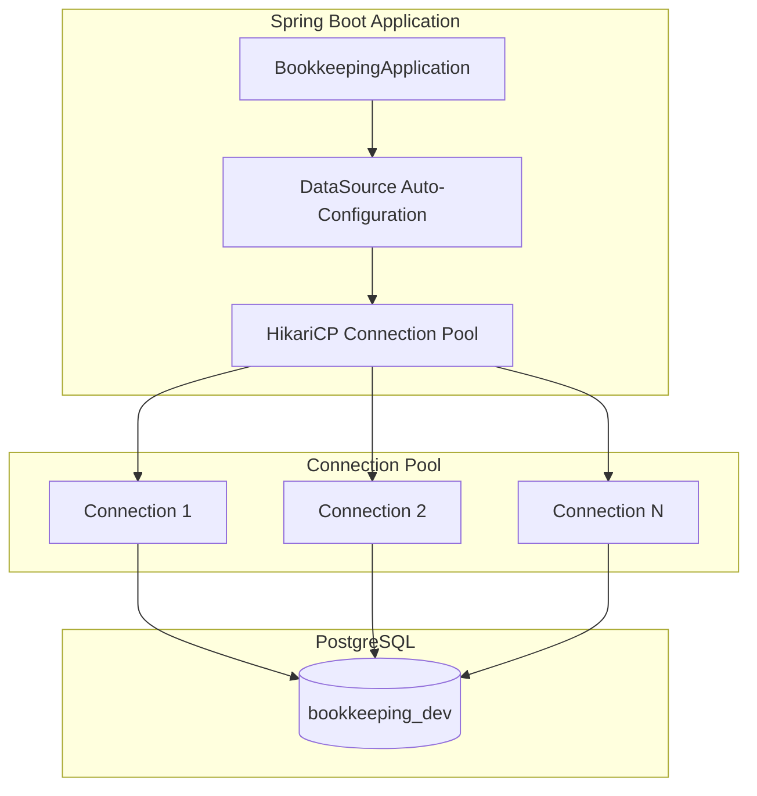
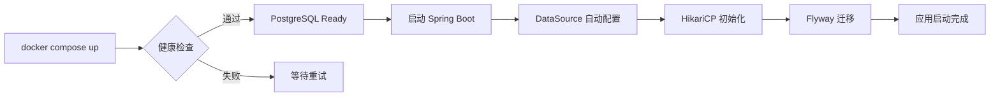

本页面详细说明记账系统的数据库连接配置，涵盖 HikariCP 连接池参数、数据源 URL 设计、多环境配置差异以及 Docker PostgreSQL 容器集成。通过对 `application-dev.yml`、`build.gradle.kts` 和 `docker-compose.yml` 等核心文件的解析，展示从开发到测试全流程的数据库连接管理方案。

## 技术选型：HikariCP 连接池

Spring Boot 默认采用 HikariCP 作为数据源连接池实现，其凭借轻量级设计和高效的连接管理机制，成为当前 Java 生态中最流行的数据库连接池方案之一。系统在 `build.gradle.kts` 中引入 `spring-boot-starter-data-jpa` 依赖，该 starter 默认包含 HikariCP 自动配置，无需额外添加依赖即可启用连接池功能。
Sources: [build.gradle.kts](backend/build.gradle.kts#L25-L27)



## 数据源基础配置

开发环境的数据源配置定义在 `application-dev.yml` 文件中，采用 Spring Boot 标准配置属性。连接参数包括 JDBC URL、用户名和密码三个核心要素，其中密码通过环境变量 `DB_PASSWORD` 注入，支持敏感信息的安全管理。
Sources: [application-dev.yml](backend/src/main/resources/application-dev.yml#L1-L7)

| 配置项 | 值 | 说明 |
|--------|-----|------|
| `spring.datasource.url` | `jdbc:postgresql://localhost:5432/bookkeeping_dev` | PostgreSQL JDBC 连接字符串 |
| `spring.datasource.username` | `bookkeeping` | 数据库用户名 |
| `spring.datasource.password` | `${DB_PASSWORD:test123}` | 密码从环境变量读取，默认 test123 |
| `spring.datasource.driver-class-name` | 自动检测 | Spring Boot 根据 URL 自动匹配 PostgreSQL 驱动 |

## JDBC URL 连接字符串设计

PostgreSQL JDBC URL 采用标准格式 `jdbc:postgresql://host:port/database`，本系统配置指向本地开发数据库。URL 中的各个组成部分决定了连接行为和性能特征，开发环境使用默认端口 5432，生产环境应通过环境变量动态注入以适应不同部署场景。
Sources: [application-dev.yml](backend/src/main/resources/application-dev.yml#L2)

```
jdbc:postgresql://localhost:5432/bookkeeping_dev
       │           │       │
       │           │       └── 数据库名称
       │           └── PostgreSQL 默认端口
       └── 本地开发环境主机
```

## 多环境数据源配置

系统为不同运行环境定义了独立的数据源配置，确保开发、测试和集成测试环境的隔离与一致性。各环境使用不同的数据库实例，避免测试数据污染开发数据。
Sources: [application-test.yml](backend/src/test/resources/application-test.yml#L1-L10)
Sources: [application-integrationtest.yml](backend/src/integrationTest/resources/application-integrationtest.yml#L4-L7)

| 环境 | 配置文件 | 数据源类型 | 连接地址 |
|------|----------|------------|----------|
| 开发环境 | `application-dev.yml` | PostgreSQL | `localhost:5432/bookkeeping_dev` |
| 单元测试 | `application-test.yml` | H2 内存数据库 | `jdbc:h2:mem:testdb` |
| 集成测试 | `application-integrationtest.yml` | PostgreSQL | `localhost:5432/bookkeeping_test` |

开发环境配置启用 Flyway 迁移管理数据库结构，测试环境则禁用迁移并使用 JPA 的 `ddl-auto: create-drop` 自动创建schema。这种差异化配置兼顾了开发便捷性和测试隔离性。
Sources: [application-dev.yml](backend/src/main/resources/application-dev.yml#L8-L11)

## HikariCP 连接池参数详解

虽然 Spring Boot 为 HikariCP 提供了开箱即用的默认值，但生产环境通常需要根据应用负载和数据库性能调优连接池参数。以下是关键的连接池配置项及其建议值：

```yaml
spring:
  datasource:
    hikari:
      maximum-pool-size: 10        # 最大连接数
      minimum-idle: 2              # 最小空闲连接
      connection-timeout: 30000    # 连接超时（毫秒）
      idle-timeout: 600000        # 空闲超时（毫秒）
      max-lifetime: 1800000       # 连接最大生命周期（毫秒）
      connection-test-query: SELECT 1  # 连接测试查询
```

HikariCP 的默认配置已经能够满足大多数开发场景，对于记账系统这类中低并发应用，默认的连接池大小（最大 10 个连接）已足够使用。如需在生产环境优化性能，可通过环境变量覆盖默认配置。

## Docker PostgreSQL 容器配置

系统通过 `docker-compose.yml` 定义 PostgreSQL 服务容器，提供标准化的数据库运行环境。容器使用 PostgreSQL 18.3 官方镜像，配置了健康检查确保数据库就绪后才允许应用连接。
Sources: [docker-compose.yml](docker-compose.yml#L1-L21)

```yaml
services:
  bookkeeping-db:
    image: postgres:18.3
    container_name: bookkeeping-db
    environment:
      POSTGRES_USER: bookkeeping
      POSTGRES_PASSWORD: test123
    ports:
      - "5432:5432"
    volumes:
      - postgres_data:/var/lib/postgresql
      - ./scripts/init-databases.sql:/docker-entrypoint-initdb.d/init-databases.sql
    healthcheck:
      test: ["CMD-SHELL", "pg_isready -U bookkeeping"]
      interval: 10s
      timeout: 5s
      retries: 5
```

容器初始化时执行 `init-databases.sql` 脚本，自动创建 `bookkeeping_dev` 和 `bookkeeping_test` 两个数据库实例，并授权 `bookkeeping` 用户访问。
Sources: [init-databases.sql](scripts/init-databases.sql#L1-L12)

开发环境还提供 `docker-compose.dev.yml` 覆盖配置，可启动独立的开发数据库实例（端口 5433），避免与共享开发数据库冲突。
Sources: [docker-compose.dev.yml](docker-compose.dev.yml#L1-L22)

## 数据库初始化脚本

`init-databases.sql` 在容器首次启动时自动执行，负责创建必要的数据库实例。该脚本使用 PostgreSQL 的 `CREATE DATABASE` 命令创建开发数据库和测试数据库，确保应用启动时数据库已就绪。
Sources: [init-databases.sql](scripts/init-databases.sql#L1-L26)

```sql
-- 创建开发数据库
CREATE DATABASE bookkeeping_dev;

-- 创建测试数据库
CREATE DATABASE bookkeeping_test;

-- 授予用户权限
GRANT ALL PRIVILEGES ON DATABASE bookkeeping_dev TO bookkeeping;
GRANT ALL PRIVILEGES ON DATABASE bookkeeping_test TO bookkeeping;
```

## 连接池与 Flyway 集成

系统使用 Flyway 进行数据库版本管理，FlywayConfig 配置类将 HikariCP 创建的 DataSource 直接注入 Flyway，实现迁移脚本与连接池的复用。这种设计确保数据库迁移使用与应用相同的连接池配置，包括连接超时和空闲超时等参数。
Sources: [FlywayConfig.java](backend/src/main/java/com/bookkeeping/config/FlywayConfig.java#L18-L27)

```java
@Bean(initMethod = "migrate")
public Flyway flyway(DataSource dataSource) {
    return Flyway.configure()
            .dataSource(dataSource)
            .locations(locations.split(","))
            .baselineOnMigrate(baselineOnMigrate)
            .table(table)
            .load();
}
```

## 快速启动指南

启动本地开发环境的完整流程如下：

1. **启动 PostgreSQL 容器**：执行 `scripts/start-db.bat` 或使用 Docker Compose

2. **等待数据库就绪**：健康检查通过后，容器即可接受连接

3. **启动应用**：运行 Spring Boot 应用，`application-dev.yml` 中的数据源配置自动生效

4. **验证连接**：Spring Boot 启动日志中会显示 HikariCP 连接池初始化信息，包括连接数和超时配置



## 故障排查

常见数据库连接问题及排查方法：

| 症状 | 可能原因 | 解决方案 |
|------|----------|----------|
| 连接超时 | PostgreSQL 容器未启动 | 执行 `docker ps` 检查容器状态 |
| 认证失败 | 用户名或密码错误 | 检查环境变量 `DB_PASSWORD` |
| 数据库不存在 | 数据库未创建 | 确认容器初始化脚本执行成功 |
| 连接池耗尽 | 并发请求过多 | 检查 `maximum-pool-size` 配置 |

连接池状态可通过 Spring Boot Actuator 的 `/actuator/health` 端点查看，其中包含数据库连接健康状态的详细信息。
Sources: [application.yml](backend/src/main/resources/application.yml#L11-L16)

## 相关资源

- [应用配置 - application.yml 与多环境支持](17-ying-yong-pei-zhi-application-yml-yu-duo-huan-jing-zhi-chi)：了解多环境配置管理
- [数据库设计 - Flyway 迁移与实体关系](7-shu-ju-ku-she-ji-flyway-qian-yi-yu-shi-ti-guan-xi)：数据库结构设计详情
- [后端结构 - Java 包组织与模块划分](4-hou-duan-jie-gou-java-bao-zu-zhi-yu-mo-kuai-hua-fen)：数据访问层架构设计