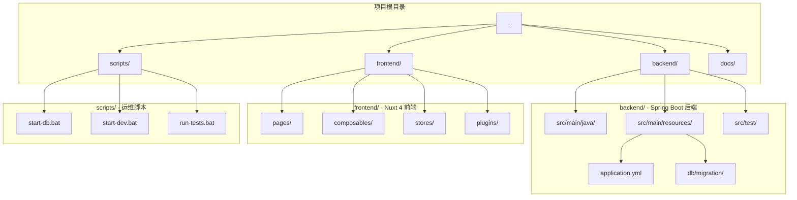
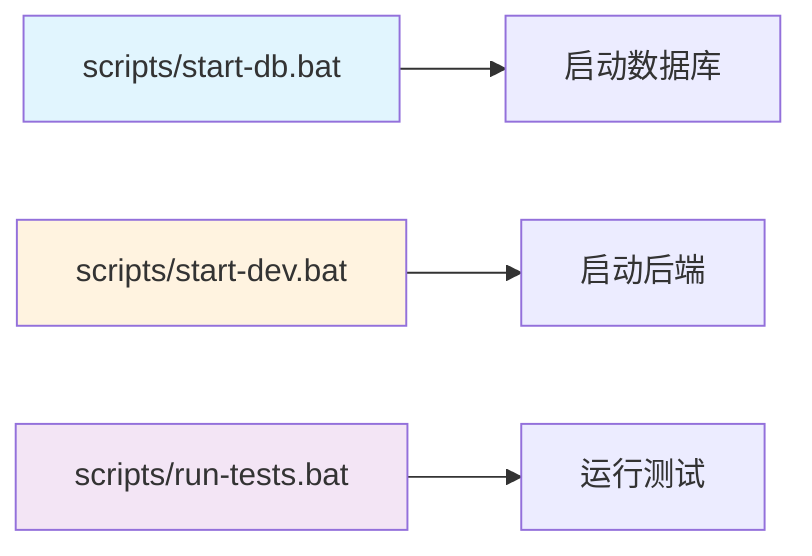

本文档面向初级开发者，介绍如何在本机搭建并运行 ezBookkeeping 个人记账应用。ezBookkeeping 是一个基于 Spring Boot 后端和 Nuxt 4 前端构建的全栈式个人财务管理系统，通过本指南，你将在 15 分钟内完成从零到可运行状态的完整环境配置。

## 环境要求与前置检查

在开始搭建之前，我们需要确认开发机器满足以下基本要求。ezBookkeeping 的技术栈要求开发者具备 Java 25、Node.js 20+ 以及 Docker 环境，这些组件的版本兼容性直接影响后续的构建与运行。

**硬件与软件要求**包括：操作系统支持 Windows 10/11、macOS 或 Linux；至少 8GB 内存（推荐 16GB）以满足后端编译和前端热重载的需求；至少 20GB 可用磁盘空间用于存放项目代码、容器镜像和数据库数据。

**核心依赖检查清单**：

| 组件 | 最低版本 | 检查命令 | 用途说明 |
|------|---------|----------|---------|
| Java (OpenJDK) | 25 | `java -version` | 后端运行时与编译 |
| Node.js | 20 LTS | `node -v` | 前端运行时 |
| pnpm | 8+ | `pnpm -v` | 前端包管理器 |
| Docker Desktop | 4.x | `docker --version` | 数据库容器化 |
| Gradle | 8.x | `gradle -v` | 后端构建工具（Wrapper 内置） |

Sources: [README.md](README.md#L1-L30), [build.gradle.kts](backend/build.gradle.kts#L9-L12)

确认 Docker Desktop 已启动是启动数据库的关键前提。在 Windows 环境下，建议通过 WSL2 后端运行 Docker，这能提供更好的性能表现和资源隔离。

## 项目结构概览

理解项目的目录结构有助于定位配置文件的归属和组件之间的交互关系。ezBookkeeping 采用前后端分离的 Monorepo 结构，根目录下分别包含 backend 和 frontend 两个独立子项目。



**关键目录职责说明**：

- `backend/` — Spring Boot 4.0 后端服务，包含 API 路由、业务逻辑和数据持久化层
- `frontend/` — Nuxt 4 前端应用，包含页面组件、状态管理和 UI 插件
- `scripts/` — 一键启动脚本，简化日常开发流程
- `docs/` — 项目文档、设计规范和进度追踪

Sources: [README.md](README.md#L1-L30), [.devcontainer/devcontainer.json](.devcontainer/devcontainer.json#L1-L31)

## 第一步：启动 PostgreSQL 数据库

ezBookkeeping 使用 PostgreSQL 17 作为主数据库，通过 Docker Compose 实现容器化部署。在启动后端服务之前，必须先确保数据库容器处于运行状态。

### 使用一键脚本启动数据库

项目在 `scripts/` 目录下提供了 Windows 批处理脚本，可以一键完成数据库的启动、初始化和状态检查。

```batch
# 双击 scripts/start-db.bat 或在终端中执行
scripts\start-db.bat
```

该脚本执行以下操作序列：首先检查 Docker 服务是否正常运行；然后停止并移除可能存在的旧数据库容器；接着使用 `docker-compose.yml` 配置启动新的 PostgreSQL 容器；最后验证数据库是否成功创建。

Sources: [scripts/start-db.bat](scripts/start-db.bat#L1-L51)

### Docker Compose 配置详解

核心的数据库配置定义在项目根目录的 `docker-compose.yml` 中：

```yaml
services:
  bookkeeping-db:
    image: postgres:18.3
    container_name: bookkeeping-db
    environment:
      POSTGRES_USER: bookkeeping
      POSTGRES_PASSWORD: test123
    ports:
      - "5432:5432"
    volumes:
      - postgres_data:/var/lib/postgresql
      - ./scripts/init-databases.sql:/docker-entrypoint-initdb.d/init-databases.sql
```

**配置参数说明**：

| 参数 | 默认值 | 说明 |
|------|--------|------|
| POSTGRES_USER | bookkeeping | 数据库用户名 |
| POSTGRES_PASSWORD | test123 | 数据库密码（开发环境） |
| 端口映射 | 5432:5432 | 宿主机端口:容器端口 |
| 初始化脚本 | init-databases.sql | 首次启动自动创建三个数据库 |

数据库初始化脚本会自动创建三个独立的数据库实例：`bookkeeping`（生产环境）、`bookkeeping_dev`（开发环境）和 `bookkeeping_test`（测试环境）。

Sources: [docker-compose.yml](docker-compose.yml#L1-L21), [scripts/init-databases.sql](scripts/init-databases.sql#L1-L26)

### 验证数据库连接

执行以下命令确认数据库已成功启动并可接受连接：

```bash
# 方式一：使用 Docker 命令检查容器健康状态
docker exec bookkeeping-db pg_isready -U bookkeeping

# 方式二：使用 psql 客户端连接测试
psql -h localhost -p 5432 -U bookkeeping -d bookkeeping -c "SELECT version();"
```

如果终端输出 `accepting connections` 或返回 PostgreSQL 版本信息，则表示数据库已就绪。

## 第二步：启动后端服务

数据库就绪后，下一步是启动 Spring Boot 后端服务。ezBookkeeping 后端运行在 8080 端口，提供 REST API 接口供前端调用。

### 使用 Gradle Wrapper 启动后端

项目内置了 Gradle Wrapper，无需预先安装 Gradle 客户端，直接使用 `gradlew` 命令即可执行构建和运行。

```bash
# 进入后端目录
cd backend

# 启动后端服务（默认加载 dev 配置）
./gradlew bootRun

# 或者使用 Windows 批处理脚本一键启动
scripts\start-dev.bat
```

Sources: [scripts/start-dev.bat](scripts/start-dev.bat#L1-L7), [backend/settings.gradle.kts](backend/settings.gradle.kts#L1-L1)

### 开发环境配置说明

Spring Boot 的配置文件位于 `backend/src/main/resources/` 目录下，按环境自动切换。主配置文件 `application.yml` 定义了公共配置项，开发环境专用配置 `application-dev.yml` 则覆盖了数据库连接和日志级别等参数。

**application.yml 公共配置**：

```yaml
spring:
  application:
    name: bookkeeping
  profiles:
    active: dev  # 默认激活 dev 环境

server:
  port: 8080     # 后端监听端口

jwt:
  secret: ${JWT_SECRET:your-256-bit-secret-key-here...}
  access-token-expiry: 1800     # 访问令牌 30 分钟有效期
  refresh-token-expiry: 2592000 # 刷新令牌 30 天有效期
```

**application-dev.yml 开发环境配置**：

```yaml
spring:
  datasource:
    url: jdbc:postgresql://localhost:5432/bookkeeping_dev  # 连接开发数据库
    username: bookkeeping
    password: ${DB_PASSWORD:test123}
  jpa:
    hibernate:
      ddl-auto: none    # 不自动修改表结构
    show-sql: false
  flyway:
    enabled: true
    locations: classpath:db/migration
    baseline-on-migrate: true
```

Flyway 数据库迁移在开发环境会自动执行，确保数据库 schema 与代码版本保持同步。

Sources: [application.yml](backend/src/main/resources/application.yml#L1-L28), [application-dev.yml](backend/src/main/resources/application-dev.yml#L1-L24)

### 后端启动日志解读

后端成功启动后，你将在控制台看到类似以下的日志输出：

```
2025-01-15 10:30:00.123  INFO 12345 --- [           main] c.b.BookkeepingApplication : 
    Starting BookkeepingApplication using Java 25.0.1 on...
2025-01-15 10:30:01.456  INFO 12345 --- [           main] o.s.b.w.embedded.tomcat.TomcatWebServer : 
    Tomcat initialized with port 8080
2025-01-15 10:30:02.789  INFO 12345 --- [           main] o.f.core.internal.command.DbMigrate : 
    Successfully applied 3 migrations (baseline)
```

最后一行 `Started BookkeepingApplication` 表示后端服务已完全就绪，API 接口可接受请求。

### 健康检查端点

后端服务启动后，可以通过以下端点验证服务状态：

```bash
# 健康检查（无需认证）
curl http://localhost:8080/healthz.json

# 预期响应
{
  "success": true,
  "result": {
    "status": "UP"
  }
}
```

## 第三步：启动前端应用

后端服务运行后，接下来启动 Nuxt 4 前端应用。前端默认运行在 3000 端口，会自动代理 API 请求到后端 8080 端口。

### 安装前端依赖

首次运行前端时，需要安装项目依赖。ezBookkeeping 使用 pnpm 作为包管理器。

```bash
# 进入前端目录
cd frontend

# 安装依赖
pnpm install

# 如果遇到网络问题，可使用淘宝镜像
pnpm config set registry https://registry.npmmirror.com
pnpm install
```

Sources: [frontend/package.json](frontend/package.json#L1-L24)

### Nuxt 配置解析

前端的配置文件 `nuxt.config.ts` 定义了模块加载、样式处理和国际化的相关配置。

```typescript
export default defineNuxtConfig({
  compatibilityDate: '2025-05-19',
  devtools: { enabled: true },
  modules: ['@nuxtjs/i18n', '@pinia/nuxt'],
  css: ['vuetify/styles', '@mdi/font/css/materialdesignicons.css'],
  build: { transpile: ['vuetify'] },
  runtimeConfig: {
    public: {
      apiBase: 'http://localhost:8080/api/v1',  # API 基础地址
    },
  },
  i18n: {
    defaultLocale: 'en-US',
    locales: [
      { code: 'en-US', iso: 'en-US', name: 'English' },
      { code: 'zh-CN', iso: 'zh-CN', name: '中文' },
    ],
  },
})
```

Sources: [frontend/nuxt.config.ts](frontend/nuxt.config.ts#L1-L48)

**前端技术栈说明**：

| 技术 | 版本 | 用途 |
|------|------|------|
| Nuxt | 4.4.6 | Vue 3 SSR 框架 |
| Vuetify | 4.0.7 | Material Design UI 组件库 |
| Pinia | 3.0.4 | 状态管理 |
| ECharts | 6.1.0 | 数据可视化图表 |
| i18n | 10.3.0 | 国际化支持 |

### 启动前端开发服务器

```bash
# 在 frontend 目录下执行
pnpm run dev
```

前端启动后，终端会显示类似输出：

```
  ➜  Local:   http://localhost:3000/
  ➜  Network: http://192.168.1.100:3000/
  ➜  API:     http://localhost:8080/api/v1
```

此时打开浏览器访问 `http://localhost:3000`，即可看到应用界面。

## 第四步：验证完整功能

前后端均启动后，通过以下验证点确认系统运行正常。

### 页面功能验证清单

| 验证项 | 访问地址 | 预期结果 |
|--------|----------|----------|
| 登录页面 | http://localhost:3000/login | 显示登录表单 |
| 注册功能 | http://localhost:3000/register | 可创建新用户 |
| 仪表盘 | http://localhost:3000/ | 展示收支概览 |
| 账户列表 | http://localhost:3000/accounts | 列出账户数据 |
| 交易记录 | http://localhost:3000/transactions | 展示交易列表 |

Sources: [frontend/pages](frontend/pages)

### API 接口验证

使用浏览器访问 Swagger UI 文档，验证 API 端点：

- Swagger UI: http://localhost:8080/swagger-ui.html
- OpenAPI 文档: http://localhost:8080/api-docs

## 一键启动脚本汇总

为提升开发效率，项目提供了以下批处理脚本，简化日常启动流程：



**脚本功能对照表**：

| 脚本文件 | 功能描述 | 前置条件 |
|----------|----------|----------|
| `start-db.bat` | 启动 PostgreSQL 容器 | Docker Desktop 运行中 |
| `start-dev.bat` | 启动 Spring Boot 后端 | 数据库已启动 |
| `run-tests.bat` | 执行单元测试 | 后端依赖已安装 |
| `stop-db.bat` | 停止数据库容器 | 无 |

Sources: [scripts/start-db.bat](scripts/start-db.bat), [scripts/start-dev.bat](scripts/start-dev.bat), [scripts/run-tests.bat](scripts/run-tests.bat)

## 常见问题排查

### Docker 容器启动失败

**症状**：执行 `start-db.bat` 后报错 "Docker is not running"

**解决方案**：
1. 确认 Docker Desktop 已安装并启动
2. 右键任务栏 Docker 图标，选择 "Open Docker Desktop"
3. 等待 Docker 引擎完全启动（状态栏图标变为绿色）
4. 重新执行 `start-db.bat`

### 数据库连接被拒绝

**症状**：后端启动日志显示 "Connection refused: localhost:5432"

**解决方案**：
1. 确认 PostgreSQL 容器正在运行：`docker ps | findstr postgres`
2. 检查端口是否被占用：`netstat -ano | findstr 5432`
3. 尝试重启容器：`docker restart bookkeeping-db`

### 前端无法连接后端 API

**症状**：浏览器控制台显示 "Failed to fetch" 或网络错误

**解决方案**：
1. 确认后端 8080 端口正常监听：`curl http://localhost:8080/healthz.json`
2. 检查 `nuxt.config.ts` 中的 `apiBase` 配置
3. 清除浏览器缓存后刷新页面

### pnpm 安装依赖失败

**症状**：`pnpm install` 执行报错或卡住

**解决方案**：
1. 清除缓存：`pnpm store prune`
2. 删除 lock 文件：`del pnpm-lock.yaml`
3. 重新安装：`pnpm install`

## 下一步学习路径

完成环境搭建后，建议按照以下顺序深入学习项目架构：

1. **[概述 - 项目定位与核心价值](1-gai-shu-xiang-mu-ding-wei-yu-he-xin-jie-zhi)** — 了解 ezBookkeeping 的设计理念和核心功能
2. **[系统架构 - Spring Boot + Nuxt 4 全栈设计](3-xi-tong-jia-gou-spring-boot-nuxt-4-quan-zhan-she-ji)** — 深入理解前后端分离架构
3. **[开发流程 - Discovery → Design → Implementation → Verification](14-kai-fa-liu-cheng-discovery-design-implementation-verification)** — 掌握规范化开发流程

祝你编码愉快！