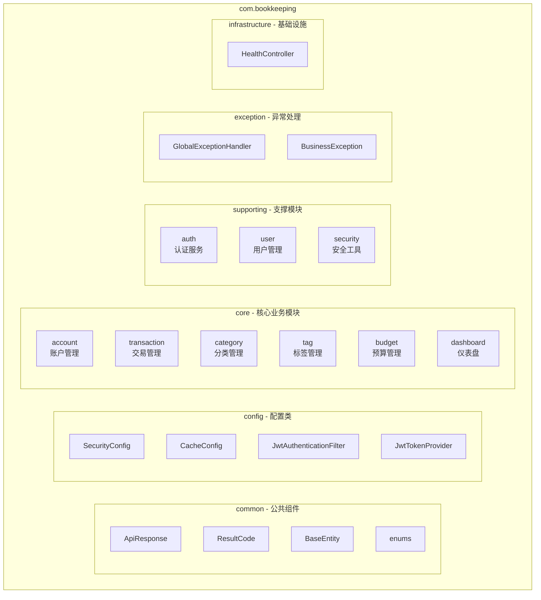
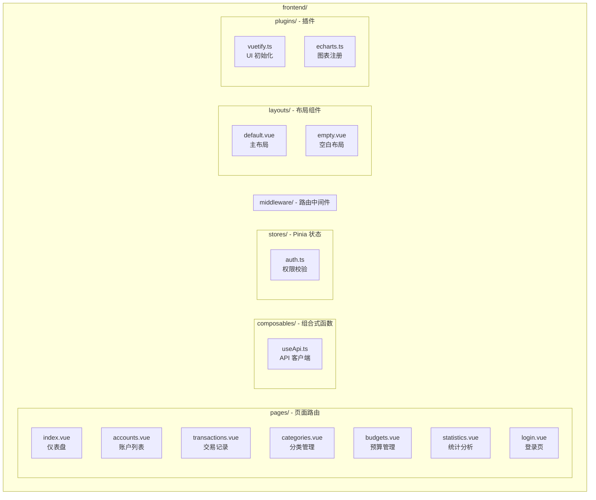
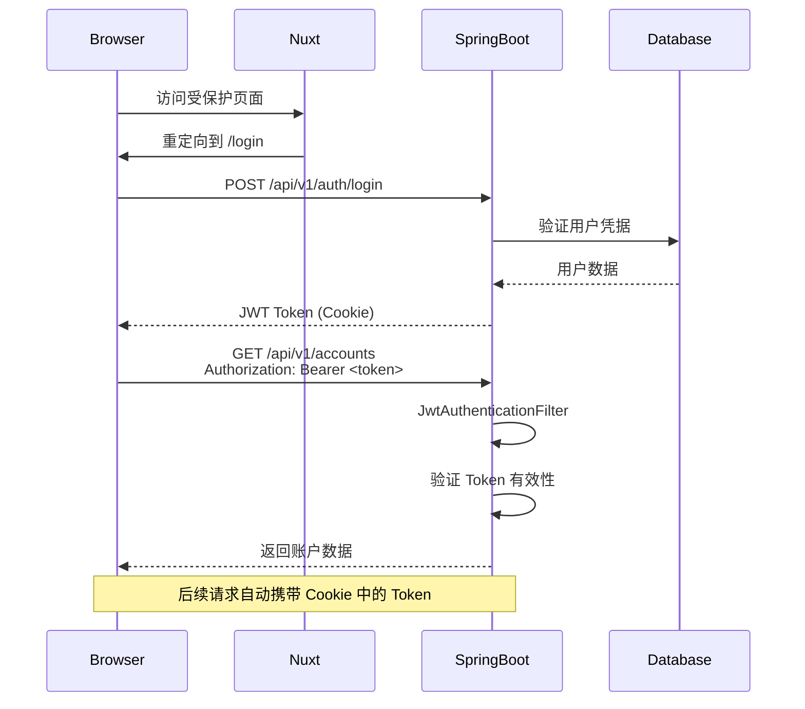
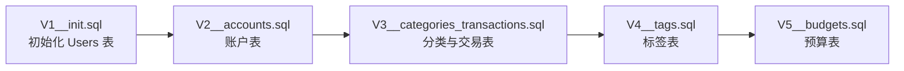
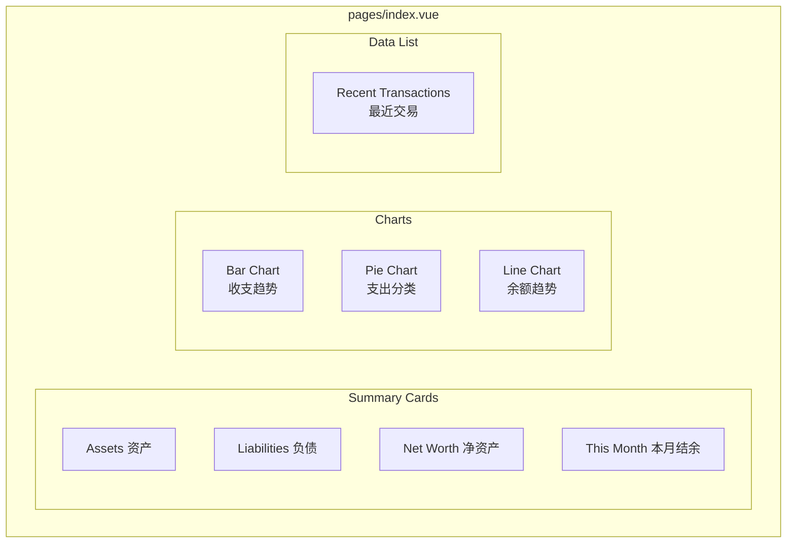
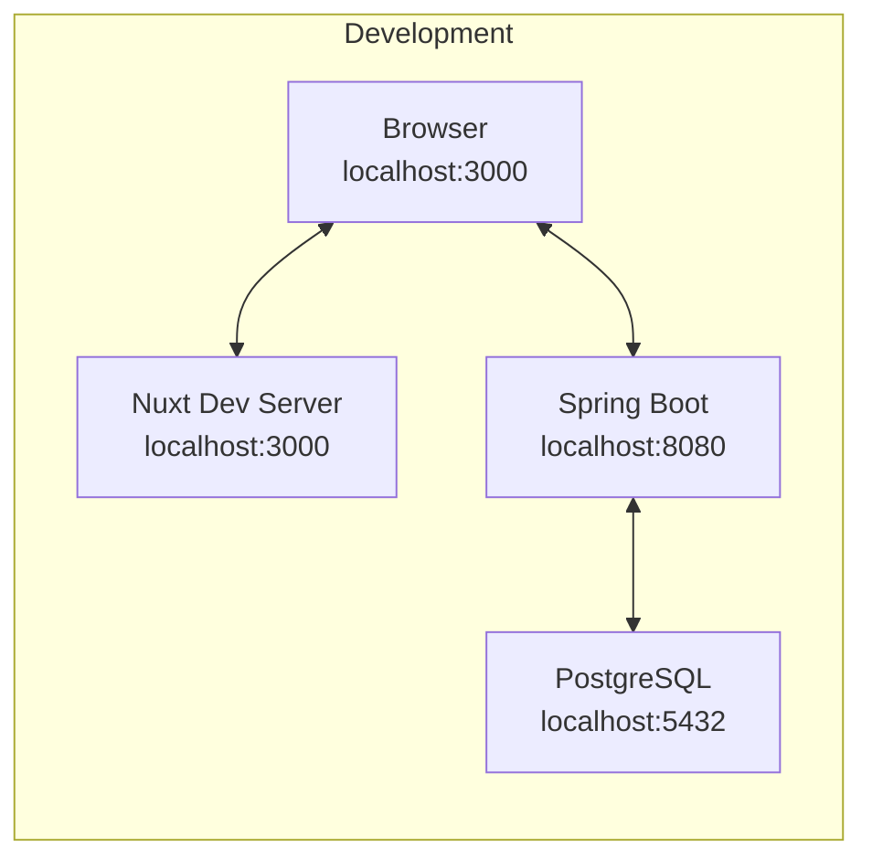

本文档详细阐述 ezBookkeeping 全栈应用的技术架构，涵盖后端 Spring Boot 服务的模块组织、前端 Nuxt 4 的页面与组件体系、安全认证机制以及 API 设计规范。通过架构图与代码引用，帮助开发者建立对整个系统的全局视图。

## 技术栈概览

本项目采用经典的前后端分离架构，后端使用 Java + Spring Boot 构建 RESTful API 服务，前端使用 Nuxt 4 + Vue 3 构建单页应用（SPA），两者通过 JSON API 进行通信。

### 技术栈对比

| 层级 | 技术选型 | 版本 | 用途 |
|------|----------|------|------|
| 后端框架 | Spring Boot | 4.0.6 | Web 服务、依赖注入、数据持久化 |
| 开发语言 | Java | 25 | 编译型语言，提供类型安全 |
| ORM 框架 | Spring Data JPA | - | JPA 抽象层，简化数据库操作 |
| 数据库迁移 | Flyway | 11.14.1 | 版本化数据库 schema 管理 |
| 数据库 | PostgreSQL | 18.3 | 关系型数据存储 |
| 认证方案 | JWT | 0.12.6 | 无状态令牌认证 |
| 前端框架 | Nuxt | 4.4.6 | SSR/SSG 框架，路由与状态管理 |
| UI 框架 | Vuetify | 4.0.7 | Material Design 组件库 |
| 图表库 | ECharts | 6.1.0 | 数据可视化 |
| 状态管理 | Pinia | 3.0.4 | Vue 3 官方推荐状态库 |

Sources: [backend/build.gradle.kts](backend/build.gradle.kts#L1-L126), [frontend/package.json](frontend/package.json#L1-L24), [docker-compose.yml](docker-compose.yml#L1-L21)

## 后端架构 - Spring Boot 模块组织

后端代码遵循清晰的包层次结构，按照职责边界将代码划分到不同模块。这种组织方式既符合领域驱动设计（DDD）的思想，又便于团队协作与代码维护。

### 包结构设计



每个核心业务模块（core.*）都遵循统一的三层结构：Controller 处理 HTTP 请求、Service 实现业务逻辑、Repository 负责数据访问。

Sources: [backend/src/main/java/com/bookkeeping](backend/src/main/java/com/bookkeeping#L1-L100)

### 核心依赖配置

后端采用 Gradle 作为构建工具，关键依赖包括 Spring Boot Starter 套件、数据库驱动、认证库与代码生成工具。

```groovy
// Spring Boot Starters
implementation("org.springframework.boot:spring-boot-starter-web")
implementation("org.springframework.boot:spring-boot-starter-data-jpa")
implementation("org.springframework.boot:spring-boot-starter-security")
implementation("org.springframework.boot:spring-boot-starter-validation")
implementation("org.springframework.boot:spring-boot-starter-cache")

// Database
implementation("org.postgresql:postgresql")
implementation("org.flywaydb:flyway-core:11.14.1")

// Security - JWT
implementation("io.jsonwebtoken:jjwt-api:0.12.6")

// DTO Mapping - MapStruct
implementation("org.mapstruct:mapstruct:1.6.3")
implementation("com.jcwhmn:mapstruct-plus:1.0.0-SNAPSHOT")
```

Sources: [backend/build.gradle.kts](backend/build.gradle.kts#L30-L70)

## 前端架构 - Nuxt 4 页面与组件体系

前端采用 Nuxt 4 框架构建，目录结构遵循 Nuxt 的约定式路由与组件组织规范。

### 目录结构与职责



Nuxt 4 的 `pages/` 目录自动生成路由，文件命名即路由路径。例如 `pages/accounts.vue` 对应 `/accounts` 路由，`pages/transactions.vue` 对应 `/transactions` 路由。

Sources: [frontend/nuxt.config.ts](frontend/nuxt.config.ts#L1-L48), [frontend/pages/index.vue](frontend/pages/index.vue#L1-L50)

### 前端模块配置

```typescript
export default defineNuxtConfig({
  modules: [
    '@nuxtjs/i18n',  // 国际化
    '@pinia/nuxt',    // 状态管理
  ],
  
  css: [
    'vuetify/styles',
    '@mdi/font/css/materialdesignicons.css',
  ],
  
  runtimeConfig: {
    public: {
      apiBase: 'http://localhost:8080/api/v1',
    },
  },
})
```

Nuxt 模块化的配置设计使功能扩展变得简单。通过 `modules` 数组声明需要的模块，`runtimeConfig` 定义运行时配置，前端可安全访问的公共配置通过 `public` 前缀暴露。

Sources: [frontend/nuxt.config.ts](frontend/nuxt.config.ts#L1-L48)

## 安全认证架构

项目采用 JWT（JSON Web Token）实现无状态认证，前端通过 Cookie 存储令牌，后端通过过滤器链验证每个请求的合法性。

### JWT 认证流程



### 安全配置详解

```java
@Configuration
@EnableWebSecurity
public class SecurityConfig {
    
    @Bean
    public SecurityFilterChain filterChain(HttpSecurity http) throws Exception {
        http
            // CORS 配置 - 允许本地开发
            .cors(cors -> cors.configurationSource(corsConfigurationSource()))
            
            // 禁用 CSRF - JWT 无状态认证不需要
            .csrf(AbstractHttpConfigurer::disable)
            
            // 无状态会话管理
            .sessionManagement(session -> session
                .sessionCreationPolicy(SessionCreationPolicy.STATELESS))
            
            // 授权规则
            .authorizeHttpRequests(auth -> auth
                // 公开端点
                .requestMatchers(
                    "/actuator/**",
                    "/api/v1/auth/login",
                    "/api/v1/auth/register",
                    "/swagger-ui/**",
                    "/api-docs/**"
                ).permitAll()
                // 其他请求需要认证
                .anyRequest().authenticated())
            
            // 添加 JWT 过滤器
            .addFilterBefore(jwtAuthenticationFilter, 
                UsernamePasswordAuthenticationFilter.class);
        
        return http.build();
    }
}
```

公开端点包括健康检查、认证接口（登录/注册）以及 API 文档。过滤器链在 `UsernamePasswordAuthenticationFilter` 之前插入 JWT 验证逻辑，确保所有受保护请求都经过认证检查。

Sources: [backend/src/main/java/com/bookkeeping/config/SecurityConfig.java](backend/src/main/java/com/bookkeeping/config/SecurityConfig.java#L1-L89), [backend/src/main/java/com/bookkeeping/config/security/JwtAuthenticationFilter.java](backend/src/main/java/com/bookkeeping/config/security/JwtAuthenticationFilter.java#L1-L73)

### 前端认证中间件

```typescript
// middleware/auth.ts
export default defineNuxtRouteMiddleware(() => {
  const token = useCookie<string>('token').value
  if (!token) {
    return navigateTo('/login')
  }
})
```

前端通过 Nuxt 中间件实现路由级别的权限控制。在需要认证的页面（如 `pages/index.vue`）中使用 `definePageMeta({ middleware: 'auth' })` 声明中间件依赖，访问时自动检查 Cookie 中的 Token。

Sources: [frontend/middleware/auth.ts](frontend/middleware/auth.ts#L1-L8), [frontend/pages/index.vue](frontend/pages/index.vue#L106)

## API 设计规范

### 统一响应格式

所有 API 响应采用标准信封（Envelope）格式，无论成功或失败都遵循一致的结构：

```java
@JsonInclude(JsonInclude.Include.NON_NULL)
public record ApiResponse<T>(
    @JsonProperty("success") boolean isSuccess,
    T result,
    Integer errorCode,
    String errorMessage
) {
    public static <T> ApiResponse<T> success(T data) {
        return new ApiResponse<>(true, data, null, null);
    }
    
    public static <T> ApiResponse<T> error(int errorCode, String errorMessage) {
        return new ApiResponse<>(false, null, errorCode, errorMessage);
    }
}
```

这种设计简化了前端解析逻辑，`success` 字段直接指示请求成败，`result` 携带数据，`errorCode` 与 `errorMessage` 提供错误详情。

Sources: [backend/src/main/java/com/bookkeeping/common/ApiResponse.java](backend/src/main/java/com/bookkeeping/common/ApiResponse.java#L1-L41)

### 错误码体系

错误码采用 `category * 100000 + subCategory * 1000 + index` 的编码规则，便于分类检索与扩展：

| 错误类别 | 错误码范围 | 示例 |
|----------|------------|------|
| 通用错误 | 1xxx | BAD_REQUEST(1001), UNAUTHORIZED(1002) |
| 认证错误 | 2xxx | AUTH_TOKEN_EXPIRED(2002), AUTH_TOKEN_INVALID(2003) |
| 用户错误 | 3xxx | USER_NOT_FOUND(3001), USER_ALREADY_EXISTS(3002) |
| 账户错误 | 4xxx | ACCOUNT_NOT_FOUND(4001), ACCOUNT_INVALID_BALANCE(4003) |
| 交易错误 | 6xxx | TRANSACTION_NOT_FOUND(6001), TRANSACTION_INSUFFICIENT_BALANCE(6002) |

Sources: [backend/src/main/java/com/bookkeeping/common/ResultCode.java](backend/src/main/java/com/bookkeeping/common/ResultCode.java#L1-L66)

### API 端点示例

```java
@RestController
@RequestMapping("/api/v1/accounts")
@Tag(name = "Accounts", description = "Account management APIs")
public class AccountController {

    @GetMapping
    @Operation(summary = "List accounts", description = "Get all accounts for the current user")
    public ApiResponse<List<AccountDto>> listAccounts() {
        return ApiResponse.success(accountService.getCurrentUserAccounts());
    }

    @PostMapping
    @Operation(summary = "Create account", description = "Create a new account")
    public ApiResponse<AccountDto> createAccount(@Valid @RequestBody CreateAccountRequest request) {
        return ApiResponse.success(accountService.createAccount(request));
    }
}
```

控制器使用 `@Tag` 注解提供 OpenAPI 分组描述，`@Operation` 注解定义每个端点的元信息，便于 Swagger UI 自动生成 API 文档。

Sources: [backend/src/main/java/com/bookkeeping/core/account/AccountController.java](backend/src/main/java/com/bookkeeping/core/account/AccountController.java#L1-L58), [backend/src/main/java/com/bookkeeping/supporting/auth/AuthController.java](backend/src/main/java/com/bookkeeping/supporting/auth/AuthController.java#L1-L46)

### 前端 API 客户端

```typescript
// composables/useApi.ts
async function request<T>(method: string, path: string, body?: unknown): Promise<T> {
  const headers: Record<string, string> = {
    'Content-Type': 'application/json',
    ...getAuthHeaders(),  // 自动附加 JWT Token
  }
  
  const res = await fetch(`${API_BASE}${path}`, options)
  const data = await res.json() as ApiResponse<T>
  
  if (!data.success) {
    throw createError({
      statusCode: data.errorCode || res.status,
      statusMessage: data.errorMessage || 'Unknown error',
    })
  }
  
  return data.result
}

export const useApi = () => ({
  get: <T>(path: string) => request<T>('GET', path),
  post: <T>(path: string, body?: unknown) => request<T>('POST', path, body),
  put: <T>(path: string, body?: unknown) => request<T>('PUT', path, body),
  delete: <T>(path: string) => request<T>('DELETE', path),
})
```

`useApi` 组合式函数封装了所有 API 调用逻辑，自动处理 Token 附加、响应解析与错误抛出。前端组件通过 `const api = useApi()` 获取 API 客户端实例。

Sources: [frontend/composables/useApi.ts](frontend/composables/useApi.ts#L1-L47)

## 数据库架构

### Flyway 迁移管理

数据库 schema 通过 Flyway 进行版本化管理，迁移脚本存放在 `backend/src/main/resources/db/migration/` 目录：



每个迁移脚本文件名前缀的数字决定执行顺序，确保数据库结构逐步演进而不出错。

Sources: [backend/src/main/resources/db/migration/V1__init.sql](backend/src/main/resources/db/migration/V1__init.sql#L1-L24), [backend/build.gradle.kts](backend/build.gradle.kts#L42-L43)

### 核心数据表设计

初始化脚本创建用户表：

```sql
CREATE TABLE users (
    id BIGSERIAL PRIMARY KEY,
    username VARCHAR(32) NOT NULL UNIQUE,
    email VARCHAR(100) NOT NULL UNIQUE,
    nickname VARCHAR(64),
    password VARCHAR(100) NOT NULL,
    salt VARCHAR(10) NOT NULL,
    default_currency VARCHAR(3) DEFAULT 'USD',
    language VARCHAR(10) DEFAULT 'en-US',
    created_at BIGINT NOT NULL,
    updated_at BIGINT NOT NULL
);
```

使用 BIGINT 存储时间戳而非 TIMESTAMP，简化跨时区处理与 Java 层的时间转换逻辑。

Sources: [backend/src/main/resources/db/migration/V1__init.sql](backend/src/main/resources/db/migration/V1__init.sql#L1-L24)

## 仪表盘与数据可视化

前端 Dashboard 页面展示了系统的核心数据聚合能力，通过多个 ECharts 图表呈现财务概览。

### 页面组件结构



页面采用响应式布局，Summary Cards 使用 `v-row` + `v-col` 实现网格布局，图表使用 `ClientOnly` 组件包裹以支持 SSR 场景下的客户端渲染。

Sources: [frontend/pages/index.vue](frontend/pages/index.vue#L1-L70)

### 图表数据处理

```typescript
// 月度收支柱状图
const monthlyBarOption = computed(() => {
  const now = new Date()
  const months: string[] = []
  const incomeData: number[] = []
  const expenseData: number[] = []
  
  for (let i = 5; i >= 0; i--) {
    const d = new Date(now.getFullYear(), now.getMonth() - i, 1)
    months.push(d.toLocaleDateString('en-US', { month: 'short' }))
    
    const monthTxs = transactions.value.filter(t => 
      t.transactionTime >= monthStart && t.transactionTime < monthEnd
    )
    
    incomeData.push(monthTxs.filter(t => t.transactionType === 2)
      .reduce((s, t) => s + t.amount, 0) / 100)
    expenseData.push(monthTxs.filter(t => t.transactionType === 3)
      .reduce((s, t) => s + t.amount, 0) / 100)
  }
  
  return {
    xAxis: { type: 'category', data: months },
    series: [
      { name: 'Income', data: incomeData, type: 'bar', itemStyle: { color: '#4CAF50' } },
      { name: 'Expense', data: expenseData, type: 'bar', itemStyle: { color: '#F44336' } }
    ]
  }
})
```

图表数据通过计算属性动态聚合，`/100` 是因为后端使用整数存储金额（分单位），前端展示时转换回元。

Sources: [frontend/pages/index.vue](frontend/pages/index.vue#L135-L170)

## 部署拓扑



开发环境中，三个服务分别运行在不同端口。前端通过 `runtimeConfig.public.apiBase` 配置的后端地址（`http://localhost:8080/api/v1`）进行 API 调用。

Sources: [frontend/nuxt.config.ts](frontend/nuxt.config.ts#L42-L46), [backend/src/main/resources/application.yml](backend/src/main/resources/application.yml#L1-L28), [docker-compose.yml](docker-compose.yml#L1-L21)

## 后续阅读建议

完成架构概览后，建议按以下路径深入学习：

1. **[后端结构 - Java 包组织与模块划分](4-hou-duan-jie-gou-java-bao-zu-zhi-yu-mo-kuai-hua-fen)** — 深入了解核心模块（Account、Transaction、Category）的实现细节
2. **[认证机制 - JWT 令牌与安全配置](6-ren-zheng-ji-zhi-jwt-ling-pai-yu-an-quan-pei-zhi)** — 深入理解 JWT 令牌的生成与验证机制
3. **[数据库设计 - Flyway 迁移与实体关系](7-shu-ju-ku-she-ji-flyway-qian-yi-yu-shi-ti-guan-xi)** — 深入了解数据表设计与关联关系