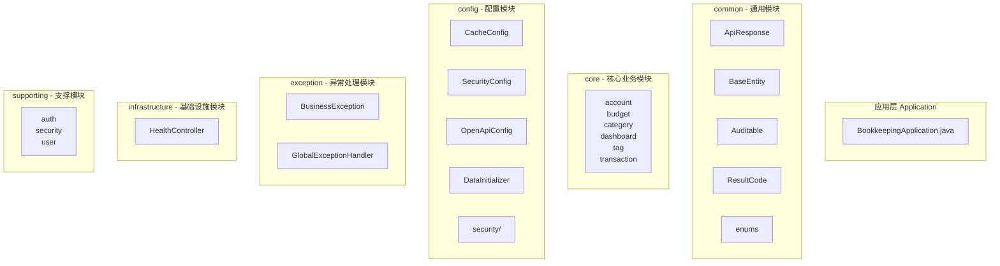
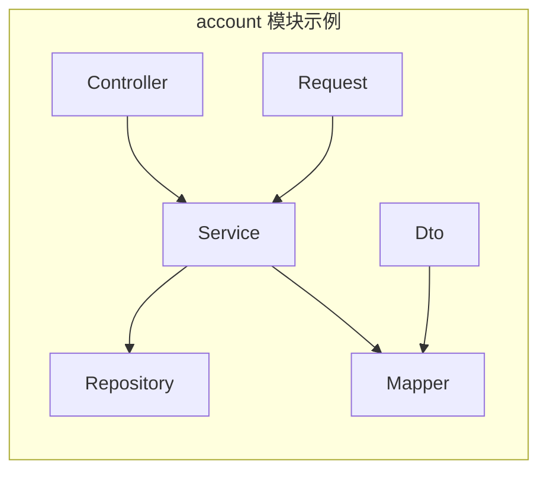
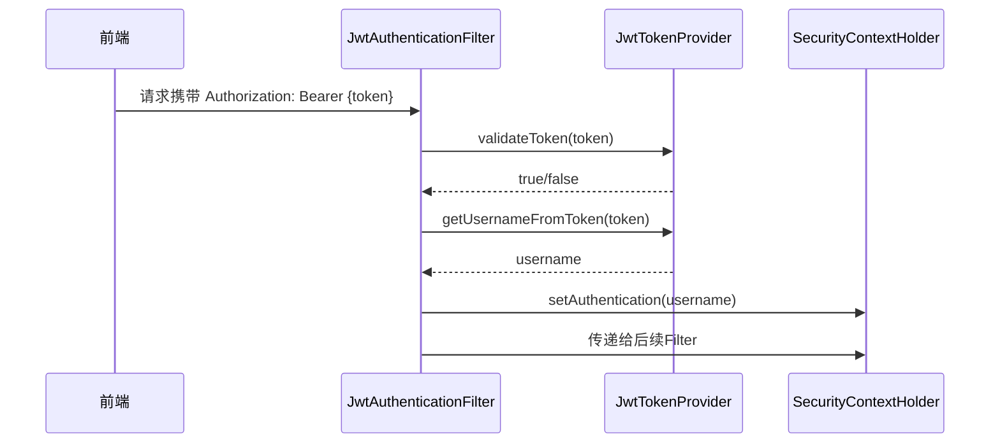
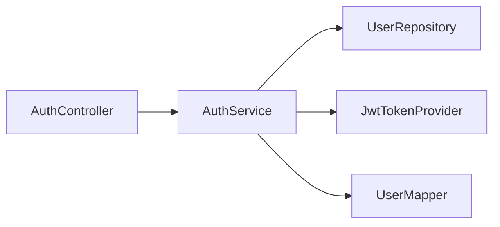
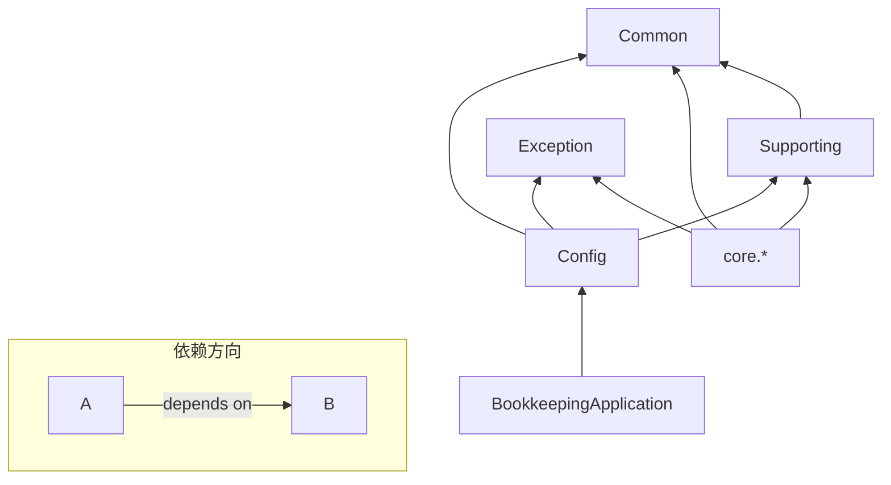

本文档详细解析记账应用后端的 Java 包组织结构与模块划分策略。该项目采用分层架构（Layered Architecture）结合领域驱动设计（DDD）思想，通过清晰的包边界划分实现关注点分离。

## 包结构总览

项目后端代码位于 `backend/src/main/java/com/bookkeeping/` 目录下，采用六层结构组织：



### 包结构树形视图

```
com.bookkeeping/
├── BookkeepingApplication.java          # 应用入口
├── common/                              # 通用组件
│   ├── ApiResponse.java                 # 统一响应封装
│   ├── Auditable.java                  # 审计接口
│   ├── BaseEntity.java                  # 基类实体
│   ├── ResultCode.java                  # 错误码枚举
│   └── enums/                           # 枚举定义
│       ├── AccountType.java
│       ├── CategoryType.java
│       └── TransactionType.java
├── config/                              # 配置层
│   ├── CacheConfig.java                # 缓存配置
│   ├── DataInitializer.java            # 数据初始化
│   ├── FlywayConfig.java
│   ├── JwtAuthenticationEntryPoint.java
│   ├── OpenApiConfig.java              # OpenAPI文档配置
│   ├── SecurityConfig.java             # 安全配置
│   └── security/
│       ├── JwtAuthenticationFilter.java # JWT过滤器
│       └── JwtTokenProvider.java        # JWT工具类
├── core/                                # 核心业务模块（DDD领域层）
│   ├── account/
│   ├── budget/
│   ├── category/
│   ├── dashboard/
│   ├── tag/
│   └── transaction/
├── exception/                           # 异常处理
│   ├── BusinessException.java
│   └── GlobalExceptionHandler.java
├── infrastructure/                      # 基础设施层
│   └── controller/
│       └── HealthController.java
└── supporting/                          # 支撑模块
    ├── auth/
    ├── security/
    └── user/
```

Sources: [get_dir_structure - backend/src/main/java/com/bookkeeping](backend/src/main/java/com/bookkeeping)

## 分层架构详解

### 1. common 层 - 通用基础组件

`common` 包包含整个应用共享的基础类型定义，不依赖任何业务模块。

#### 统一响应格式 - ApiResponse

所有 API 响应都使用 `ApiResponse<T>` 记录类型封装，遵循 `{success, result, errorCode, errorMessage}` 的标准格式：

```java
public record ApiResponse<T>(
    @JsonProperty("success") boolean isSuccess,
    T result,
    Integer errorCode,
    String errorMessage
)
```

提供三种工厂方法创建响应：
- `ApiResponse.success(data)` - 成功带数据
- `ApiResponse.success()` - 成功无数据
- `ApiResponse.error(code, message)` - 错误响应

Sources: [ApiResponse.java](backend/src/main/java/com/bookkeeping/common/ApiResponse.java#L1-L41)

#### 基类实体 - BaseEntity

所有 JPA 实体继承 `BaseEntity`，提供统一的审计字段和 ID 生成策略：

```java
@MappedSuperclass
@Getter
public abstract class BaseEntity implements Auditable {
    @Id
    @GeneratedValue(strategy = GenerationType.IDENTITY)
    protected Long id;
    
    @Column(name = "created_at", nullable = false, updatable = false)
    protected Long createdAt;
    
    @Column(name = "updated_at", nullable = false)
    protected Long updatedAt;
    
    @PrePersist
    protected void onCreate() {
        long now = System.currentTimeMillis() / 1000;
        this.createdAt = now;
        this.updatedAt = now;
    }
    
    @PreUpdate
    protected void onUpdate() {
        this.updatedAt = System.currentTimeMillis() / 1000;
    }
}
```

时间戳使用 Unix 时间戳（秒级），与前端保持一致。

Sources: [BaseEntity.java](backend/src/main/java/com/bookkeeping/common/BaseEntity.java#L1-L53)

#### 错误码体系 - ResultCode

错误码采用分类编码方案：`类别 * 100000 + 子类别 * 1000 + 序号`

| 类别 | 范围 | 说明 |
|------|------|------|
| 通用错误 | 0xxx | 成功、请求错误、未授权等 |
| 认证错误 | 2xxx | 认证失败、Token 过期等 |
| 用户错误 | 3xxx | 用户不存在、已存在、密码错误等 |
| 账户错误 | 4xxx | 账户不存在、已存在、余额无效等 |
| 分类错误 | 5xxx | 分类不存在、已存在等 |
| 交易错误 | 6xxx | 交易不存在、余额不足等 |

Sources: [ResultCode.java](backend/src/main/java/com/bookkeeping/common/ResultCode.java#L1-L66)

### 2. core 层 - 核心业务模块（DDD 领域层）

`core` 包按照业务领域划分，每个子包代表一个独立的限界上下文（Bounded Context）。

#### 模块结构模式

每个核心模块遵循统一的四层结构：



以 `account` 模块为例，包含以下文件：

| 文件类型 | 文件名 | 职责 |
|----------|--------|------|
| Entity | `Account.java` | JPA 实体映射 |
| DTO | `AccountDto.java` | 响应数据传输对象 |
| Request | `CreateAccountRequest.java`<br/>`UpdateAccountRequest.java` | 请求数据验证对象 |
| Repository | `AccountRepository.java` | 数据访问层接口 |
| Service | `AccountService.java` | 业务逻辑层 |
| Controller | `AccountController.java` | REST 控制器 |

Sources: [account 模块目录](backend/src/main/java/com/bookkeeping/core/account)

#### 实体设计规范

**Account 实体示例：**

```java
@Entity
@Table(name = "accounts")
@Getter
@Builder(toBuilder = true)
@NoArgsConstructor(access = AccessLevel.PROTECTED)
@AllArgsConstructor
public class Account extends BaseEntity {
    @Column(nullable = false, length = 64)
    private String name;
    
    @Column(name = "account_type", nullable = false, length = 20)
    @Enumerated(EnumType.STRING)
    private AccountType accountType;
    
    /** 余额单位为分（fen），避免浮点运算问题 */
    @Column(nullable = false)
    private Long balance = 0L;
    
    @Column(name = "user_id", nullable = false)
    private Long userId;
    
    @Column
    private Boolean deleted = false;  // 软删除标记
}
```

关键设计特点：
- 使用 `@Builder(toBuilder = true)` 支持部分更新模式
- 构造函数访问级别设置为 `PROTECTED`，强制使用构建器
- 余额以分为单位存储为 `Long` 类型
- 软删除通过 `deleted` 字段实现

Sources: [Account.java](backend/src/main/java/com/bookkeeping/core/account/Account.java#L1-L50)

#### Service 层设计

Service 层负责业务逻辑编排，使用 `@Transactional` 控制事务边界：

```java
@Service
public class AccountService {
    private final AccountRepository accountRepository;
    private final AccountMapper accountMapper;
    private final SecurityUtils securityUtils;
    
    @Transactional
    public AccountDto createAccount(CreateAccountRequest request) {
        Long userId = securityUtils.requireCurrentUser().getId();
        
        // 业务验证
        if (accountRepository.existsByNameAndUserIdAndDeletedFalse(...)) {
            throw new BusinessException(ResultCode.ACCOUNT_ALREADY_EXISTS, ...);
        }
        
        // 构建实体
        Account account = Account.builder()
            .name(request.name())
            .accountType(request.accountType())
            .balance(request.initialBalance())
            .userId(userId)
            .deleted(false)
            .build();
        
        // 数据持久化
        Account saved = accountRepository.save(account);
        return accountMapper.toDto(saved);
    }
}
```

Sources: [AccountService.java](backend/src/main/java/com/bookkeeping/core/account/AccountService.java#L1-L134)

#### Repository 层设计

使用 Spring Data JPA 的 `JpaRepository`，自定义查询方法遵循 Spring Data 命名约定：

```java
@Repository
public interface AccountRepository extends JpaRepository<Account, Long> {
    /** 按用户ID查询（排除已删除） */
    List<Account> findByUserIdAndDeletedFalse(Long userId);
    
    /** 按ID和用户ID查询（排除已删除） */
    Optional<Account> findByIdAndUserIdAndDeletedFalse(Long id, Long userId);
    
    /** 检查重名 */
    boolean existsByNameAndUserIdAndDeletedFalse(String name, Long userId);
}
```

Sources: [AccountRepository.java](backend/src/main/java/com/bookkeeping/core/account/AccountRepository.java#L1-L21)

### 3. config 层 - 配置模块

配置层包含 Spring 框架配置、安全配置和基础设施配置。

#### 安全配置

`SecurityConfig` 定义了 JWT 无状态认证策略：

```java
@Configuration
@EnableWebSecurity
public class SecurityConfig {
    @Bean
    public SecurityFilterChain filterChain(HttpSecurity http) throws Exception {
        http
            .csrf(AbstractHttpConfigurer::disable)           // 禁用 CSRF
            .sessionManagement(session -> session
                .sessionCreationPolicy(SessionCreationPolicy.STATELESS))  // 无状态会话
            .authorizeHttpRequests(auth -> auth
                .requestMatchers("/api/v1/auth/**", "/api/v1/health", "/swagger-ui/**").permitAll()
                .anyRequest().authenticated())
            .addFilterBefore(jwtAuthenticationFilter, UsernamePasswordAuthenticationFilter.class);
        return http.build();
    }
}
```

Sources: [SecurityConfig.java](backend/src/main/java/com/bookkeeping/config/SecurityConfig.java#L1-L89)

#### JWT 认证流程



Sources: [JwtAuthenticationFilter.java](backend/src/main/java/com/bookkeeping/config/security/JwtAuthenticationFilter.java#L1-L73)

#### 缓存配置

使用 Caffeine 作为本地缓存实现：

```java
@Configuration
@EnableCaching
public class CacheConfig {
    @Bean
    public CacheManager cacheManager() {
        CaffeineCacheManager cacheManager = new CaffeineCacheManager();
        cacheManager.setCaffeine(Caffeine.newBuilder()
            .expireAfterWrite(10, TimeUnit.MINUTES)
            .maximumSize(1000)
            .recordStats());
        return cacheManager;
    }
}
```

Sources: [CacheConfig.java](backend/src/main/java/com/bookkeeping/config/CacheConfig.java#L1-L31)

### 4. exception 层 - 异常处理

#### 全局异常处理器

`GlobalExceptionHandler` 统一处理所有异常，返回标准化的错误响应：

```java
@RestControllerAdvice
public class GlobalExceptionHandler {
    
    /** 处理业务异常 - 返回 200 状态码，success=false */
    @ExceptionHandler(BusinessException.class)
    public ResponseEntity<ApiResponse<Void>> handleBusinessException(BusinessException ex) {
        return ResponseEntity
            .status(HttpStatus.OK)
            .body(ApiResponse.error(ex.getErrorCode(), ex.getErrorMessage()));
    }
    
    /** 处理验证异常 */
    @ExceptionHandler(MethodArgumentNotValidException.class)
    public ResponseEntity<ApiResponse<Void>> handleValidationException(...) {
        // 提取字段错误消息
        return ResponseEntity.status(HttpStatus.OK)
            .body(ApiResponse.error(ResultCode.VALIDATION_ERROR.getCode(), message));
    }
    
    /** 处理其他异常 - 返回 500 */
    @ExceptionHandler(Exception.class)
    public ResponseEntity<ApiResponse<Void>> handleGenericException(Exception ex) {
        return ResponseEntity
            .status(HttpStatus.INTERNAL_SERVER_ERROR)
            .body(ApiResponse.error(ResultCode.INTERNAL_ERROR.getCode(), "An unexpected error occurred"));
    }
}
```

Sources: [GlobalExceptionHandler.java](backend/src/main/java/com/bookkeeping/exception/GlobalExceptionHandler.java#L1-L75)

### 5. supporting 层 - 支撑模块

支撑模块为业务核心提供基础设施服务，包括认证、用户管理、安全工具等。

#### 认证模块 - auth



`AuthService` 提供登录和注册功能：

```java
@Service
public class AuthService {
    @Transactional(readOnly = true)
    public LoginResponse login(LoginRequest request) {
        User user = userRepository.findByUsername(request.username())
            .orElseThrow(() -> new BusinessException(ResultCode.AUTHENTICATION_FAILED, ...));
        
        String hashedPassword = hashPassword(request.password(), user.getSalt());
        if (!hashedPassword.equals(user.getPassword())) {
            throw new BusinessException(ResultCode.AUTHENTICATION_FAILED, ...);
        }
        
        String token = jwtTokenProvider.generateToken(user.getUsername());
        return new LoginResponse(token, userMapper.toDto(user));
    }
}
```

密码使用 MD5 + Salt 哈希存储（开发环境，生产环境应使用 BCrypt）。

Sources: [AuthService.java](backend/src/main/java/com/bookkeeping/supporting/auth/AuthService.java#L1-L125)

#### 安全工具 - SecurityUtils

```java
@Component
public class SecurityUtils {
    public User requireCurrentUser() {
        return getCurrentUser()
            .orElseThrow(() -> new BusinessException(ResultCode.USER_NOT_FOUND, ...));
    }
}
```

Sources: [SecurityUtils.java](backend/src/main/java/com/bookkeeping/supporting/security/SecurityUtils.java#L1-L64)

### 6. infrastructure 层 - 基础设施

基础设施层包含与应用核心业务无关的技术基础设施，如健康检查端点：

```java
@RestController
@RequestMapping("/api/v1")
public class HealthController {
    @GetMapping("/health")
    public ApiResponse<String> health() {
        return ApiResponse.success("OK");
    }
}
```

Sources: [HealthController.java](backend/src/main/java/com/bookkeeping/infrastructure/controller/HealthController.java)

## 依赖关系图



| 调用方 | 被调用方 | 依赖类型 |
|--------|----------|----------|
| Controller | Service | 依赖注入 |
| Service | Repository | 依赖注入 |
| Service | Mapper | 依赖注入 |
| Service | SecurityUtils | 依赖注入 |
| Service | BusinessException | 异常抛出 |
| Config | JwtTokenProvider | 依赖注入 |

## DTO 映射策略

项目使用 MapStructPlus 注解处理器自动实现 Entity ↔ DTO 转换：

```java
/** AccountDto.java */
@MapperAuto(sourceEntity = Account.class, direction = Direction.From)
public record AccountDto(
    Long id,
    String name,
    AccountType accountType,
    String currency,
    Long balance,
    Long userId,
    String description
) {}

/** AccountMapper.java（自动生成）*/
public interface AccountMapper {
    AccountDto toDto(Account account);
}
```

Sources: [AccountDto.java](backend/src/main/java/com/bookkeeping/core/account/AccountDto.java#L1-L21)

## 数据初始化

`DataInitializer` 在应用启动时自动创建演示数据：

```java
@Component
public class DataInitializer implements CommandLineRunner {
    @Override
    @Transactional
    public void run(String... args) {
        User demoUser = createDemoUserIfNeeded();
        // 创建演示账户、分类、交易
    }
}
```

Sources: [DataInitializer.java](backend/src/main/java/com/bookkeeping/config/DataInitializer.java#L1-L195)

## 模块依赖矩阵

| 模块 | common | config | core | exception | infrastructure | supporting |
|------|--------|--------|------|-----------|----------------|------------|
| **common** | - | ✗ | ✗ | ✗ | ✗ | ✗ |
| **config** | ✓ | - | ✗ | ✗ | ✗ | ✓ |
| **core** | ✓ | ✗ | - | ✓ | ✗ | ✓ |
| **exception** | ✓ | ✗ | ✗ | - | ✗ | ✗ |
| **infrastructure** | ✓ | ✗ | ✗ | ✗ | - | ✗ |
| **supporting** | ✓ | ✗ | ✗ | ✓ | ✗ | - |

✓ = 单向依赖，✗ = 无依赖

## 后续阅读

建议继续阅读以下章节深入理解：

- [系统架构 - Spring Boot + Nuxt 4 全栈设计](3-xi-tong-jia-gou-spring-boot-nuxt-4-quan-zhan-she-ji) - 了解整体架构设计
- [认证机制 - JWT 令牌与安全配置](6-ren-zheng-ji-zhi-jwt-ling-pai-yu-an-quan-pei-zhi) - 深入理解 JWT 实现
- [API 设计规范 - 统一响应格式与错误码](8-api-she-ji-gui-fan-tong-xiang-ying-ge-shi-yu-cuo-wu-ma) - 响应格式与错误处理