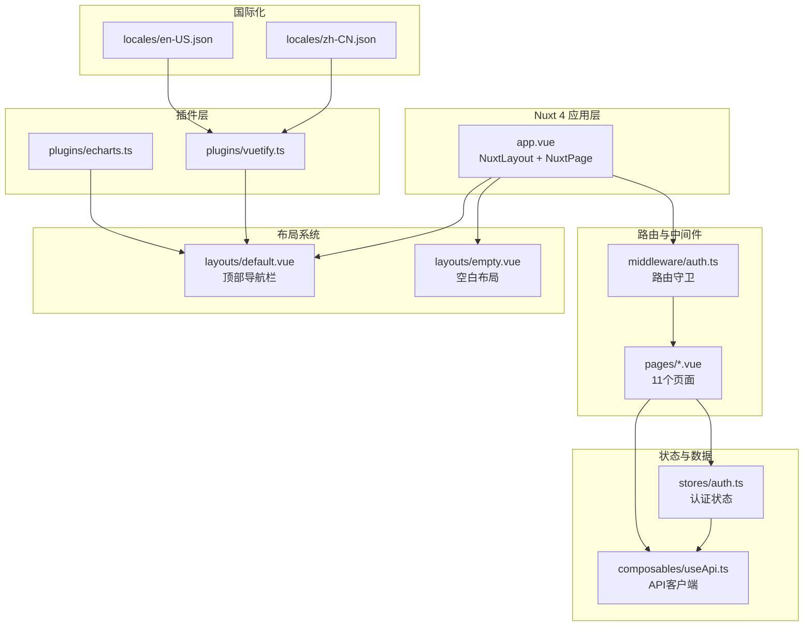
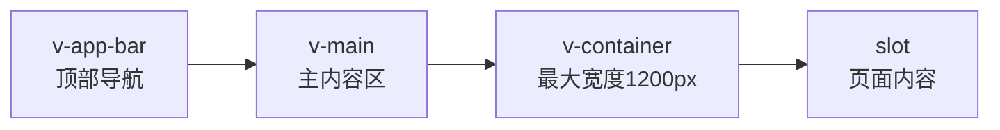
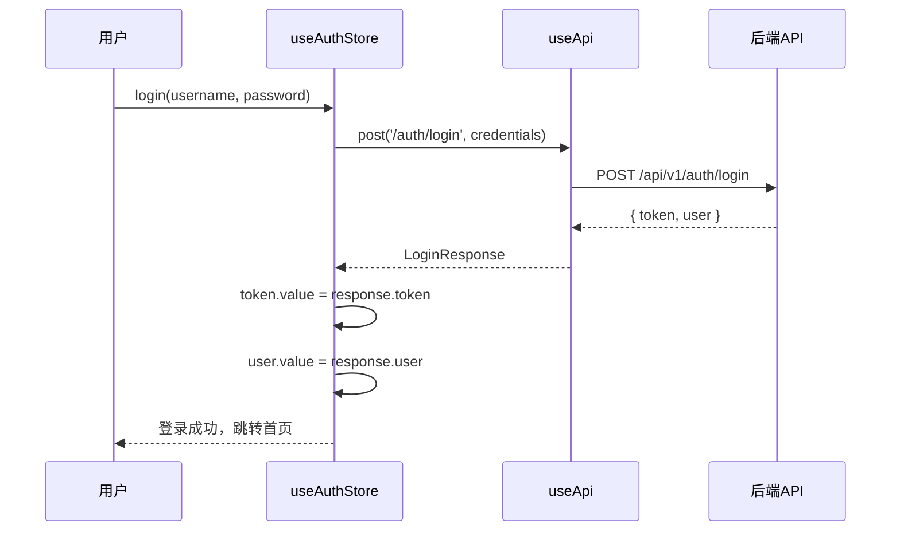

本文档深入解析记账应用的 Nuxt 4 前端架构，涵盖技术栈选型、目录组织、页面体系、布局系统、状态管理、国际化配置以及关键设计模式的实现细节。通过理解这些架构决策，开发者可以快速掌握前端代码的组织逻辑，为功能扩展和定制化开发奠定基础。

## 技术栈概览

项目基于 **Nuxt 4** 构建，采用 Vue 3 Composition API 风格，结合 Vuetify 4 作为 UI 组件库。前端采用服务端渲染（SSR）模式，通过 Nuxt 的文件路由系统自动生成页面路由，并利用 Pinia 进行状态管理。图表可视化通过 ECharts 实现，数据请求通过统一的 `useApi` Composable 处理，并配合 `@nuxtjs/i18n` 模块支持中英文切换。



核心依赖清单如下所示：

| 依赖 | 版本 | 用途 |
|------|------|------|
| nuxt | ^4.4.6 | 核心框架 |
| vue | ^3.5.34 | 视图层 |
| vuetify | ^4.0.7 | UI 组件库 |
| @pinia/nuxt | ^0.11.3 | 状态管理 |
| @nuxtjs/i18n | ^10.3.0 | 国际化 |
| echarts | ^6.1.0 | 图表库 |
| vue-echarts | ^8.0.1 | Vue 封装 |

Sources: [package.json](frontend/package.json#L1-L24) [nuxt.config.ts](frontend/nuxt.config.ts#L1-L47)

## 目录结构与组织规范

前端目录采用 Nuxt 4 的标准约定大于配置模式，通过目录命名自动激活框架行为。`pages` 目录下的每个 `.vue` 文件自动映射为路由，`layouts` 目录的文件通过 `definePageMeta` 声明式选择，`plugins` 目录的文件在应用启动时自动执行。

```
frontend/
├── app.vue                    # 应用根组件
├── nuxt.config.ts            # Nuxt 配置
├── composables/
│   └── useApi.ts             # API 请求封装
├── layouts/
│   ├── default.vue           # 主布局（含导航栏）
│   └── empty.vue            # 空白布局（登录/注册页）
├── locales/
│   ├── en-US.json           # 英文翻译
│   └── zh-CN.json           # 中文翻译
├── middleware/
│   └── auth.ts              # 认证中间件
├── pages/                    # 11 个业务页面
├── plugins/
│   ├── echarts.ts           # ECharts 注册
│   └── vuetify.ts          # Vuetify 配置
├── stores/
│   └── auth.ts             # 认证 Pinia Store
└── types/
    └── index.ts            # TypeScript 类型定义
```

`types/index.ts` 目前仅定义了 `Account` 接口，尚未建立完整的类型体系，这是后续可优化的地方。`composables` 目录遵循 Nuxt 自动导入约定，`useApi.ts` 导出的 `useApi` 函数在所有页面中可直接使用，无需显式导入。

Sources: [types/index.ts](frontend/types/index.ts#L1-L11)

## 布局系统设计

布局系统通过两层设计满足不同页面的视觉需求：**`default.vue`** 提供带顶部导航栏的主布局，适用于所有已认证用户的功能页面；**`empty.vue`** 提供无导航栏的居中布局，专用于登录和注册页面。

### 默认布局（default.vue）

默认布局采用 Vuetify 的 `v-app` 结构，包含固定顶部栏（`v-app-bar`）和主内容区（`v-main`）。顶部栏在 `isAuthenticated` 为真时渲染，包含品牌标识、导航按钮、货币选择器和用户头像菜单。内容区最大宽度限制在 1200px，内边距为 24px。



导航按钮通过 `to` 属性绑定路由，`active-class="text-primary"` 确保当前路由按钮高亮显示。用户头像下拉菜单包含"个人资料"和"退出登录"两个选项，其中退出操作直接调用 `auth.logout()` 方法。

Sources: [layouts/default.vue](frontend/layouts/default.vue#L1-L52)

### 空白布局（empty.vue）

空白布局为登录注册页面提供简洁的居中视觉，避免顶部导航栏干扰用户聚焦操作。布局内容在垂直和水平方向居中，最大宽度限制为 520px，满足表单页面的最佳阅读宽度。

```vue
<!-- layouts/empty.vue -->
<template>
  <v-app>
    <v-main class="bg-grey-lighten-4">
      <v-container class="fill-height d-flex align-center justify-center" style="max-width: 520px">
        <slot />
      </v-container>
    </v-main>
  </v-app>
</template>
```

Sources: [layouts/empty.vue](frontend/layouts/empty.vue#L1-L10)

### 布局选择机制

页面通过 `definePageMeta` 声明式选择布局：

```typescript
// 登录/注册页选择空白布局
definePageMeta({ layout: 'empty' })

// 功能页默认使用 default 布局
definePageMeta({ middleware: 'auth' })
```

Nuxt 自动在 `layouts/` 目录查找同名布局文件，无需额外配置。

Sources: [pages/login.vue](frontend/pages/login.vue#L96) [pages/register.vue](frontend/pages/register.vue#L39)

## 页面路由体系

项目包含 11 个业务页面，按功能划分为三个层级。认证层包含登录和注册两个页面，功能层包含仪表盘、交易、账户、分类、标签、统计、预算、报表和个人资料页面。

| 页面路径 | 路由名称 | 布局 | 中间件 | 核心功能 |
|----------|----------|------|--------|----------|
| `/login` | 登录 | empty | 无 | 用户认证 |
| `/register` | 注册 | empty | 无 | 用户注册 |
| `/` | 仪表盘 | default | auth | 数据概览、图表 |
| `/transactions` | 交易 | default | auth | 交易 CRUD、筛选 |
| `/accounts` | 账户 | default | auth | 账户管理 |
| `/categories` | 分类 | default | auth | 分类管理 |
| `/tags` | 标签 | default | auth | 标签管理 |
| `/statistics` | 统计 | default | auth | 收支统计图表 |
| `/budgets` | 预算 | default | auth | 预算设置追踪 |
| `/reports` | 报表 | default | auth | 报表导出 |
| `/profile` | 个人资料 | default | auth | 用户信息 |

### 页面通用模式分析

通过分析 `transactions.vue` 和 `accounts.vue` 可以归纳出页面的通用架构模式：

**脚本区（Script Setup）结构**：

```typescript
// 1. 页面元数据声明
definePageMeta({ middleware: 'auth' })

// 2. 依赖注入
const api = useApi()

// 3. 状态定义
const loading = ref(true)
const dialog = ref(false)

// 4. 数据模型接口
interface Account { id: number; name: string; ... }

// 5. 响应式数据
const accounts = shallowRef<Account[]>([])

// 6. 计算属性
const filteredAccounts = computed(() => ...)

// 7. 工具函数
function fmt(cents: number) { return (cents / 100).toLocaleString(...) }

// 8. 生命周期
onMounted(fetchAccounts)
```

**模板区结构**：

```vue
<!-- 1. 标题栏 + 操作按钮 -->
<div class="d-flex align-center mb-4">
  <h1>标题</h1>
  <v-spacer />
  <v-btn>新增</v-btn>
</div>

<!-- 2. 筛选/导航区 -->
<v-tabs> / <v-card>筛选器</v-card>

<!-- 3. 加载状态 -->
<v-progress-linear v-if="loading" indeterminate />

<!-- 4. 数据列表/卡片 -->
<v-row><v-col><v-card>...</v-card></v-col></v-row>

<!-- 5. 新增/编辑对话框 -->
<v-dialog v-model="dialog">...</v-dialog>

<!-- 6. 删除确认对话框 -->
<v-dialog v-model="deleteDialog">...</v-dialog>
```

Sources: [pages/accounts.vue](frontend/pages/accounts.vue#L114-L193) [pages/transactions.vue](frontend/pages/transactions.vue#L1-L200)

## 状态管理架构

### Pinia 认证 Store

`stores/auth.ts` 采用 Pinia 的 Composition API 风格定义，实现用户认证状态的集中管理。Store 包含三个核心状态：`token`（存储在 Cookie 中的 JWT 令牌）、`user`（当前用户信息）、`isAuthenticated`（计算属性，判断认证状态）。



Store 提供四个核心方法：

| 方法 | 用途 | 返回值 |
|------|------|--------|
| `login(username, password)` | 用户登录 | `LoginResponse` |
| `register(username, email, password)` | 用户注册 | `User` |
| `fetchCurrentUser()` | 获取当前用户 | `void` |
| `logout()` | 退出登录 | `void` |

`token` 使用 `useCookie` 封装，支持设置 `maxAge: 86400`（24小时有效期），确保服务端 SSR 和客户端 CSR 均可访问令牌。

Sources: [stores/auth.ts](frontend/stores/auth.ts#L1-L55)

### API 客户端 Composable

`composables/useApi.ts` 提供统一的 API 请求封装，处理请求构建、认证头注入、响应解析和错误转换。所有 API 请求携带 Bearer Token 认证头，响应通过统一的 `ApiResponse<T>` 包装结构解析。

```typescript
// API 请求封装核心逻辑
async function request<T>(method: string, path: string, body?: unknown): Promise<T> {
  const headers: Record<string, string> = {
    'Content-Type': 'application/json',
    ...getAuthHeaders(),  // 自动注入 Bearer Token
  }
  
  const res = await fetch(`${API_BASE}${path}`, options)
  const data = await res.json() as ApiResponse<T>
  
  if (!data.success) {
    throw createError({ ... })  // 转换为 Nuxt 错误
  }
  
  return data.result
}
```

导出的 `useApi` 函数提供四个 RESTful 方法：`get`、`post`、`put`、`delete`，使用泛型指定响应数据类型。

```typescript
// 使用示例
const api = useApi()
const accounts = await api.get<Account[]>('/accounts')
await api.post('/accounts', { name: 'Cash', accountType: 'CASH' })
```

API 基础地址配置在 `nuxt.config.ts` 的 `runtimeConfig.public.apiBase`，默认为 `http://localhost:8080/api/v1`。

Sources: [composables/useApi.ts](frontend/composables/useApi.ts#L1-L47)

## 认证与路由保护

### Auth 中间件

`middleware/auth.ts` 实现路由级别的访问控制，通过检查 Cookie 中的 `token` 值判断用户是否已认证。未认证用户自动重定向至 `/login` 页面。

```typescript
export default defineNuxtRouteMiddleware(() => {
  const token = useCookie<string>('token').value
  if (!token) {
    return navigateTo('/login')
  }
})
```

该中间件使用 Nuxt 的 `defineNuxtRouteMiddleware` 声明，符合 Nuxt 3 的中间件规范。页面通过 `definePageMeta({ middleware: 'auth' })` 声明使用此中间件，无需在 `nuxt.config.ts` 中注册。

Sources: [middleware/auth.ts](frontend/middleware/auth.ts#L1-L8)

### 登录页面特殊处理

登录页面（`login.vue`）不使用认证中间件，而是通过 `auth.isAuthenticated` 状态在脚本初始化时检查。若用户已登录，则自动跳转至首页：

```typescript
// pages/login.vue
onMounted(async () => {
  if (auth.isAuthenticated) {
    await router.push('/')
  }
})
```

登录表单采用 Vuetify 的 `v-form` 组件，包含用户名、密码输入框和密码可见性切换。表单提交通过 `handleLogin` 异步函数处理，调用 `auth.login()` 后根据结果跳转或显示错误信息。

Sources: [pages/login.vue](frontend/pages/login.vue#L95-L120)

## 插件系统

### Vuetify 插件配置

`plugins/vuetify.ts` 在应用启动时初始化 Vuetify，配置浅蓝色主题配色方案。插件导出 `default` 对象，Nuxt 自动识别并执行。

```typescript
export default defineNuxtPlugin((nuxtApp) => {
  const vuetify = createVuetify({
    components,
    directives,
    theme: {
      defaultTheme: 'light',
      themes: {
        light: {
          colors: {
            primary: '#1976D2',    // 主色调
            secondary: '#424242',
            error: '#FF5252',
            success: '#4CAF50',
            warning: '#FB8C00',
          },
        },
      },
    },
  })
  nuxtApp.vueApp.use(vuetify)
})
```

Nuxt 配置中设置 `build.transpile: ['vuetify']` 启用 Vuetify 的服务端编译，`css` 数组加载 Vuetify 样式和 Material Design Icons 字体。

Sources: [plugins/vuetify.ts](frontend/plugins/vuetify.ts#L1-L31) [nuxt.config.ts](frontend/nuxt.config.ts#L12-L19)

### ECharts 插件配置

`plugins/echarts.ts` 注册 ECharts 核心组件和 Vue 封装组件，仅引入项目所需的图表类型以控制包体积。

```typescript
import { BarChart, PieChart } from 'echarts/charts'
import { TitleComponent, TooltipComponent, LegendComponent, GridComponent } from 'echarts/components'
import { CanvasRenderer } from 'echarts/renderers'

use([BarChart, PieChart, TitleComponent, TooltipComponent, LegendComponent, GridComponent, CanvasRenderer])

export default defineNuxtPlugin((nuxtApp) => {
  nuxtApp.vueApp.component('VueECharts', VueECharts)
})
```

页面中使用 `<ClientOnly>` 包裹 ECharts 组件，规避服务端渲染环境无法执行 Canvas 渲染的限制：

```vue
<ClientOnly>
  <VueECharts :option="monthlyBarOption" style="height: 300px" autoresize />
</ClientOnly>
```

Sources: [plugins/echarts.ts](frontend/plugins/echarts.ts#L1-L14)

## 国际化配置

### i18n 模块配置

`nuxt.config.ts` 中配置 `@nuxtjs/i18n` 模块，支持中英文切换。语言检测通过 Cookie 存储用户偏好，路由采用无前缀模式（`no_prefix`）。

```typescript
i18n: {
  defaultLocale: 'en-US',
  lazy: false,
  langDir: null as any,  // 禁用文件加载
  locales: [
    { code: 'en-US', iso: 'en-US', name: 'English' },
    { code: 'zh-CN', iso: 'zh-CN', name: '中文' },
  ],
  strategy: 'no_prefix',
  detectBrowserLanguage: {
    useCookie: true,
    cookieKey: 'locale',
  },
}
```

当前实现中，`langDir: null` 禁用了基于文件的翻译加载，翻译内容存储在 `locales/` 目录的 JSON 文件中。

Sources: [nuxt.config.ts](frontend/nuxt.config.ts#L27-L40)

### 翻译文件结构

翻译文件采用键值对格式，包含认证、表单、通用操作等常用文本：

```json
{
  "login": "登录",
  "register": "注册",
  "dashboard": "仪表盘",
  "accounts": "账本",
  "username": "用户名",
  "password": "密码",
  "save": "保存",
  "required": "必填"
}
```

当前翻译文件仅覆盖基础词汇，页面内的业务文本（如"Add Transaction"、"Income vs Expense"等）仍以硬编码形式存在于模板中，这是后续 i18n 完善的方向。

Sources: [locales/zh-CN.json](frontend/locales/zh-CN.json#L1-L24) [locales/en-US.json](frontend/locales/en-US.json#L1-L24)

## 关键设计模式

### Composable 自动导入约定

Nuxt 的 auto-import 机制使 `composables/` 目录下的函数在所有组件中自动可用，无需显式导入。这种约定简化了代码组织，例如 `useApi()` 在任何页面中均可直接调用。

```typescript
// composables/useApi.ts
export const useApi = () => ({ ... })

// pages/accounts.vue - 无需 import 语句
const api = useApi()
```

### shallowRef 优化大数据响应式

页面中处理数组数据时使用 `shallowRef` 而非 `ref`，避免深层响应式追踪带来的性能开销。例如 `transactions.vue` 中的 `transactions` 和 `accounts.vue` 中的 `accounts` 均采用 `shallowRef`。

```typescript
const accounts = shallowRef<Account[]>([])
const transactions = shallowRef<Tx[]>([])
```

### 金额单位转换约定

后端以"分"存储金额（避免浮点精度问题），前端统一在展示层转换。以分为单位的值除以 100 转换为元：

```typescript
function fmt(cents: number) {
  return (cents / 100).toLocaleString('en-US', { minimumFractionDigits: 2 })
}
```

Sources: [pages/accounts.vue](frontend/pages/accounts.vue#L147) [pages/transactions.vue](frontend/pages/transactions.vue#L136-L155)

## 后续阅读建议

前端结构文档完成后，建议按以下路径深入学习：

- [系统架构 - Spring Boot + Nuxt 4 全栈设计](3-xi-tong-jia-gou-spring-boot-nuxt-4-quan-zhan-she-ji)：了解前后端通信的整体架构设计
- [认证机制 - JWT 令牌与安全配置](6-ren-zheng-ji-zhi-jwt-ling-pai-yu-an-quan-pei-zhi)：深入理解 JWT 认证流程与安全实现
- [API 设计规范 - 统一响应格式与错误码](8-api-she-ji-gui-fan-tong-xiang-ying-ge-shi-yu-cuo-wu-ma)：掌握前后端数据契约