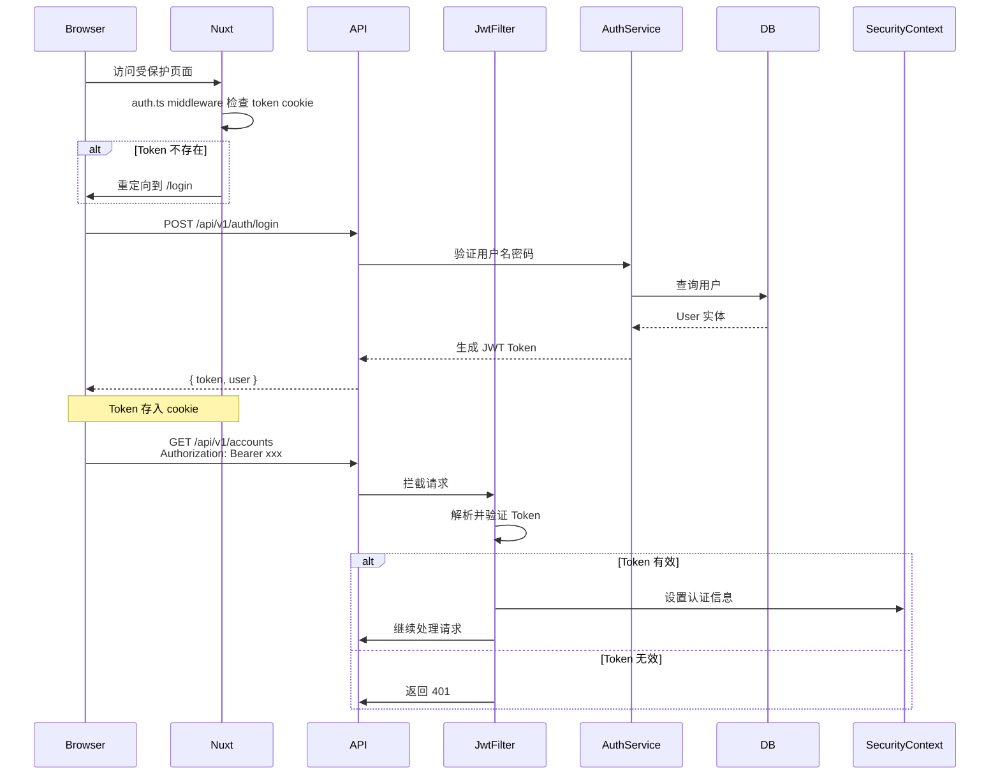
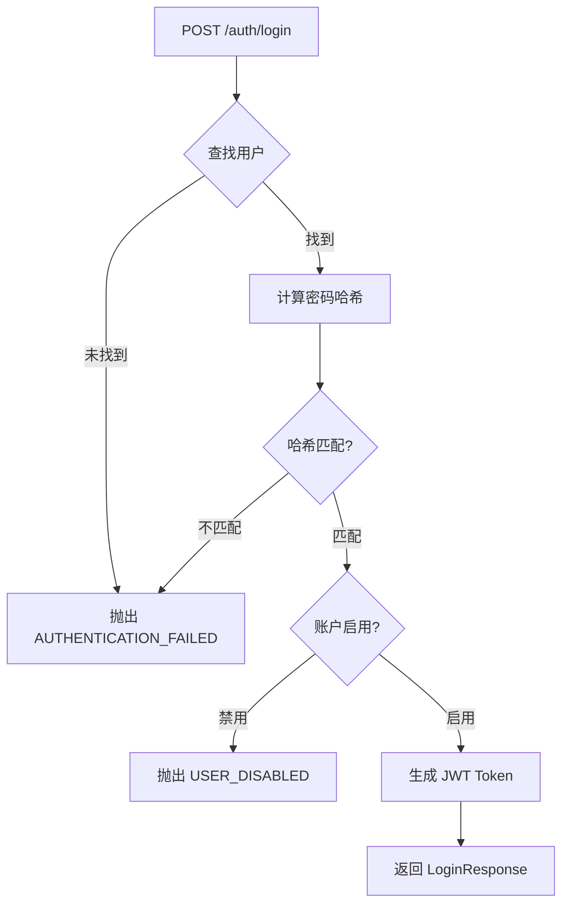

本页面详述项目实现的无状态 JWT（JSON Web Token）认证机制，涵盖后端令牌生成与验证的全流程、前端 Token 管理策略，以及 Spring Security 与 Nuxt 路由守卫的协同工作方式。阅读本页面后，开发者应能够理解认证请求从客户端发起、经安全过滤器处理、到返回用户上下文的完整链路。

---

## 1. 技术架构总览

该项目采用 **前后端分离架构**，后端基于 Spring Boot 提供 RESTful API，前端基于 Nuxt 4 运行单页应用。JWT 令牌作为无状态会话机制，在每次 HTTP 请求中携带，用以标识当前登录用户。



### 核心组件职责矩阵

| 组件 | 位置 | 职责 |
|------|------|------|
| `JwtTokenProvider` | backend/config/security | 生成、解析、验证 JWT Token |
| `JwtAuthenticationFilter` | backend/config/security | 拦截每个请求，提取并验证 Token |
| `SecurityConfig` | backend/config | 配置安全过滤链、CORS、端点权限 |
| `JwtAuthenticationEntryPoint` | backend/config | 未认证请求的统一响应处理 |
| `AuthService` | backend/supporting/auth | 登录/注册业务逻辑，密码哈希 |
| `SecurityUtils` | backend/supporting/security | 获取当前登录用户上下文 |
| `useAuthStore` | frontend/stores | 前端 Token 状态管理 |
| `useApi` | frontend/composables | 自动附加 Authorization 头 |
| `auth.ts` | frontend/middleware | 路由守卫保护 |

Sources: [JwtTokenProvider.java](backend/src/main/java/com/bookkeeping/config/security/JwtTokenProvider.java#L23-L24), [AuthService.java](backend/src/main/java/com/bookkeeping/supporting/auth/AuthService.java#L21-L35)

---

## 2. JWT 令牌生成与验证

### 2.1 令牌提供器核心逻辑

`JwtTokenProvider` 使用 JJWT 库（`io.jsonwebtoken`）实现令牌的生成与验证，依赖 Spring 的 `@Value` 注解从配置文件读取密钥与过期时间。

**配置读取与密钥构建**：

```java
public JwtTokenProvider(
        @Value("${jwt.secret:defaultSecretKeyForDevelopmentOnly12345678901234567890}") String secret,
        @Value("${jwt.expiration:86400000}") long expirationMs) {
    this.secretKey = Keys.hmacShaKeyFor(secret.getBytes(StandardCharsets.UTF_8));
    this.expirationMs = expirationMs;
}
```

默认值设计确保开发环境下无需额外配置即可运行。生产环境必须通过 `JWT_SECRET` 环境变量覆盖默认密钥。

Sources: [JwtTokenProvider.java](backend/src/main/java/com/bookkeeping/config/security/JwtTokenProvider.java#L31-L36)

**令牌生成流程**：

```java
public String generateToken(String username) {
    Date now = new Date();
    Date expiryDate = new Date(now.getTime() + expirationMs);

    return Jwts.builder()
            .subject(username)
            .issuedAt(now)
            .expiration(expiryDate)
            .signWith(secretKey)
            .compact();
}
```

令牌 Payload 仅包含 `subject`（用户名）、`issuedAt`（签发时间）、`expiration`（过期时间）三个标准声明，不携带额外业务数据。

Sources: [JwtTokenProvider.java](backend/src/main/java/com/bookkeeping/config/security/JwtTokenProvider.java#L41-L51)

**令牌验证异常捕获**：

```java
public boolean validateToken(String token) {
    try {
        Jwts.parser()
                .verifyWith(secretKey)
                .build()
                .parseSignedClaims(token);
        return true;
    } catch (SignatureException ex) {
        log.error("Invalid JWT signature");
    } catch (MalformedJwtException ex) {
        log.error("Invalid JWT token");
    } catch (ExpiredJwtException ex) {
        log.error("Expired JWT token");
    } catch (UnsupportedJwtException ex) {
        log.error("Unsupported JWT token");
    } catch (IllegalArgumentException ex) {
        log.error("JWT claims string is empty");
    }
    return false;
}
```

该方法捕获五种异常场景并记录对应日志，返回布尔值供调用方判断。`ExpiredJwtException` 的单独处理使得业务层可针对令牌过期进行差异化响应（如引导刷新 Token）。

Sources: [JwtTokenProvider.java](backend/src/main/java/com/bookkeeping/config/security/JwtTokenProvider.java#L69-L88)

### 2.2 配置文件中的 JWT 参数

```yaml
jwt:
  secret: ${JWT_SECRET:your-256-bit-secret-key-here-change-in-production-minimum-32-chars}
  access-token-expiry: 1800
  refresh-token-expiry: 2592000
```

| 参数 | 默认值 | 说明 |
|------|--------|------|
| `jwt.secret` | 内置长字符串 | 必须≥32字符，建议256位 |
| `jwt.expiration`（代码中） | 86400000ms | 默认24小时有效期 |

注意：`application.yml` 中定义了 `access-token-expiry`（1800秒）与 `refresh-token-expiry`（2592000秒），但 `JwtTokenProvider` 目前使用硬编码的 `expiration` 参数。后续重构可考虑统一使用配置文件的参数名。

Sources: [application.yml](backend/src/main/resources/application.yml#L19-L22), [JwtTokenProvider.java](backend/src/main/java/com/bookkeeping/config/security/JwtTokenProvider.java#L32-L33)

---

## 3. 安全过滤链与请求拦截

### 3.1 Spring Security 配置架构

`SecurityConfig` 是整个安全架构的核心配置类，通过 `SecurityFilterChain` Bean 定义过滤链行为：

```java
@Bean
public SecurityFilterChain filterChain(HttpSecurity http) throws Exception {
    http
        // CORS 跨域配置
        .cors(cors -> cors.configurationSource(corsConfigurationSource()))
        
        // 禁用 CSRF（JWT 无状态特性）
        .csrf(AbstractHttpConfigurer::disable)
        
        // 无状态会话管理
        .sessionManagement(session -> session
            .sessionCreationPolicy(SessionCreationPolicy.STATELESS))
        
        // 认证失败处理
        .exceptionHandling(ex -> ex
            .authenticationEntryPoint(jwtAuthenticationEntryPoint))
        
        // 端点权限规则
        .authorizeHttpRequests(auth -> auth
            .requestMatchers(
                "/actuator/**",
                "/api/v1/health",
                "/api/v1/auth/login",
                "/api/v1/auth/register",
                "/api-docs/**",
                "/swagger-ui/**",
                "/v3/api-docs/**"
            ).permitAll()
            .anyRequest().authenticated())
        
        // JWT 过滤器置于用户名密码过滤器之前
        .addFilterBefore(jwtAuthenticationFilter, UsernamePasswordAuthenticationFilter.class);
    
    return http.build();
}
```

关键设计决策：

- **无状态会话**：`STATELESS` 策略确保 Spring Security 不创建或使用任何 HTTP Session
- **CSRF 禁用**：由于 Token 通过 `Authorization` 头传递而非 Cookie，CSRF 攻击面不存在
- **JWT 过滤器优先**：在表单登录过滤器之前执行，支持 Token 优先的认证流程

Sources: [SecurityConfig.java](backend/src/main/java/com/bookkeeping/config/SecurityConfig.java#L49-L87)

### 3.2 JWT 认证过滤器工作原理

`JwtAuthenticationFilter` 继承自 `OncePerRequestFilter`，保证每个请求仅执行一次拦截逻辑：

```java
@Override
protected void doFilterInternal(HttpServletRequest request, HttpServletResponse response,
                                 FilterChain filterChain) throws ServletException, IOException {
    try {
        String jwt = extractJwtFromRequest(request);

        if (StringUtils.hasText(jwt) && jwtTokenProvider.validateToken(jwt)) {
            String username = jwtTokenProvider.getUsernameFromToken(jwt);

            UsernamePasswordAuthenticationToken authentication =
                    new UsernamePasswordAuthenticationToken(
                            username,
                            null,
                            List.of(new SimpleGrantedAuthority("ROLE_USER"))
                    );

            authentication.setDetails(new WebAuthenticationDetailsSource().buildDetails(request));
            SecurityContextHolder.getContext().setAuthentication(authentication);
        }
    } catch (Exception ex) {
        logger.error("Could not set user authentication in security context", ex);
    }

    filterChain.doFilter(request, response);
}
```

该过滤器的三个核心行为：

1. **Token 提取**：从 `Authorization` 头解析 Bearer Token
2. **安全上下文设置**：验证通过后创建 `UsernamePasswordAuthenticationToken` 并存入 `SecurityContextHolder`
3. **静默失败**：任何异常不影响请求继续处理，避免单点故障导致所有 API 不可用

Sources: [JwtAuthenticationFilter.java](backend/src/main/java/com/bookkeeping/config/security/JwtAuthenticationFilter.java#L34-L58)

### 3.3 认证失败响应处理

`JwtAuthenticationEntryPoint` 实现了 `AuthenticationEntryPoint` 接口，当未认证用户访问受保护资源时返回统一 JSON 响应：

```java
@Override
public void commence(HttpServletRequest request, HttpServletResponse response,
                     AuthenticationException authException) throws IOException {
    response.setContentType("application/json");
    response.setCharacterEncoding("UTF-8");
    response.setStatus(HttpServletResponse.SC_UNAUTHORIZED);
    response.getWriter().write("{\"success\":false,\"errorCode\":401001,\"errorMessage\":\"Unauthorized: " 
        + authException.getMessage() + "\"}");
}
```

返回格式与业务层 `ApiResponse` 保持一致，便于前端统一处理。错误码 `401001` 对应 `ResultCode.UNAUTHORIZED`。

Sources: [JwtAuthenticationEntryPoint.java](backend/src/main/java/com/bookkeeping/config/JwtAuthenticationEntryPoint.java#L18-L26)

---

## 4. 认证业务逻辑

### 4.1 登录流程



`AuthService.login()` 方法实现上述流程：

```java
@Transactional(readOnly = true)
public LoginResponse login(LoginRequest request) {
    User user = userRepository.findByUsername(request.username())
            .orElseThrow(() -> new BusinessException(
                    ResultCode.AUTHENTICATION_FAILED,
                    "Invalid username or password"));

    String hashedPassword = hashPassword(request.password(), user.getSalt());
    if (!hashedPassword.equals(user.getPassword())) {
        throw new BusinessException(
                ResultCode.AUTHENTICATION_FAILED,
                "Invalid username or password");
    }

    if (!user.isActive()) {
        log.warn("Login failed: user {} is disabled", user.getUsername());
        throw new BusinessException(
                ResultCode.USER_DISABLED,
                "User account is disabled");
    }

    String token = jwtTokenProvider.generateToken(user.getUsername());
    log.info("User {} logged in successfully", user.getUsername());
    return new LoginResponse(token, userMapper.toDto(user));
}
```

该方法使用 `@Transactional(readOnly = true)` 优化只读查询性能，在单一数据库操作场景下足够应对。

Sources: [AuthService.java](backend/src/main/java/com/bookkeeping/supporting/auth/AuthService.java#L37-L61)

### 4.2 注册与密码存储

注册流程包含用户名/邮箱唯一性校验、盐值生成、密码哈希三个关键步骤：

```java
@Transactional
public UserDto register(RegisterRequest request) {
    // 唯一性校验
    if (userRepository.existsByUsername(request.username())) {
        throw new BusinessException(ResultCode.USERNAME_ALREADY_EXISTS, "Username already exists");
    }
    if (userRepository.existsByEmail(request.email())) {
        throw new BusinessException(ResultCode.EMAIL_ALREADY_EXISTS, "Email already exists");
    }

    // 生成盐值与密码哈希
    String salt = generateSalt();
    User user = User.builder()
            .username(request.username())
            .email(request.email())
            .password(hashPassword(request.password(), salt))
            .salt(salt)
            .nickname(request.username())
            .defaultCurrency("USD")
            .language("en-US")
            .emailVerified(true)  // 注册即激活
            .disabled(false)
            .build();

    User savedUser = userRepository.save(user);
    log.info("User {} registered successfully (id={})", savedUser.getUsername(), savedUser.getId());
    return userMapper.toDto(savedUser);
}
```

**密码哈希算法**：采用 MD5 + Salt 的简单方案。盐值为 10 字符的 UUID（去除连字符后截取）。由于 MD5 已存在已知的碰撞攻击，**生产环境应升级为 bcrypt 或 Argon2**。

```java
private String hashPassword(String password, String salt) {
    try {
        String saltedPassword = salt + password;
        MessageDigest md = MessageDigest.getInstance("MD5");
        byte[] digest = md.digest(saltedPassword.getBytes(StandardCharsets.UTF_8));
        StringBuilder hexString = new StringBuilder();
        for (byte b : digest) {
            String hex = Integer.toHexString(0xff & b);
            if (hex.length() == 1) hexString.append('0');
            hexString.append(hex);
        }
        return hexString.toString();
    } catch (NoSuchAlgorithmException e) {
        throw new RuntimeException("MD5 algorithm not available", e);
    }
}

private String generateSalt() {
    return UUID.randomUUID().toString().replace("-", "").substring(0, 10);
}
```

Sources: [AuthService.java](backend/src/main/java/com/bookkeeping/supporting/auth/AuthService.java#L63-L113)

### 4.3 当前用户上下文获取

`SecurityUtils` 组件提供了安全上下文访问的便捷方法：

```java
public String getCurrentUsername() {
    Authentication authentication = SecurityContextHolder.getContext().getAuthentication();
    if (authentication == null || !authentication.isAuthenticated()) {
        return null;
    }
    return authentication.getName();
}

public User requireCurrentUser() {
    return getCurrentUser()
            .orElseThrow(() -> new BusinessException(ResultCode.USER_NOT_FOUND, "User not authenticated"));
}

public boolean isAuthenticated() {
    Authentication authentication = SecurityContextHolder.getContext().getAuthentication();
    return authentication != null && authentication.isAuthenticated() 
            && !"anonymousUser".equals(authentication.getPrincipal());
}
```

当 JWT 过滤器验证通过后，`authentication.getName()` 返回 Token 的 `subject`（用户名），通过 `UserRepository` 可获取完整用户实体。核心业务服务（如 AccountService）通过注入 `SecurityUtils` 获取当前用户 ID。

Sources: [SecurityUtils.java](backend/src/main/java/com/bookkeeping/supporting/security/SecurityUtils.java#L28-L62)

---

## 5. 前端 Token 管理

### 5.1 认证状态存储

前端使用 Pinia 的 `useAuthStore` 管理认证状态，Token 以 HTTP-only Cookie 形式存储：

```typescript
export const useAuthStore = defineStore('auth', () => {
  const token = useCookie<string>('token', { maxAge: 86400 })
  const user = ref<User | null>(null)
  const isAuthenticated = computed(() => !!token.value)

  async function login(username: string, password: string) {
    const api = useApi()
    const response = await api.post<LoginResponse>('/auth/login', { username, password })
    token.value = response.token
    user.value = response.user
    return response
  }

  async function fetchCurrentUser() {
    if (!token.value) return
    try {
      const api = useApi()
      user.value = await api.get<User>('/auth/me')
    } catch {
      logout()
    }
  }

  function logout() {
    token.value = null
    user.value = null
    navigateTo('/login')
  }

  return { token, user, isAuthenticated, login, register, fetchCurrentUser, logout }
})
```

`useCookie` 的 `maxAge: 86400` 设置 24 小时过期时间，与后端 JWT 默认过期时间保持一致。

Sources: [auth.ts](frontend/stores/auth.ts#L18-L54)

### 5.2 API 请求自动附加 Token

`useApi` Composable 在每次请求时自动从 Cookie 读取 Token 并添加到 `Authorization` 头：

```typescript
function getAuthHeaders(): Record<string, string> {
  if (typeof window === 'undefined') return {}
  const token = useCookie<string>('token').value
  return token ? { Authorization: `Bearer ${token}` } : {}
}

async function request<T>(method: string, path: string, body?: unknown): Promise<T> {
  const headers: Record<string, string> = {
    'Content-Type': 'application/json',
    ...getAuthHeaders(),
  }

  const options: RequestInit = { method, headers }
  if (body) options.body = JSON.stringify(body)

  const res = await fetch(`${API_BASE}${path}`, options)
  const data = await res.json() as ApiResponse<T>

  if (!data.success) {
    throw createError({
      statusCode: data.errorCode || res.status,
      statusMessage: data.errorMessage || 'Unknown error',
    })
  }

  return data.result
}
```

服务端异常响应（非 2xx 状态码）通过 `createError` 包装后由 Nuxt 错误处理机制捕获，实现错误提示与页面状态更新。

Sources: [useApi.ts](frontend/composables/useApi.ts#L13-L39)

### 5.3 路由守卫与页面保护

```typescript
// middleware/auth.ts
export default defineNuxtRouteMiddleware(() => {
  const token = useCookie<string>('token').value
  if (!token) {
    return navigateTo('/login')
  }
})
```

该中间件在每次路由切换时执行，检查 Token 是否存在。若 Token 不存在，立即重定向至登录页。业务页面通过 `definePageMeta({ middleware: 'auth' })` 声明受保护状态。

```vue
<!-- pages/accounts.vue -->
<script setup lang="ts">
definePageMeta({ middleware: 'auth' })
// ...
</script>
```

Sources: [auth.ts](frontend/middleware/auth.ts#L2-L7)

---

## 6. API 端点一览

| 端点 | 方法 | 权限 | 说明 |
|------|------|------|------|
| `/api/v1/auth/login` | POST | 公开 | 用户登录，返回 JWT Token |
| `/api/v1/auth/register` | POST | 公开 | 用户注册 |
| `/api/v1/auth/me` | GET | 需认证 | 获取当前用户信息 |

Sources: [AuthController.java](backend/src/main/java/com/bookkeeping/supporting/auth/AuthController.java#L25-L44), [SecurityConfig.java](backend/src/main/java/com/bookkeeping/config/SecurityConfig.java#L67-L79)

---

## 7. 安全考量与已知限制

### 7.1 当前安全措施

- **JWT 无状态认证**：无需 Session 存储，支持水平扩展
- **Bearer Token 机制**：Token 通过 Authorization 头传递，避免 CSRF 攻击
- **密码加盐哈希**：即使数据库泄露，攻击者需为每个账户单独破解
- **账户禁用机制**：管理员可禁用账户而无需删除数据

### 7.2 已知限制与改进方向

| 问题 | 当前状态 | 建议改进 |
|------|----------|----------|
| 密码哈希算法 | MD5（不安全） | 升级为 bcrypt 或 Argon2 |
| Token 续期 | 无 Refresh Token | 实现 access/refresh token 双令牌机制 |
| 密钥管理 | 配置文件明文 | 使用 Vault 或 KMS 服务 |
| 登录失败限流 | 无 | 添加登录失败次数限制与账户锁定 |
| 敏感操作二次验证 | 无 | 大额交易启用 MFA |

Sources: [AuthService.java](backend/src/main/java/com/bookkeeping/supporting/auth/AuthService.java#L94-L109)

---

## 8. 后续阅读建议

认证机制涉及多个关联系统的协作，推荐按以下顺序深入：

- [API 设计规范 - 统一响应格式与错误码](8-api-she-ji-gui-fan-tong-xiang-ying-ge-shi-yu-cuo-wu-ma)：了解认证相关错误码的定义体系
- [数据库设计 - Flyway 迁移与实体关系](7-shu-ju-ku-she-ji-flyway-qian-yi-yu-shi-ti-guan-xi)：查看 User 实体与数据库表结构
- [应用配置 - application.yml 与多环境支持](17-ying-yong-pei-zhi-application-yml-yu-duo-huan-jing-zhi-chi)：JWT 配置在不同环境下的覆盖方式