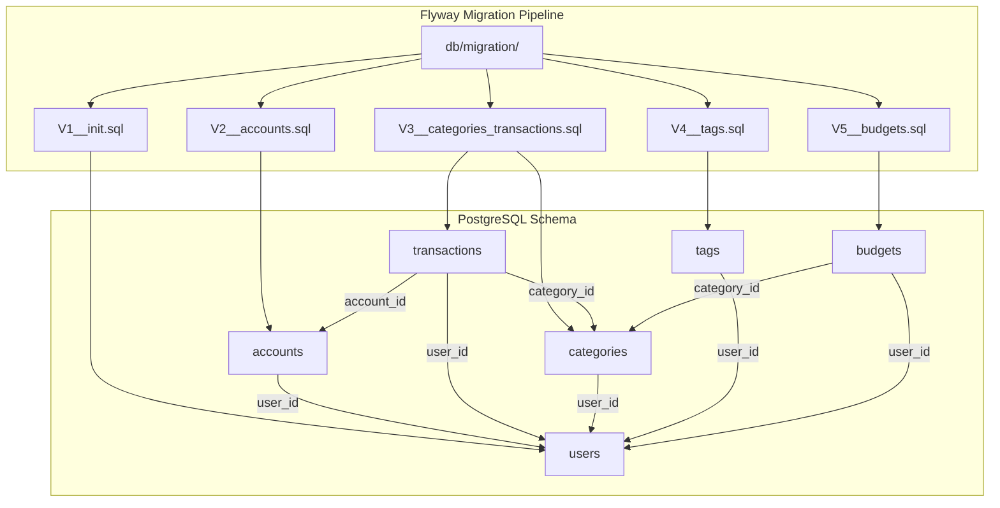
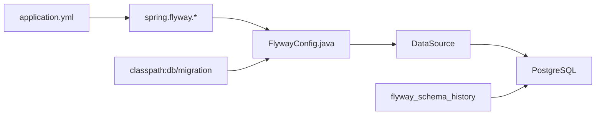
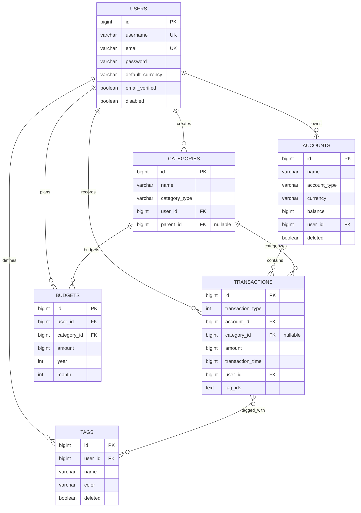
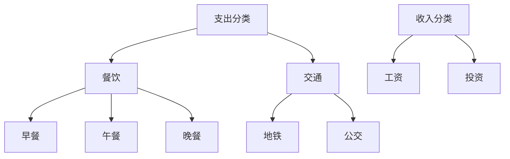
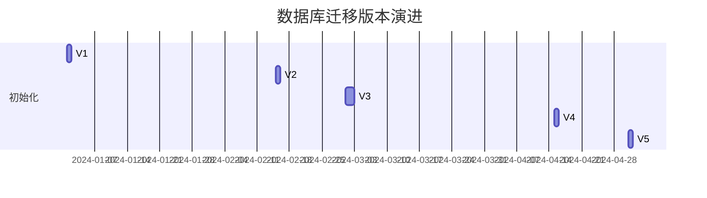

本文档深入解析家庭记账系统的数据库架构，涵盖 Flyway 迁移策略、核心实体设计以及表间关系。通过理解本章节，设计者和开发者将掌握数据库层面的完整设计思路，为后续的业务功能开发奠定坚实基础。

## 1. 架构概览

本系统采用 **Flyway** 作为数据库版本管理工具，配合 **PostgreSQL** 数据库实现结构化迁移。Flyway 通过版本化的 SQL 脚本确保数据库变更可追溯、可重复执行，完美适配敏捷开发流程中的数据库演进需求。



**迁移脚本命名规范**：`V{版本号}__{描述}.sql`，其中版本号采用两位数递增（V1、V2、V3...），双下划线分隔描述信息。

Sources: [V1__init.sql](backend/src/main/resources/db/migration/V1__init.sql#L1-L24), [V2__accounts.sql](backend/src/main/resources/db/migration/V2__accounts.sql#L1-L20), [V3__categories_transactions.sql](backend/src/main/resources/db/migration/V3__categories_transactions.sql#L1-L40)

## 2. Flyway 配置解析

FlywayConfig 类负责初始化数据库迁移服务，通过 Spring Boot 的自动配置机制与 @ConditionalOnProperty 注解实现条件化加载，确保 Flyway 仅在启用时生效。



关键配置参数说明：

| 配置项 | 默认值 | 说明 |
|--------|--------|------|
| `spring.flyway.locations` | `classpath:db/migration` | 迁移脚本存放路径 |
| `spring.flyway.baseline-on-migrate` | `true` | 新数据库自动创建基线 |
| `spring.flyway.table` | `flyway_schema_history` | 版本记录表名 |

Sources: [FlywayConfig.java](backend/src/main/java/com/bookkeeping/config/FlywayConfig.java#L1-L34)

## 3. 实体关系图

以下实体关系图展示了六个核心表的完整关联结构，体现了家庭记账系统的业务模型。



## 4. 核心实体详解

### 4.1 Users（用户表）

用户表是整个系统的根实体，所有其他数据均通过 `user_id` 关联到具体用户，实现多租户数据隔离。

```sql
CREATE TABLE users (
    id BIGSERIAL PRIMARY KEY,
    username VARCHAR(32) NOT NULL UNIQUE,
    email VARCHAR(100) NOT NULL UNIQUE,
    nickname VARCHAR(64),
    password VARCHAR(100) NOT NULL,
    salt VARCHAR(10) NOT NULL,
    default_currency VARCHAR(3) DEFAULT 'USD',
    default_account_id BIGINT,
    language VARCHAR(10) DEFAULT 'en-US',
    email_verified BOOLEAN DEFAULT FALSE,
    disabled BOOLEAN DEFAULT FALSE,
    created_at BIGINT NOT NULL,
    updated_at BIGINT NOT NULL,
    created_by BIGINT,
    modified_by BIGINT
);
```

**设计要点**：

- `BIGSERIAL` 用于自增主键，与 Java 的 `GenerationType.IDENTITY` 对应
- `salt` 字段存储密码盐值，支持安全的密码哈希
- `default_account_id` 建立用户与默认账户的关联
- `created_by` 和 `modified_by` 实现审计追踪（指向用户自身）

Sources: [V1__init.sql](backend/src/main/resources/db/migration/V1__init.sql#L4-L20)

### 4.2 Accounts（账户表）

账户实体代表用户的资产账户，支持多种账户类型，是交易记录的核心容器。

```java
@Entity
@Table(name = "accounts")
@Getter
@Builder(toBuilder = true)
public class Account extends BaseEntity {
    @Column(nullable = false, length = 64)
    private String name;

    @Column(name = "account_type", nullable = false, length = 20)
    @Enumerated(EnumType.STRING)
    private AccountType accountType;

    @Column(nullable = false, length = 3)
    private String currency = "USD";

    /** Balance in cents (fen) */
    @Column(nullable = false)
    private Long balance = 0L;

    @Column(name = "user_id", nullable = false)
    private Long userId;

    @Column
    private Boolean deleted = false;
}
```

账户类型枚举定义：

| 枚举值 | 显示名称 | 适用场景 |
|--------|----------|----------|
| `CASH` | Cash | 现金管理 |
| `CHECKING` | Checking | 日常支票账户 |
| `SAVINGS` | Savings | 储蓄账户 |
| `CREDIT` | Credit | 信用卡 |
| `INVESTMENT` | Investment | 投资账户 |

Sources: [V2__accounts.sql](backend/src/main/resources/db/migration/V2__accounts.sql#L3-L16), [Account.java](backend/src/main/java/com/bookkeeping/core/account/Account.java#L1-L50), [AccountType.java](backend/src/main/java/com/bookkeeping/common/enums/AccountType.java#L1-L22)

### 4.3 Categories（分类表）

分类系统支持树形结构，通过 `parent_id` 实现层级分类。分类分为收入（INCOME）和支出（EXPENSE）两大类。

```java
@Entity
@Table(name = "categories")
public class Category extends BaseEntity {
    @Column(nullable = false, length = 64)
    private String name;

    @Column(name = "category_type", nullable = false, length = 10)
    @Enumerated(EnumType.STRING)
    private CategoryType categoryType;

    @Column(name = "user_id", nullable = false)
    private Long userId;

    @Column(name = "parent_id")
    private Long parentId;

    @Column
    private Integer sortOrder = 0;
}
```

分类层级示例：



Sources: [V3__categories_transactions.sql](backend/src/main/resources/db/migration/V3__categories_transactions.sql#L3-L14), [Category.java](backend/src/main/java/com/bookkeeping/core/category/Category.java#L1-L36), [CategoryType.java](backend/src/main/java/com/bookkeeping/common/enums/CategoryType.java#L1-L20)

### 4.4 Transactions（交易表）

交易表是核心业务表，记录所有财务流水。每条交易关联账户、用户，可选关联分类和标签。

```java
@Entity
@Table(name = "transactions")
public class Transaction extends BaseEntity {
    /** 1=MODIFY_BALANCE, 2=INCOME, 3=EXPENSE, 4=TRANSFER_OUT, 5=TRANSFER_IN */
    @Column(name = "transaction_type", nullable = false)
    private Integer transactionType;

    @Column(name = "account_id", nullable = false)
    private Long accountId;

    @Column(name = "category_id")
    private Long categoryId;

    /** Amount in cents */
    @Column(nullable = false)
    private Long amount;

    @Column(name = "transaction_time", nullable = false)
    private Long transactionTime;

    @Column(name = "user_id", nullable = false)
    private Long userId;

    @Column(name = "tag_ids", columnDefinition = "TEXT")
    private String tagIds;
}
```

交易类型详解：

| 类型码 | 枚举值 | 说明 | 余额变化 |
|--------|--------|------|----------|
| 1 | `MODIFY_BALANCE` | 余额调整 | 直接设置 |
| 2 | `INCOME` | 收入 | 增加 |
| 3 | `EXPENSE` | 支出 | 减少 |
| 4 | `TRANSFER_OUT` | 转出 | 减少 |
| 5 | `TRANSFER_IN` | 转入 | 增加 |

Sources: [V3__categories_transactions.sql](backend/src/main/resources/db/migration/V3__categories_transactions.sql#L21-L35), [Transaction.java](backend/src/main/java/com/bookkeeping/core/transaction/Transaction.java#L1-L48), [TransactionType.java](backend/src/main/java/com/bookkeeping/common/enums/TransactionType.java#L1-L37)

### 4.5 Tags（标签表）

标签系统采用纯文本存储 `tag_ids`，通过逗号分隔的 ID 列表实现多对多关系。这种设计避免了关联表的开销，适合低并发场景。

```sql
-- Add tag_ids column to transactions (stored as comma-separated IDs)
ALTER TABLE transactions ADD COLUMN IF NOT EXISTS tag_ids TEXT;
```

标签实体设计简洁，支持颜色自定义：

```java
@Entity
@Table(name = "tags")
public class Tag {
    @Id
    @GeneratedValue(strategy = GenerationType.IDENTITY)
    private Long id;

    @Column(nullable = false)
    private Long userId;

    @Column(nullable = false)
    private String name;

    @Column(length = 7)
    private String color;  // Hex color code

    @Column(name = "deleted")
    private Boolean deleted = false;
}
```

Sources: [V4__tags.sql](backend/src/main/resources/db/migration/V4__tags.sql#L1-L21), [Tag.java](backend/src/main/java/com/bookkeeping/core/tag/Tag.java#L1-L35)

### 4.6 Budgets（预算表）

预算表实现月度预算管理，通过 `year` 和 `month` 组合唯一确定预算周期。

```java
@Entity
@Table(name = "budgets")
public class Budget {
    @Column(name = "user_id", nullable = false)
    private Long userId;

    @Column(name = "category_id", nullable = false)
    private Long categoryId;

    /** Amount in cents */
    @Column(nullable = false)
    private Long amount;

    @Column(nullable = false)
    private Integer year;

    @Column(nullable = false)
    private Integer month;
}
```

数据库层索引设计：

```sql
CREATE INDEX idx_budgets_user_month ON budgets(user_id, year, month);
CREATE INDEX idx_budgets_category ON budgets(category_id);
```

Sources: [V5__budgets.sql](backend/src/main/resources/db/migration/V5__budgets.sql#L1-L18), [Budget.java](backend/src/main/java/com/bookkeeping/core/budget/Budget.java#L1-L39)

## 5. 基础设施模式

### 5.1 BaseEntity 抽象基类

所有业务实体继承 `BaseEntity`，统一实现主键和时间戳管理。这种设计确保了数据访问的一致性。

```java
@MappedSuperclass
@Getter
public abstract class BaseEntity implements Auditable {
    @Id
    @GeneratedValue(strategy = GenerationType.IDENTITY)
    protected Long id;

    @Column(name = "created_at", nullable = false, updatable = false)
    protected Long createdAt;

    @Column(name = "updated_at", nullable = false)
    protected Long updatedAt;

    @PrePersist
    protected void onCreate() {
        long now = System.currentTimeMillis() / 1000;
        this.createdAt = now;
        this.updatedAt = now;
    }

    @PreUpdate
    protected void onUpdate() {
        this.updatedAt = System.currentTimeMillis() / 1000;
    }
}
```

**核心设计原则**：

- `@MappedSuperclass`：非实体类，仅作为继承基类
- `Unix Timestamp`：统一使用秒级时间戳，与前端 JavaScript Date 兼容
- JPA 生命周期回调：`@PrePersist` 和 `@PreUpdate` 自动维护时间戳

Sources: [BaseEntity.java](backend/src/main/java/com/bookkeeping/common/BaseEntity.java#L1-L53), [Auditable.java](backend/src/main/java/com/bookkeeping/common/Auditable.java#L1-L12)

### 5.2 金额存储策略

所有金额字段采用 **BIGINT** 类型存储**分（cent）**而非元，避免浮点数精度问题。

```
数据库存储：123450 → 前端显示：$1,234.50
计算方式：amount / 100
```

这种设计在金融系统中尤为重要，可以避免 `0.1 + 0.2 = 0.30000000000000004` 的问题。

| 场景 | 存储值 | 显示值 |
|------|--------|--------|
| 日常支出 | `500` | ¥5.00 |
| 工资收入 | `1500000` | ¥15,000.00 |
| 大额转账 | `50000000` | ¥500,000.00 |

Sources: [Transaction.java](backend/src/main/java/com/bookkeeping/core/transaction/Transaction.java#L29-L31)

## 6. 索引设计策略

合理的索引设计显著提升查询性能。以下是各表的索引规划：

| 表名 | 索引名称 | 索引字段 | 用途 |
|------|----------|----------|------|
| `users` | `idx_users_username` | `username` | 登录查询 |
| `users` | `idx_users_email` | `email` | 邮箱查找 |
| `accounts` | `idx_accounts_user_id` | `user_id` | 用户账户列表 |
| `accounts` | `idx_accounts_deleted` | `deleted` | 软删除过滤 |
| `categories` | `idx_categories_user_id` | `user_id` | 用户分类查询 |
| `categories` | `idx_categories_type` | `category_type` | 类型过滤 |
| `transactions` | `idx_transactions_user_id` | `user_id` | 用户交易列表 |
| `transactions` | `idx_transactions_account_id` | `account_id` | 账户交易查询 |
| `transactions` | `idx_transactions_time` | `transaction_time` | 时间范围查询 |
| `tags` | `idx_tags_user_id` | `user_id` | 用户标签查询 |
| `budgets` | `idx_budgets_user_month` | `(user_id, year, month)` | 月度预算查询 |

Sources: [V1__init.sql](backend/src/main/resources/db/migration/V1__init.sql#L22-L23), [V2__accounts.sql](backend/src/main/resources/db/migration/V2__accounts.sql#L18-L19), [V3__categories_transactions.sql](backend/src/main/resources/db/migration/V3__categories_transactions.sql#L16-L17, L37-L39), [V4__tags.sql](backend/src/main/resources/db/migration/V4__tags.sql#L14-L15), [V5__budgets.sql](backend/src/main/resources/db/migration/V5__budgets.sql#L15-L16)

## 7. 迁移历史时间线



| 版本 | 文件名 | 主要内容 |
|------|--------|----------|
| V1 | `V1__init.sql` | 用户表初始化 |
| V2 | `V2__accounts.sql` | 账户表创建 |
| V3 | `V3__categories_transactions.sql` | 分类表 + 交易表 |
| V4 | `V4__tags.sql` | 标签表 + 交易表 tag_ids 列 |
| V5 | `V5__budgets.sql` | 预算表创建 |

## 8. 下一步阅读

完成本章节后，建议继续深入以下主题：

- [API 设计规范 - 统一响应格式与错误码](8-api-she-ji-gui-fan-tong-xiang-ying-ge-shi-yu-cuo-wu-ma)：了解后端如何返回数据库操作结果
- [账户管理 - 账户实体与 CRUD 操作](9-zhang-hu-guan-li-zhang-hu-shi-ti-yu-crud-cao-zuo)：掌握账户相关的业务逻辑实现
- [交易管理 - 交易类型与金额处理](10-jiao-yi-guan-li-jiao-yi-lei-xing-yu-jin-e-chu-li)：深入理解交易的完整生命周期