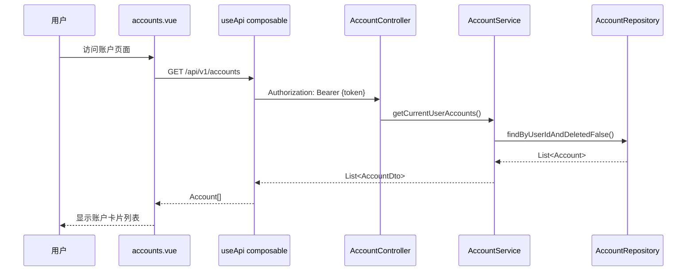

本文档详细解析家庭记账系统中的**账户管理模块**，涵盖账户实体设计、数据持久化策略、业务逻辑实现以及前后端交互规范。该模块采用标准的 DDD 分层架构，通过 JPA + Flyway 实现数据管理，使用 MapStructPlus 进行实体与 DTO 的自动映射。

---

## 1. 账户实体设计

### 1.1 实体结构与字段定义

账户实体 `Account` 继承自 `BaseEntity`，利用 JPA 注解映射到 `accounts` 表。所有字段均遵循不可变设计原则，通过 Builder 模式构建实例。

```java
@Entity
@Table(name = "accounts")
@Getter
@Builder(toBuilder = true)
@NoArgsConstructor(access = AccessLevel.PROTECTED)
@AllArgsConstructor
public class Account extends BaseEntity {
    @Column(nullable = false, length = 64)
    private String name;                                      // 账户名称

    @Column(name = "account_type", nullable = false, length = 20)
    @Enumerated(EnumType.STRING)
    private AccountType accountType;                           // 账户类型枚举

    @Column(nullable = false, length = 3)
    private String currency = "USD";                           // 币种代码

    @Column(nullable = false)
    private Long balance = 0L;                                 // 余额（单位：分）

    @Column(name = "user_id", nullable = false)
    private Long userId;                                       // 所属用户ID

    @Column(length = 255)
    private String description;                               // 账户描述

    @Column
    private Boolean deleted = false;                          // 软删除标记
}
```

关键设计要点说明：

| 字段 | 类型 | 设计决策 | 原因 |
|------|------|----------|------|
| `balance` | `Long` | 以分为单位存储 | 避免浮点运算精度问题，前端显示时除以 100 |
| `deleted` | `Boolean` | 软删除策略 | 保留数据完整性，支持数据恢复 |
| `accountType` | `Enum` | 字符串枚举存储 | 便于数据库查询和调试 |

Sources: [Account.java](backend/src/main/java/com/bookkeeping/core/account/Account.java#L16-L49)

### 1.2 数据库表结构

账户表通过 Flyway 迁移脚本 `V2__accounts.sql` 创建，包含以下索引策略：

```sql
CREATE TABLE accounts (
    id BIGSERIAL PRIMARY KEY,
    name VARCHAR(64) NOT NULL,
    account_type VARCHAR(20) NOT NULL,
    currency VARCHAR(3) NOT NULL DEFAULT 'USD',
    balance BIGINT NOT NULL DEFAULT 0,
    user_id BIGINT NOT NULL REFERENCES users(id),
    description VARCHAR(255),
    deleted BOOLEAN DEFAULT FALSE,
    created_at BIGINT NOT NULL,
    updated_at BIGINT NOT NULL,
    created_by BIGINT,
    modified_by BIGINT
);

CREATE INDEX idx_accounts_user_id ON accounts(user_id);      -- 用户账户列表查询
CREATE INDEX idx_accounts_deleted ON accounts(deleted);    -- 软删除过滤
```

时间戳字段使用 Unix 秒级时间戳（`BIGINT`），与前端时间处理保持一致，避免时区转换问题。

Sources: [V2__accounts.sql](backend/src/main/resources/db/migration/V2__accounts.sql#L1-L20)

### 1.3 账户类型枚举

```java
public enum AccountType {
    CASH("Cash"),           // 现金
    CHECKING("Checking"),   // 活期存款
    SAVINGS("Savings"),     // 储蓄账户
    CREDIT("Credit"),       // 信用卡
    INVESTMENT("Investment"); // 投资账户
    
    private final String displayName;
}
```

账户类型枚举定义了五种账户类型，每个类型具有显示名称，支持前端 UI 的本地化展示。

Sources: [AccountType.java](backend/src/main/java/com/bookkeeping/common/enums/AccountType.java#L1-L22)

---

## 2. 领域模型分层架构

### 2.1 架构概览

账户模块采用经典的三层架构，各层职责清晰分离：

```mermaid
flowchart TB
    subgraph Controller["表现层"]
        AC[AccountController]
    end
    
    subgraph Service["服务层"]
        AS[AccountService]
        SM[AccountMapper]
    end
    
    subgraph Repository["持久化层"]
        AR[AccountRepository]
    end
    
    subgraph Domain["领域层"]
        A[Account]
        ADR[CreateAccountRequest]
        ADU[UpdateAccountRequest]
        ADTO[AccountDto]
    end
    
    AC --> AS
    AS --> SM
    AS --> AR
    SM --> ADTO
    AR --> A
    
    AC : "/api/v1/accounts"
    AS : 业务校验/用户隔离
    SM : MapStructPlus自动映射
```

### 2.2 各层职责定义

| 层次 | 组件 | 职责 |
|------|------|------|
| 表现层 | `AccountController` | HTTP 请求路由、OpenAPI 文档生成、请求验证 |
| 服务层 | `AccountService` | 业务逻辑、事务管理、用户数据隔离 |
| 服务层 | `AccountMapper` | 实体↔DTO 自动映射（MapStructPlus） |
| 持久化层 | `AccountRepository` | JPA 数据访问、自定义查询方法 |
| 领域层 | 实体与 DTO | 数据传输对象、输入验证规则 |

---

## 3. REST API 设计

### 3.1 端点规范

| 方法 | 路径 | 描述 | 请求体 |
|------|------|------|--------|
| `GET` | `/api/v1/accounts` | 获取当前用户所有账户 | - |
| `GET` | `/api/v1/accounts/{id}` | 获取指定账户详情 | - |
| `POST` | `/api/v1/accounts` | 创建新账户 | `CreateAccountRequest` |
| `PUT` | `/api/v1/accounts/{id}` | 更新账户信息 | `UpdateAccountRequest` |
| `DELETE` | `/api/v1/accounts/{id}` | 软删除账户 | - |

所有端点均需 JWT 认证，响应格式统一为 `ApiResponse<T>` 包装。

### 3.2 请求 DTO 设计

**创建账户请求**包含完整的验证规则：

```java
public record CreateAccountRequest(
    @NotBlank(message = "Account name is required")
    @Size(min = 1, max = 64, message = "Account name must be 1-64 characters")
    String name,

    @NotNull(message = "Account type is required")
    AccountType accountType,

    @NotBlank(message = "Currency is required")
    @Size(min = 3, max = 3, message = "Currency must be 3 characters")
    String currency,

    Long initialBalance,  // 初始余额（分）

    @Size(max = 255, message = "Description must be at most 255 characters")
    String description
) {
    // 初始化余额默认值为 0
    public CreateAccountRequest {
        if (initialBalance == null) initialBalance = 0L;
    }
}
```

**更新账户请求**仅允许修改名称和描述，账户类型和币种创建后不可变更：

```java
public record UpdateAccountRequest(
    @Size(min = 1, max = 64, message = "Account name must be 1-64 characters")
    String name,

    @Size(max = 255, message = "Description must be at most 255 characters")
    String description
) {}
```

Sources: [CreateAccountRequest.java](backend/src/main/java/com/bookkeeping/core/account/CreateAccountRequest.java#L1-L32)
Sources: [UpdateAccountRequest.java](backend/src/main/java/com/bookkeeping/core/account/UpdateAccountRequest.java#L1-L15)

### 3.3 响应 DTO 设计

```java
@MapperAuto(sourceEntity = Account.class, direction = Direction.From)
public record AccountDto(
    Long id,
    String name,
    AccountType accountType,
    String currency,
    Long balance,           // 单位：分
    Long userId,
    String description
) {}
```

响应 DTO 通过 `MapStructPlus` 的 `@MapperAuto` 注解自动生成映射逻辑，从 `Account` 实体映射而来。

Sources: [AccountDto.java](backend/src/main/java/com/bookkeeping/core/account/AccountDto.java#L1-L21)

---

## 4. 业务逻辑实现

### 4.1 服务层核心方法

```java
@Service
public class AccountService {
    private final AccountRepository accountRepository;
    private final AccountMapper accountMapper;
    private final SecurityUtils securityUtils;

    /** 获取当前用户所有未删除账户 */
    @Transactional(readOnly = true)
    public List<AccountDto> getCurrentUserAccounts() {
        Long userId = securityUtils.requireCurrentUser().getId();
        return accountRepository.findByUserIdAndDeletedFalse(userId).stream()
                .map(accountMapper::toDto)
                .toList();
    }

    /** 创建账户（含名称唯一性校验） */
    @Transactional
    public AccountDto createAccount(CreateAccountRequest request) {
        Long userId = securityUtils.requireCurrentUser().getId();
        
        // 检查同名账户是否已存在
        if (accountRepository.existsByNameAndUserIdAndDeletedFalse(request.name(), userId)) {
            throw new BusinessException(ResultCode.ACCOUNT_ALREADY_EXISTS, 
                    "Account with name '" + request.name() + "' already exists");
        }
        
        Account account = Account.builder()
                .name(request.name())
                .accountType(request.accountType())
                .currency(request.currency())
                .balance(request.initialBalance())
                .userId(userId)
                .description(request.description())
                .deleted(false)
                .build();
        
        return accountMapper.toDto(accountRepository.save(account));
    }

    /** 更新账户（支持部分更新） */
    @Transactional
    public AccountDto updateAccount(Long id, UpdateAccountRequest request) {
        Long userId = securityUtils.requireCurrentUser().getId();
        Account account = accountRepository.findByIdAndUserIdAndDeletedFalse(id, userId)
                .orElseThrow(() -> new BusinessException(ResultCode.ACCOUNT_NOT_FOUND));

        Account.AccountBuilder builder = account.toBuilder();
        if (request.name() != null) {
            if (!request.name().equals(account.getName()) 
                    && accountRepository.existsByNameAndUserIdAndDeletedFalse(request.name(), userId)) {
                throw new BusinessException(ResultCode.ACCOUNT_ALREADY_EXISTS);
            }
            builder.name(request.name());
        }
        if (request.description() != null) {
            builder.description(request.description());
        }
        return accountMapper.toDto(accountRepository.save(builder.build()));
    }

    /** 软删除账户 */
    @Transactional
    public void deleteAccount(Long id) {
        accountRepository.save(account.toBuilder().deleted(true).build());
    }

    /** 更新账户余额（交易模块调用） */
    @Transactional
    public void updateBalance(Long accountId, Long amountChange) {
        Account account = accountRepository.findById(accountId)
                .orElseThrow(() -> new BusinessException(ResultCode.ACCOUNT_NOT_FOUND));
        accountRepository.save(account.toBuilder()
                .balance(account.getBalance() + amountChange).build());
    }
}
```

### 4.2 用户数据隔离策略

所有查询必须携带 `userId` 条件，确保用户只能访问自己的数据：

```java
// Repository 查询方法
List<Account> findByUserIdAndDeletedFalse(Long userId);
Optional<Account> findByIdAndUserIdAndDeletedFalse(Long id, Long userId);
boolean existsByNameAndUserIdAndDeletedFalse(String name, Long userId);
```

通过 `SecurityUtils.requireCurrentUser()` 获取当前认证用户 ID，注入到所有服务方法中。

Sources: [AccountService.java](backend/src/main/java/com/bookkeeping/core/account/AccountService.java#L1-L134)
Sources: [AccountRepository.java](backend/src/main/java/com/bookkeeping/core/account/AccountRepository.java#L1-L21)

### 4.3 错误处理机制

| 错误码 | 枚举值 | 触发场景 |
|--------|--------|----------|
| 4001 | `ACCOUNT_NOT_FOUND` | 账户不存在或不属于当前用户 |
| 4002 | `ACCOUNT_ALREADY_EXISTS` | 同名账户已存在 |
| 4003 | `ACCOUNT_INVALID_BALANCE` | 余额无效（交易模块使用） |

全局异常处理器 `GlobalExceptionHandler` 统一处理 `BusinessException`，返回统一的错误响应格式：

```json
{
  "success": false,
  "result": null,
  "errorCode": 4001,
  "errorMessage": "Account not found"
}
```

Sources: [ResultCode.java](backend/src/main/java/com/bookkeeping/common/ResultCode.java#L32-L36)
Sources: [GlobalExceptionHandler.java](backend/src/main/java/com/bookkeeping/exception/GlobalExceptionHandler.java#L28-L34)

---

## 5. 前端集成

### 5.1 账户页面组件

前端使用 Nuxt 3 + Vuetify 构建账户管理界面，主要功能包括：

- **类型筛选**：通过 Tab 组件按账户类型（Cash/Bank/Credit/Investment）筛选
- **卡片展示**：每个账户以卡片形式展示，包含图标、余额、类型信息
- **余额可视化**：进度条展示各账户余额占比
- **CRUD 弹窗**：创建/编辑/删除操作通过 Dialog 组件完成

```typescript
// 前端类型定义
interface Account {
  id: number
  name: string
  accountType: string
  currency: string
  balance: number  // 单位：分
  userId: number
  description?: string
}

// API 调用封装
const api = useApi()
const accounts = await api.get<Account[]>('/accounts')

// 金额格式化（分 → 元）
function fmt(c: number) { 
  return (c / 100).toLocaleString('en-US', { minimumFractionDigits: 2 }) 
}
```

Sources: [accounts.vue](frontend/pages/accounts.vue#L1-L199)
Sources: [types/index.ts](frontend/types/index.ts#L1-L11)

### 5.2 前端数据流



### 5.3 账户类型图标映射

| 类型 | 图标 | 颜色 | 含义 |
|------|------|------|------|
| `CASH` | `mdi-cash` | success (绿色) | 现金 |
| `CHECKING` | `mdi-bank` | primary (蓝色) | 银行活期 |
| `SAVINGS` | `mdi-piggy-bank` | info (青色) | 储蓄 |
| `CREDIT` | `mdi-credit-card` | error (红色) | 信用卡 |
| `INVESTMENT` | `mdi-chart-line` | warning (橙色) | 投资账户 |

Sources: [accounts.vue](frontend/pages/accounts.vue#L139-L146)

---

## 6. 技术栈要点总结

| 层级 | 技术选型 | 核心依赖 |
|------|----------|----------|
| 实体映射 | JPA + Hibernate | `spring-boot-starter-data-jpa` |
| 数据迁移 | Flyway | `flyway-core:11.14.1` |
| 对象映射 | MapStructPlus | `mapstruct-plus:1.0.0-SNAPSHOT` |
| 输入验证 | Jakarta Validation | `spring-boot-starter-validation` |
| API 文档 | SpringDoc OpenAPI | `springdoc-openapi-starter-webmvc-ui:2.8.8` |
| 前端框架 | Nuxt 3 + Vuetify | `nuxt`, `vuetify` |

**金额处理规范**：所有金额在后端以 `Long` 类型存储（单位：分），前端显示时除以 100 转换为元，确保计算精度。

---

## 7. 扩展阅读

本模块为记账系统的核心基础模块，与以下模块存在依赖关系：

- **[交易管理 - 交易类型与金额处理](10-jiao-yi-guan-li-jiao-yi-lei-xing-yu-jin-e-chu-li)**：交易记录关联账户，自动更新账户余额
- **[分类管理 - 收入支出分类体系](11-fen-lei-guan-li-shou-ru-zhi-chu-fen-lei-ti-xi)**：交易分类与账户联动

如需了解数据持久化的完整迁移流程，请参阅 [数据库设计 - Flyway 迁移与实体关系](7-shu-ju-ku-she-ji-flyway-qian-yi-yu-shi-ti-guan-xi)。