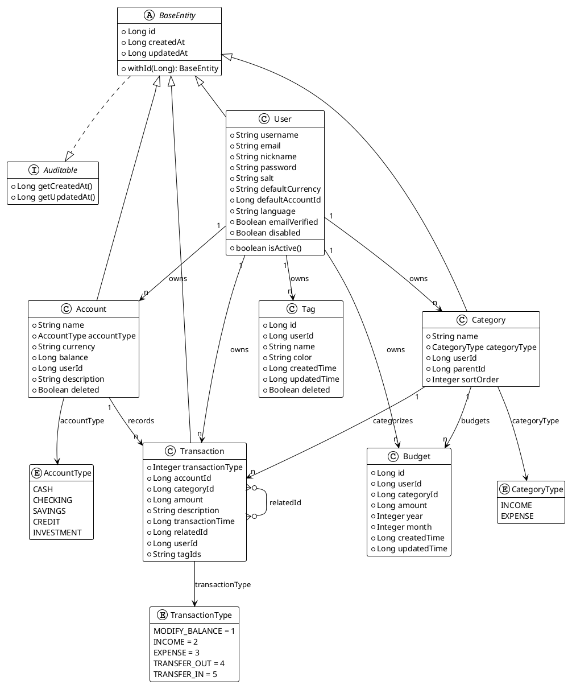
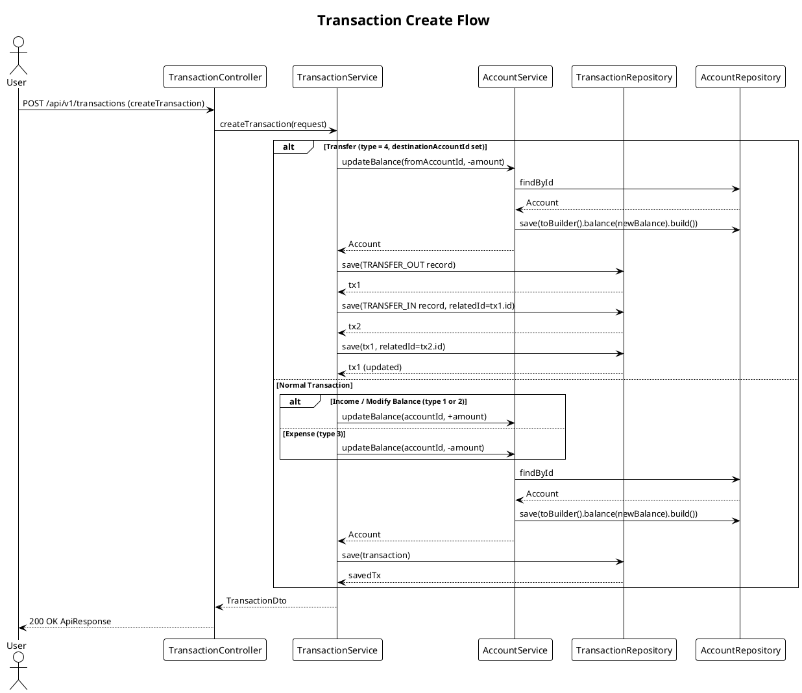
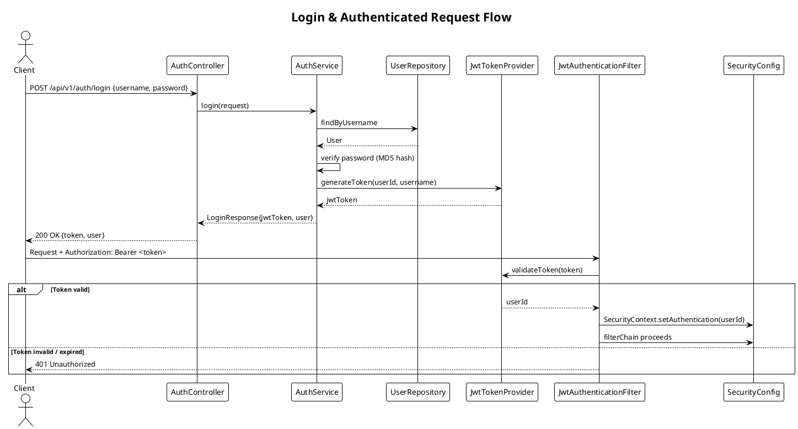
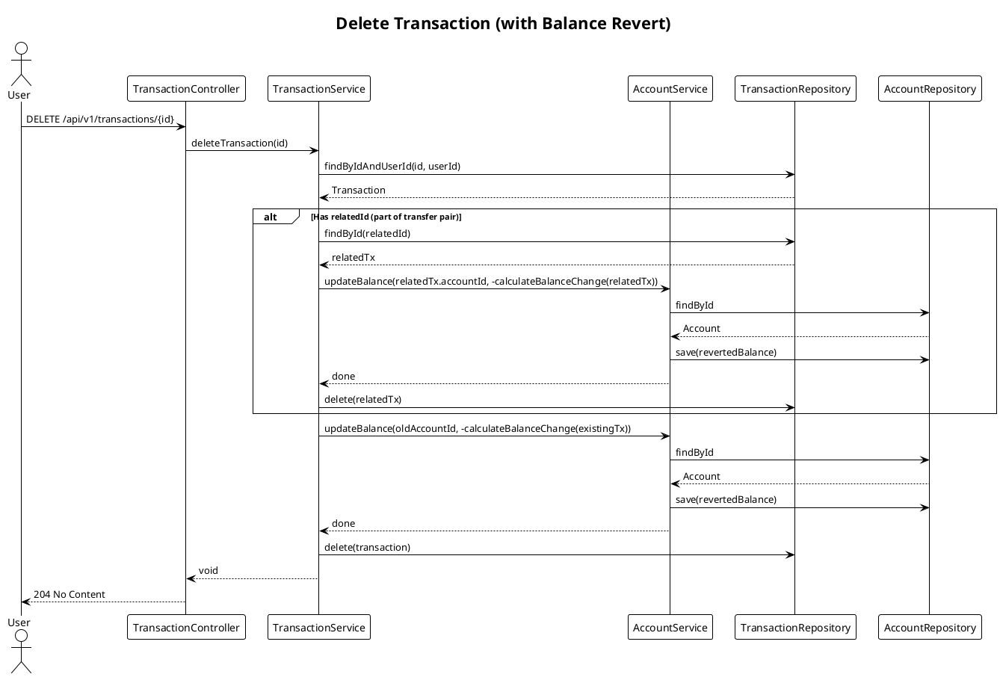
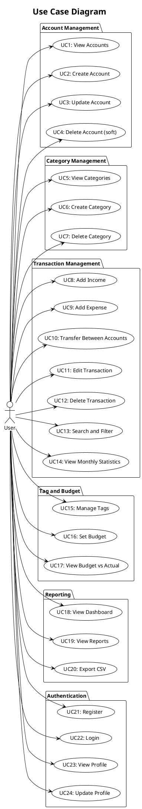
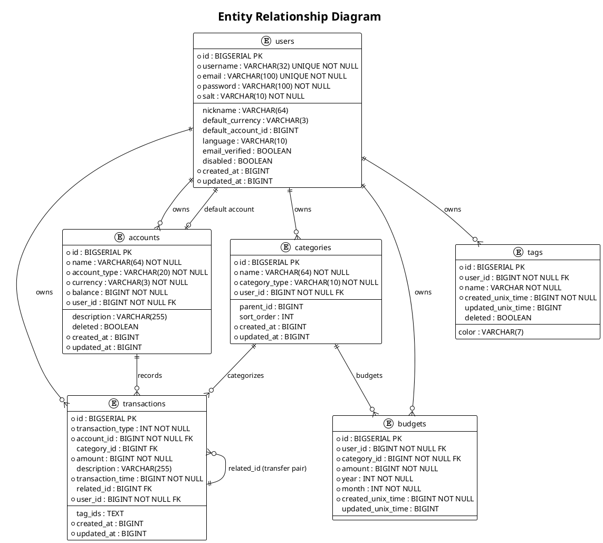
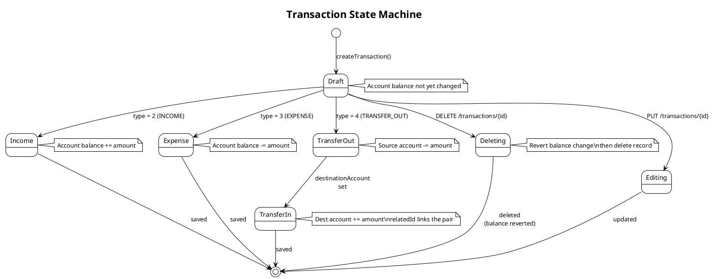
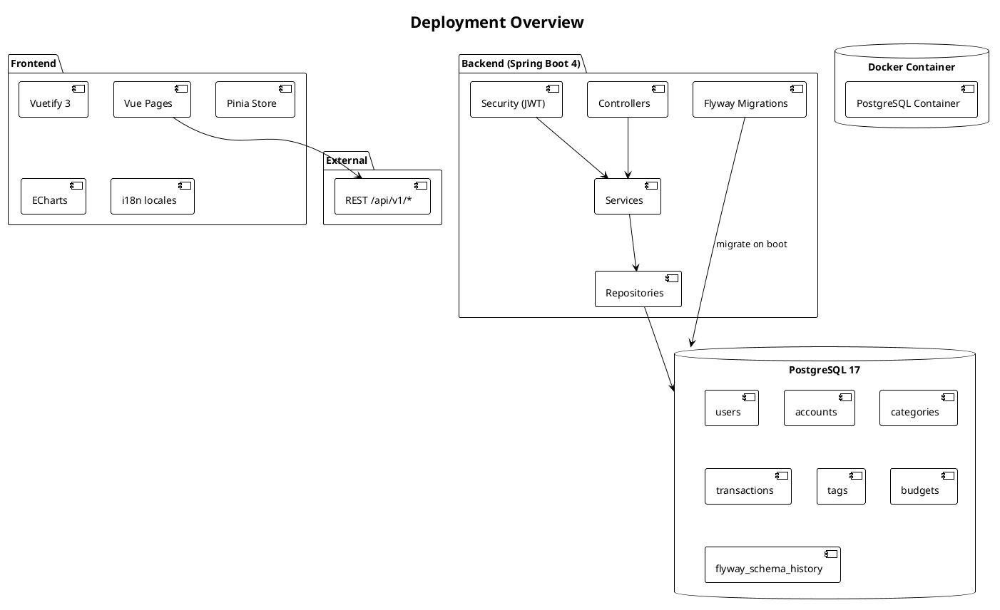
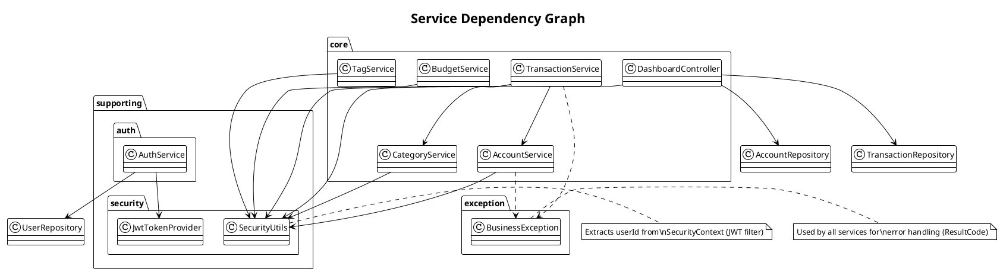

# Bookkeeping System — Object-Oriented Design

> PlantUML diagrams for architecture, domain model, and interactions.

## 1. Domain Model (Class Diagram)



---

## 2. Package Architecture (Component Diagram)

```plantuml
@startuml
!theme plain

title Package Architecture

package "common" {
    class BaseEntity
    interface Auditable
    class ApiResponse
    class ResultCode
    enum AccountType
    enum CategoryType
    enum TransactionType
}

package "supporting" {
    package "auth" {
        class AuthController
        class AuthService
        record LoginRequest
        record LoginResponse
        record RegisterRequest
    }
    package "security" {
        class JwtTokenProvider
        class JwtAuthenticationFilter
        class SecurityUtils
    }
    package "user" {
        class User
        class UserController
        class UserService
        record UserDto
        record UpdateUserRequest
    }
}

package "core" {
    package "account" {
        class Account
        class AccountController
        class AccountService
        record AccountDto
        record CreateAccountRequest
        record UpdateAccountRequest
        interface AccountMapper
    }
    package "category" {
        class Category
        class CategoryController
        class CategoryService
        record CategoryDto
    }
    package "transaction" {
        class Transaction
        class TransactionController
        class TransactionService
        record TransactionDto
        record CreateTransactionRequest
        record UpdateTransactionRequest
        record StatisticsDto
        record TransactionSearchParams
        interface TransactionMapper
    }
    package "tag" {
        class Tag
        class TagController
        class TagService
        record TagDto
    }
    package "budget" {
        class Budget
        class BudgetController
        class BudgetService
        record BudgetDto
    }
    package "dashboard" {
        class DashboardController
    }
}

package "config" {
    class SecurityConfig
    class DataInitializer
    class JwtAuthenticationEntryPoint
}

package "exception" {
    class BusinessException
    class GlobalExceptionHandler
}

' Intra-package dependencies
AuthService ..> User
SecurityUtils ..> UserRepository
AuthController --> SecurityConfig
AccountService ..> SecurityUtils
TransactionService ..> AccountService
TransactionService ..> SecurityUtils
TransactionService ..> TransactionMapper

@enduml
```

---

## 3. Transaction Create Flow (Sequence Diagram)



---

## 4. Login & Authenticated Request (Sequence Diagram)



---

## 5. Delete Transaction with Balance Revert (Sequence Diagram)



---

## 6. Use Case Diagram



---

## 7. Entity Relationship Diagram (Database Schema)



---

## 8. System Mind Map

```plantuml
@startuml
!theme plain

title Bookkeeping System - Functionality Mind Map

' Core Modules
rectangle "Account Management" #LightGreen {
  card "Account entity\n(name, balance, currency)"
  card "AccountService"
  card "AccountRepository"
  card "AccountController"
  card "AccountDto + @MapperAuto"
  note bottom #White
    CRUD + soft delete
    Balance auto-update on tx
  end note
}

rectangle "Category Management" #LightGreen {
  card "Category entity\n(name, categoryType, parentId)"
  card "CategoryService"
  card "CategoryRepository"
  card "CategoryController"
  card "CategoryDto + @MapperAuto"
  note bottom #White
    INCOME / EXPENSE types
    Optional parent hierarchy
  end note
}

rectangle "Transaction Management" #LightGreen {
  card "Transaction entity"
  card "TransactionService"
  card "TransactionRepository"
  card "TransactionController"
  card "StatisticsDto"
  note bottom #White
    5 types: INCOME, EXPENSE,\nTRANSFER_OUT, TRANSFER_IN, MODIFY_BALANCE
    Auto balance update
    relatedId for transfers
  end note
}

rectangle "Tag Management" #LightGreen {
  card "Tag entity\n(name, color)"
  card "TagService"
  card "TagRepository"
  card "TagController"
  card "TagDto + @MapperAuto"
  note bottom #White
    CRUD + soft delete
    Tag colors (hex)
  end note
}

rectangle "Budget Management" #LightGreen {
  card "Budget entity\n(amount, year, month)"
  card "BudgetService"
  card "BudgetRepository"
  card "BudgetController"
  card "BudgetDto (calculated spent)"
  note bottom #White
    Per category / month
    Spent vs budget tracking
  end note
}

rectangle "Dashboard & Reporting" #LightGreen {
  card "DashboardController"
  card "Statistics (by category)"
  card "Charts (ECharts)"
  card "Reports page"
  card "CSV Export"
  note bottom #White
    KPI: income, expense, net
    Monthly trend analysis
  end note
}

' Supporting
rectangle "Authentication" #LightYellow {
  card "User entity"
  card "AuthService"
  card "AuthController"
  card "Login / Register / JWT"
  card "UserService"
  note bottom #White
    MD5 + salt password hash
    JWT stateless auth
  end note
}

rectangle "Security" #LightYellow {
  card "JwtTokenProvider\n(token gen/validate)"
  card "JwtAuthenticationFilter"
  card "SecurityUtils\n(requireCurrentUser)"
  card "SecurityConfig\n(CORS, routes)"
  note bottom #White
    Public: /auth/*, /health
    Protected: /api/v1/*
  end note
}

rectangle "Infrastructure" #LightYellow {
  card "DataInitializer\n(seed demo data)"
  card "GlobalExceptionHandler"
  card "ResultCode (error codes)"
  card "OpenApiConfig (Swagger)"
  card "Flyway migrations"
  note bottom #White
    Flyway: V1-V5 migrations
    Demo user: demo/demo123
  end note
}

' Common
rectangle "Common" #LightGray {
  card "BaseEntity (id, createdAt, updatedAt)"
  card "Auditable interface"
  card "ApiResponse<T>"
  card "AccountType enum"
  card "CategoryType enum"
  card "TransactionType enum"
  note bottom #White
    @Builder(toBuilder=true)
    @NoArgsConstructor(PROTECTED)
    No setters in production code
  end note
}

' Key Design Rules
rectangle "Key Design Rules" #Lavender {
  card "Amount: BIGINT cents (no float)"
  card "Time: Unix epoch BIGINT sec"
  card "Soft delete: deleted flag"
  card "Transfer: 2 records + relatedId"
  card "Response: ApiResponse<T>"
  card "Builder pattern (no setters)"
  card "MapStructPlus @MapperAuto on DTO"
}

@enduml
```



---

## 9. Transaction State Machine



---

## 10. Deployment Overview



---

## 11. Service Dependency Graph

