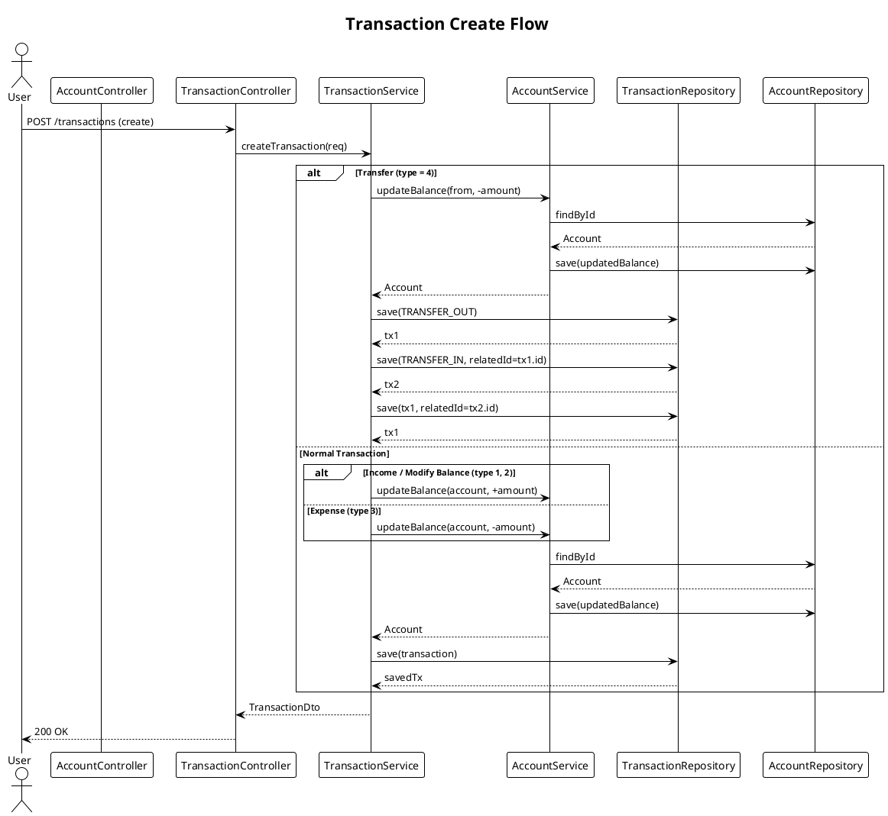
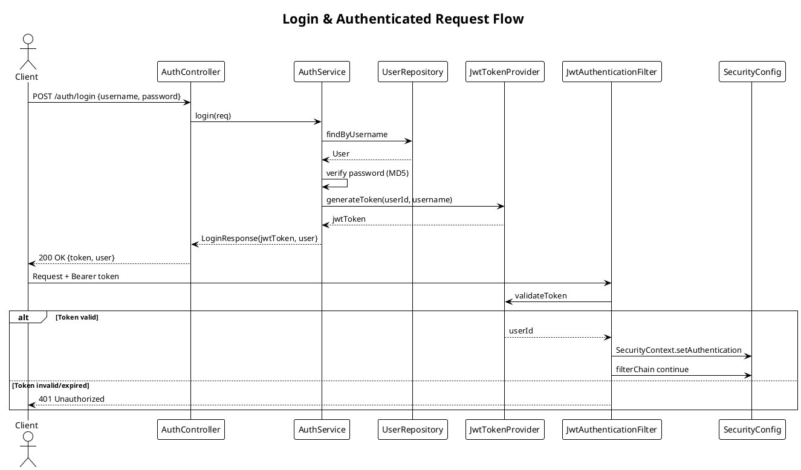
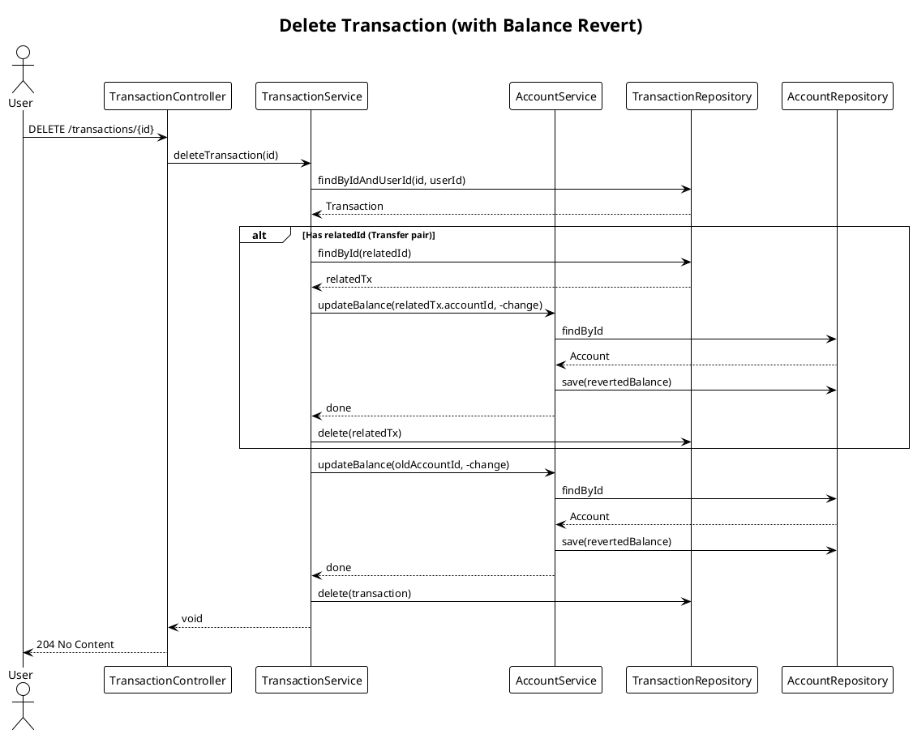
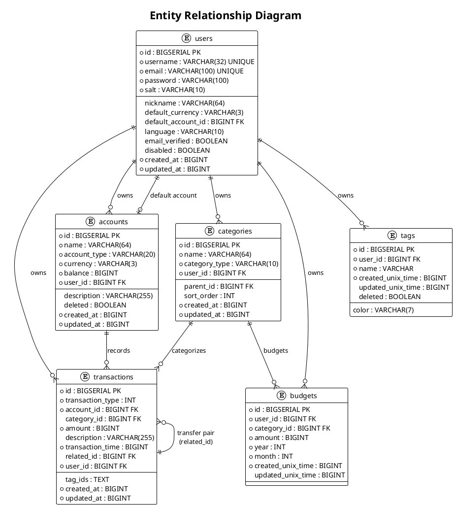
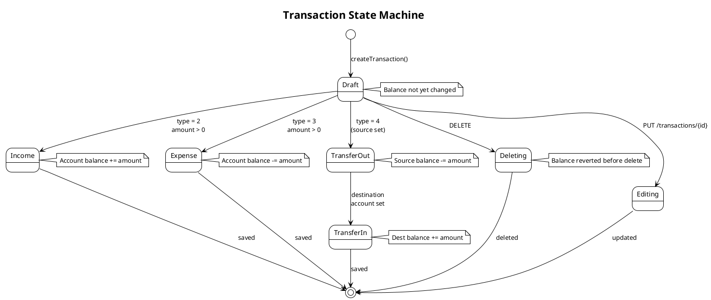
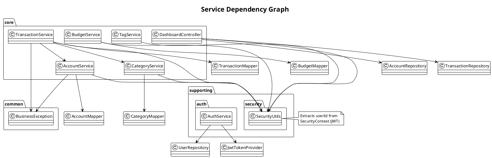

# Bookkeeping System — Object-Oriented Design

> PlantUML diagrams for architecture, domain model, and interactions.

## 1. Domain Model (Class Diagram)

```plantuml
@startuml
!theme plain

' === BASE ===
abstract class BaseEntity {
    +Long id
    +Long createdAt
    +Long updatedAt
    +withId(Long): BaseEntity
}

interface Auditable {
    +Long getCreatedAt()
    +Long getUpdatedAt()
}

BaseEntity ..|> Auditable

' === USER ===
class User {
    +String username
    +String email
    +String nickname
    +String password
    +String salt
    +String defaultCurrency
    +Long defaultAccountId
    +String language
    +Boolean emailVerified
    +Boolean disabled
    +boolean isActive()
}
BaseEntity <|-- User

' === CORE — ACCOUNT ===
class Account {
    +String name
    +AccountType accountType
    +String currency
    +Long balance
    +Long userId
    +String description
    +Boolean deleted
}
BaseEntity <|-- Account

enum AccountType {
    CASH
    CHECKING
    SAVINGS
    CREDIT
    INVESTMENT
}
Account --> AccountType : accountType

' === CORE — CATEGORY ===
class Category {
    +String name
    +CategoryType categoryType
    +Long userId
    +Long parentId
    +Integer sortOrder
}
BaseEntity <|-- Category

enum CategoryType {
    INCOME
    EXPENSE
}
Category --> CategoryType : categoryType

' === CORE — TAG ===
class Tag {
    +Long id
    +Long userId
    +String name
    +String color
    +Long createdTime
    +Long updatedTime
    +Boolean deleted
}

' === CORE — BUDGET ===
class Budget {
    +Long id
    +Long userId
    +Long categoryId
    +Long amount
    +Integer year
    +Integer month
    +Long createdTime
    +Long updatedTime
}

' === CORE — TRANSACTION ===
class Transaction {
    +Integer transactionType
    +Long accountId
    +Long categoryId
    +Long amount
    +String description
    +Long transactionTime
    +Long relatedId
    +Long userId
    +String tagIds
}
BaseEntity <|-- Transaction

enum TransactionType {
    MODIFY_BALANCE = 1
    INCOME = 2
    EXPENSE = 3
    TRANSFER_OUT = 4
    TRANSFER_IN = 5
}
Transaction --> TransactionType : transactionType

' === RELATIONSHIPS ===
User "1" --> "n" Account : owns
User "1" --> "n" Category : owns
User "1" --> "n" Tag : owns
User "1" --> "n" Budget : owns
User "1" --> "n" Transaction : owns

Account "1" --> "n" Transaction : records
Category "1" --> "n" Transaction : categorizes
Category "1" --> "n" Budget : budgets

' Transfer link
Transaction "4\nTRANSFER_OUT" --o{ Transaction "5\nTRANSFER_IN" : relatedId

@enduml
```

---

## 2. Package Architecture (Component Diagram)

```plantuml
@startuml
!theme plain

title Package Architecture

package "common" {
    class BaseEntity
    interface Auditable
    class ApiResponse
    class ResultCode
    enum AccountType
    enum CategoryType
    enum TransactionType
}

package "supporting" {
    package "auth" {
        class AuthController
        class AuthService
        record LoginRequest
        record LoginResponse
        record RegisterRequest
    }
    package "security" {
        class JwtTokenProvider
        class JwtAuthenticationFilter
        class SecurityUtils
    }
    package "user" {
        class User
        class UserController
        class UserService
        record UserDto
        record UpdateUserRequest
    }
}

package "core" {
    package "account" {
        class Account
        class AccountController
        class AccountService
        record AccountDto
        record CreateAccountRequest
        record UpdateAccountRequest
        interface AccountMapper
    }
    package "category" {
        class Category
        class CategoryController
        class CategoryService
        record CategoryDto
    }
    package "transaction" {
        class Transaction
        class TransactionController
        class TransactionService
        record TransactionDto
        record CreateTransactionRequest
        record UpdateTransactionRequest
        record StatisticsDto
        record TransactionSearchParams
        interface TransactionMapper
    }
    package "tag" {
        class Tag
        class TagController
        class TagService
        record TagDto
    }
    package "budget" {
        class Budget
        class BudgetController
        class BudgetService
        record BudgetDto
    }
    package "dashboard" {
        class DashboardController
    }
}

package "config" {
    class SecurityConfig
    class DataInitializer
    class JwtAuthenticationEntryPoint
}

package "exception" {
    class BusinessException
    class GlobalExceptionHandler
}

' Intra-package dependencies
AuthService ..> User
SecurityUtils ..> UserRepository
AuthController --> SecurityConfig
AccountService ..> SecurityUtils
TransactionService ..> AccountService
TransactionService ..> SecurityUtils
TransactionService ..> TransactionMapper

@enduml
```

---

## 3. Service Layer — Transaction Flow (Sequence Diagram)



---

## 4. Authentication Flow (Sequence Diagram)



---

## 5. Sequence Diagram — Delete Transaction (with Transfer Revert)



---

## 6. Use Case Diagram — System Functions

```plantuml
@startuml
!theme plain

title Use Case Diagram

left to right direction

actor User

package "Account Management" {
    usecase "UC1: View Accounts" as UC1
    usecase "UC2: Create Account" as UC2
    usecase "UC3: Update Account" as UC3
    usecase "UC4: Delete Account (soft)" as UC4
}

package "Category Management" {
    usecase "UC5: View Categories" as UC5
    usecase "UC6: Create Category" as UC6
    usecase "UC7: Delete Category" as UC7
}

package "Transaction Management" {
    usecase "UC8: Add Income" as UC8
    usecase "UC9: Add Expense" as UC9
    usecase "UC10: Transfer Between Accounts" as UC10
    usecase "UC11: Edit Transaction" as UC11
    usecase "UC12: Delete Transaction" as UC12
    usecase "UC13: Search/Filter Transactions" as UC13
    usecase "UC14: View Monthly Statistics" as UC14
}

package "Tag & Budget" {
    usecase "UC15: Manage Tags" as UC15
    usecase "UC16: Set Budget" as UC16
    usecase "UC17: View Budget vs Actual" as UC17
}

package "Reporting" {
    usecase "UC18: View Dashboard" as UC18
    usecase "UC19: View Reports" as UC19
    usecase "UC20: Export CSV" as UC20
}

package "Authentication" {
    usecase "UC21: Register" as UC21
    usecase "UC22: Login" as UC22
    usecase "UC23: Logout" as UC23
    usecase "UC24: View Profile" as UC24
    usecase "UC25: Update Profile" as UC25
}

User --> UC1
User --> UC2
User --> UC3
User --> UC4
User --> UC5
User --> UC6
User --> UC7
User --> UC8
User --> UC9
User --> UC10
User --> UC11
User --> UC12
User --> UC13
User --> UC14
User --> UC15
User --> UC16
User --> UC17
User --> UC18
User --> UC19
User --> UC20
User --> UC21
User --> UC22
User --> UC24
User --> UC25

@enduml
```



---

## 7. Entity Relationship Diagram (Database Schema)



---

## 8. Mind Map — System Functionality Overview

```plantuml
@startuml
!theme plain

title Bookkeeping System — Functionality Mind Map

center footer Generated from OOD analysis. PlantUML mindmap support varies by renderer.

legend left
| **Color Legend** |
| <back:#E8F5E9>Green = Module/Feature</back> |
| <back:#E3F2FD>Blue = Sub-feature</back> |
| <back:#FFF3E0>Orange = Data Entity</back> |
| <back:#FCE4EC>Pink = API Endpoint</back> |
endlegend

leaf root {
  Bookkeeping System
}

branch {root} core {
  Account Management
  leaf {core} accounts {
    **Entity:** Account
    **Service:** AccountService
    **Repository:** AccountRepository
    leaf CRUD {
      Create Account
      Update Account
      Soft Delete
      List Accounts
    }
    leaf Balance {
      Initial Balance
      Auto-Update on Tx
    }
  }

  Category Management
  leaf {core} categories {
    **Entity:** Category
    **Service:** CategoryService
    **Repository:** CategoryRepository
    leaf CRUD {
      Create Category
      Delete Category
      List by Type
    }
    leaf Hierarchy {
      Parent Category
      Sort Order
    }
  }

  Transaction Management
  leaf {core} transactions {
    **Entity:** Transaction
    **Service:** TransactionService
    **Repository:** TransactionRepository
    leaf Types {
      INCOME (+amount)
      EXPENSE (-amount)
      TRANSFER (pair)
      MODIFY_BALANCE
    }
    leaf Features {
      Create Transaction
      Edit Transaction
      Delete Transaction
      Search & Filter
      Month Navigation
    }
  }

  Tag Management
  leaf {core} tags {
    **Entity:** Tag
    **Service:** TagService
    leaf CRUD {
      Create Tag
      Update Tag
      Delete Tag
      Tag Colors
    }
  }

  Budget Management
  leaf {core} budgets {
    **Entity:** Budget
    **Service:** BudgetService
    leaf Set Budget (amount/month/category)
    leaf Track Spent vs Budget
    leaf Alerts (over budget)
  }

  Dashboard & Reporting
  leaf {core} dashboard {
    **Controller:** DashboardController
    leaf KPI Cards {
      Total Balance
      Monthly Income
      Monthly Expense
      Net Change
    }
    leaf Statistics {
      Category Breakdown
      Income vs Expense
      Trend Charts
    }
    leaf Reports {
      Monthly Summary
      Category Report
      Budget vs Actual
    }
  }
}

branch {root} supporting {
  Authentication & User
  leaf {supporting} auth {
    **Entities:** User, Session
    **Services:** AuthService, UserService
    leaf Login (JWT)
    leaf Register
    leaf Profile Update
    leaf Password Hash (MD5+salt)
  }

  Security
  leaf {supporting} security {
    **Components:** JwtTokenProvider, JwtFilter
    leaf Stateless JWT
    leaf CORS Config
    leaf Public/Protected Routes
  }

  Infrastructure
  leaf {supporting} infra {
    leaf DataInitializer (Seed Data)
    leaf GlobalExceptionHandler
    leaf ResultCode (Error Codes)
    leaf OpenAPI / Swagger
  }
}

branch {root} data {
  Amount Storage
  leaf amount {
    BIGINT (cents/fen)
    No floating point
  }

  Time Storage
  leaf time {
    Unix Epoch (BIGINT seconds)
    JPA @PrePersist/@PreUpdate
  }

  Soft Delete
  leaf soft-delete {
    deleted flag
    updatedAt timestamp
  }
}

@enduml
```

---

## 9. State Machine — Transaction Lifecycle



---

## 10. Deployment / Infrastructure View (Component Diagram)

```plantuml
@startuml
!theme plain

title Deployment Overview

node "Frontend (Nuxt 4)" {
    component "Vue 3 Pages"
    component "Vuetify 3 UI"
    component "Pinia Store"
    component "ECharts"
    component "i18n"
}

node "Backend (Spring Boot 4)" {
    component "Controllers" as C
    component "Services" as S
    component "Repositories" as R
    component "Security (JWT)" as SEC
    component "Flyway Migrations" as FLY

    database "PostgreSQL 17" as PG {
        table "users"
        table "accounts"
        table "categories"
        table "transactions"
        table "tags"
        table "budgets"
    }
}

node "Docker" {
    database "PostgreSQL Container" as PC
}

Frontend --> REST API : HTTPS
C --> S : @Service
S --> R : @Repository
R --> PG : JDBC
S --> SEC : Auth check
C --> SEC : Filter chain
FLY --> PG : migrate()

note bottom of PG
  3 databases:
  bookkeeping (prod)
  bookkeeping_dev
  bookkeeping_test
end note

@enduml
```

---

## 11. Controller & Service Dependency Graph

